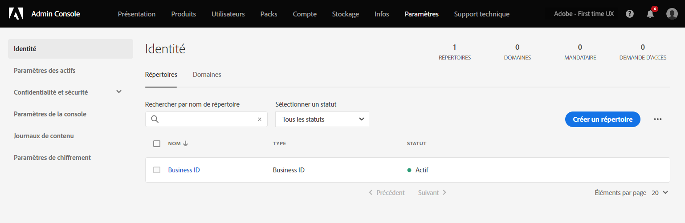

# Gestion des utilisateurs et des produits d’Experience Cloud

Découvrez comment vous connecter à Admin Console, gérer les autorisations d’utilisateur et les profils de produits d’Experience Cloud, ainsi que la prise en charge des navigateurs.

>[!IMPORTANT]
>
>Les informations suivantes concernent spécifiquement les applications Experience Cloud. Ces informations complètent les informations administratives générales du [Guide d’utilisation de l’administrateur Enterprise](https://helpx.adobe.com/fr/enterprise/admin-guide.html) pour tous les produits cloud d’Adobe.

Vous pouvez afficher une liste triable et filtrable de tous les utilisateurs d’Experience Cloud et de leurs informations dans l’outil d’administration. Voir [Affichage des utilisateurs d’Experience Cloud dans l’outil d’administration](admin-tool-experience-cloud.md).

## Avis de mise à jour de l’approvisionnement {#provisioning}

Mise à jour le **20 juillet 2022**

>[!IMPORTANT]
>
>Veuillez consulter l’avis suivant concernant l’approvisionnement d’Experience Cloud.

Adobe met à jour son approvisionnement afin de fournir à tous les clients d’Experience Cloud l’accès aux fonctionnalités fondamentales qui facilitent l’interopérabilité entre certains produits Experience Cloud. Les utilisateurs verront un nouveau droit Adobe Experience Platform ajouté à leurs organisations Experience Cloud, avec la [!UICONTROL collecte de données] incluse comme service.

La [!UICONTROL collecte de données] d’Adobe Experience Platform inclut des [balises](https://experienceleague.adobe.com/docs/tags.html?lang=fr) pour une gestion universelle et simplifiée des balises. Elle offre également une infrastructure de données en continu fiable, robuste et complète. Les balises simplifient la collecte de données de l’expérience client et rationalisent la diffusion d’expérience.

**Modifications dans Admin Console**

Les administrateurs peuvent voir les modifications ou les ajouts à Admin Console comme suit :

* La carte de produit Adobe Experience Platform dans Admin Console comprend :

   * Places
   * Assurance
   * Espace de noms d’identité
   * Sandbox
   * Modèle de données d’expérience
   * Schémas
   * Flux de données
   * Visitor ID (Identifiant visiteur)

   Pour les organisations qui n’utilisent pas actuellement Experience Platform, le produit _Adobe Experience Platform_ s’affichera désormais dans Admin Console, y compris les fonctionnalités répertoriées ci-dessus.

   Pour les organisations qui utilisent actuellement Experience Platform, _Places_ sera désormais consolidée dans la carte Experience Platform.

* La collecte de données Adobe Experience Platform (anciennement Launch) et la confidentialité continueront à apparaître en tant que cartes de produits distinctes des autres fonctionnalités d’Experience Platform.

Pour plus d’informations sur les nouvelles fonctionnalités, consultez leurs pages respectives sur Experience League :

* [Collecte de données](https://experienceleague.adobe.com/docs/analytics/analyze/reports-analytics/reporting-interface/overview-data-collection.html?lang=fr)
* [Places](https://experienceleague.adobe.com/docs/places/using/home.html?lang=fr)
* [Assurance](https://experienceleague.adobe.com/docs/platform-learn/implement-mobile-sdk/app-implementation/assurance.html?lang=fr)
* [Espace de noms d’identité](https://experienceleague.adobe.com/docs/experience-platform/identity/home.html?lang=fr)
* [Sandbox](https://experienceleague.adobe.com/docs/experience-platform/sandbox/home.html?lang=fr)
* [Modèle de données d’expérience](https://experienceleague.adobe.com/docs/experience-platform/xdm/home.html?lang=fr)
* [Schémas](https://experienceleague.adobe.com/docs/experience-platform/xdm/schema/composition.html?lang=fr)
* [Flux de données](https://experienceleague.adobe.com/docs/experience-platform/edge/datastreams/overview.html?lang=fr)
* [Visitor ID (Identifiant visiteur)](https://experienceleague.adobe.com/docs/core-services/interface/services/core-services.html?lang=fr#section_3C9F6DF37C654D939625BB4D485E4354)
* [Confidentialité](https://experienceleague.adobe.com/docs/experience-platform/privacy/home.html?lang=fr)

## Authentification des utilisateurs d’Experience Cloud (migration planifiée) {#migration}

Depuis février 2022, Adobe met à jour son système de gestion des profils afin de permettre aux entreprises de mieux gérer les droits de l’entreprise sur les profils individuels. Ainsi, tous les utilisateurs disposant d’un profil personnel, qui correspond à un Adobe ID individuel (Type1), seront migrés vers un nouveau profil professionnel. Ce profil correspond à un _Identifiant professionnel_ (Type2e).

Voir [Types d’identité dans Adobe Admin Console](https://helpx.adobe.com/fr/enterprise/using/identity.html) pour des informations sur les types d’identité.

### Processus de migration

Au moment de la migration, les administrateurs de l’organisation recevront un e-mail de notification 30 jours avant la migration.

* La migration sera planifiée entre 22 h et 6 h, en fonction du fuseau horaire principal de l’organisation ou pendant le week-end.
* Pendant la migration, l’application Experience Cloud peut être inaccessible pendant environ 15 minutes et Admin Console jusquʼà 30 minutes. Sinon, cette migration sera transparente.

### Modifications après la migration

Admin Console

* Les administrateurs disposant de plusieurs comptes peuvent voir un sélecteur de profil lors de la connexion à [!UICONTROL Admin Console].
* Les utilisateurs d’Adobe ID individuels seront mis à jour pour passer au Business ID.
* Le répertoire Business ID sera ajouté dans **[!UICONTROL Paramètres]** > **[!UICONTROL Identité]** > **[!UICONTROL Répertoires]**.

   

### Connexion après la migration

Votre expérience de connexion ne change pas avec cette mise à jour :

1. Connectez-vous à `experience.adobe.com` en utilisant les mêmes informations d’identification.

1. Un nouveau profil associé au Business ID est créé. Vous êtes invité à vous **[!UICONTROL connecter maintenant]** ou à **[!UICONTROL Ignorer]** cette étape.

1. En choisissant l’une des options, vous accédez à une page de destination existante.

1. Un profil Adobe est associé à chaque abonnement Entreprise et permet d’organiser les ressources créées à partir d’autres offres Adobe Cloud (Creative Cloud et Document Cloud).

Pour plus d’informations, voir [Présentation des profils Adobe](https://helpx.adobe.com/fr/enterprise/kb/introducing-adobe-profiles.html).

## Qu’est-ce qu’un profil de produit ? {#section_AB50558124D541CF80A0D3D76D35A4BF}

Les _[!UICONTROL profils de produits]_ sont des groupes de produits et de services que vous pouvez affecter aux utilisateurs. Dans Experience Cloud, les autorisations sont basées sur le profil d’un produit et non sur l’utilisateur. (Cependant, vous pouvez déléguer des droits d’administration à des utilisateurs spécifiques.)

Dans Analytics par exemple, vous pouvez configurer une collection d’outils de création de rapports, tels qu’Analysis Workspace et le Report Builder, parallèlement aux suites de rapports, aux mesures et aux dimensions. Vous pouvez octroyer une autorisation à un profil de produits en ajoutant des utilisateurs au profil.

* Voir [Attribution d’autorisations d’accès Analytics à un profil de produits](admin-getting-started.md#task_040673FE3E3E429B9531FBCB8B6A4391) sur cette page.
* Voir [Délégation de rôles administratifs aux utilisateurs](#delegate-rights) sur cette page.

## Gestion des profils de produit Experience Cloud {#task_16335111C52D40E9BAC73D0699584DBF}

Vous pouvez créer un profil de produits et l’affecter à un groupe d’autorisations.

Lorsque vous invitez un utilisateur à rejoindre une organisation, vous pouvez lui donner accès à des produits et à des profils de produits. Vous pouvez également déléguer des autorisations administratives limitées à un utilisateur. De même, vous pouvez créer des groupes d’utilisateurs, puis ajouter le groupe à un profil de produits pour activer l’accès.

1. Dans [Admin Console](https://adminconsole.adobe.com/enterprise/), sélectionnez **[!UICONTROL Produits]**.
1. Sélectionnez le nom de votre organisation.
1. Sélectionnez **[!UICONTROL Nouveau profil]**.
1. Configurez les détails du profil, puis sélectionnez **[!UICONTROL Enregistrer]**.

Pour plus d’informations (et pour obtenir de l’aide sur la gestion des produits Creative Cloud et Document Cloud), voir [Identité](https://helpx.adobe.com/fr/enterprise/using/identity.html) dans le [Guide d’utilisation de l’administrateur](https://helpx.adobe.com/fr/enterprise/using/users.html).

**Aide connexe**

* [Gérez les produits et les profils](https://helpx.adobe.com/fr/enterprise/using/manage-products.html) dans le Guide d’utilisation de l’administrateur.
* [Autorisations des utilisateurs d’entreprise](https://experienceleague.adobe.com/docs/target/using/administer/manage-users/enterprise/property-channel.html?lang=fr) dans l’aide d’Adobe Target pour plus d’informations.
* Vidéo : [Configuration des espaces de travail Adobe Target dans Adobe Admin Console](https://experienceleague.adobe.com/docs/experience-cloud-kcs/kbarticles/KA-17521.html?lang=fr)

## Délégation des rôles d’administration aux utilisateurs {#delegate-rights}

Dans Admin Console, vous pouvez déléguer des droits d’administration limités à d’autres membres de votre organisation. Les rôles délégués permettent aux utilisateurs d’administrer l’accès logiciel aux utilisateurs finaux, de fournir des capacités de déploiement d’accès et de fonctionner en tant que délégués du support technique.

Par exemple, vous pouvez effectuer les opérations suivantes :

* Autoriser votre directeur créatif à accorder l’accès à Creative Cloud
* Autoriser votre directeur marketing à accorder l’accès à Experience Cloud
* Garder ces deux rôles séparés de sorte qu’ils ne puissent pas outrepasser les rôles respectifs

En utilisant ces rôles, vous pouvez déléguer simultanément la gestion à d’autres personnes sans fournir plus de capacités que nécessaire.

1. Dans Admin Console, sélectionnez **[!UICONTROL Utilisateurs]**, puis le nom de lʼutilisateur.

   

1. Sélectionnez **[!UICONTROL Modifier droits d’administration]**.

   

1. Spécifiez les droits d’administrateur de l’utilisateur.
1. Sélectionnez **[!UICONTROL Enregistrer]**.

## Gérer les utilisateurs et les produits Analytics {#section_97DE101F92CD494AB073893680992F1A}

Vous pouvez attribuer des autorisations d’accès aux rapports Analytics (suites de rapports, mesures, dimensions, etc.) à un profil de produits.

Par exemple, vous pouvez créer un profil de produit qui contient plusieurs outils Analytics ([!UICONTROL Analysis Workspace], [!UICONTROL Reports &amp; Analytics] et [!UICONTROL Report Builder]). Ces profils contiennent l’autorisation d’accéder à des mesures et dimensions spécifiques (y compris les eVars), ainsi que des fonctionnalités telles que la création de segments ou de mesures calculées.

1. Connectez-vous à [Admin Console](https://adminconsole.adobe.com/enterprise), puis sélectionnez **[!UICONTROL Produits]**.
1. Sur la page [!UICONTROL Produits], sélectionnez votre produit, puis choisissez **[!UICONTROL Autorisations]** (disponible uniquement pour les administrateurs).
1. Configurez les autorisations du profil :

| Élément | Description |
|--- |--- |
| Suites de rapports | Activez les autorisations pour des suites de rapports spécifiques. |
| Mesures | Activez les autorisations pour les événements personnalisés, de trafic, de conversion, dʼapplication, la reconnaissance de contenu, etc. |
| Dimensions | Personnalisez lʼaccès des utilisateurs à un niveau plus détaillé, y compris les eVars, les rapports de trafic, les rapports dʼapplication et les rapports de cheminement. |
| Outils de suites de rapports | Activez les autorisations d’utilisateurs pour les services web, la gestion des suites de rapports, les outils et les rapports, ainsi que les éléments de tableau de bord. |
| Outils Analytics | Activez les autorisations d’utilisateurs pour les éléments généraux (facturation, journaux, etc.), la gestion des entreprises, les outils, l’accès au service web, le Report Builder et l’intégration de Data Connectors. Les paramètres d’entreprise de la catégorie de personnalisation d’Admin Console ont été déplacés dans les outils Analytics. |

**Migration des comptes d’utilisateurs**

Dans Analytics, les administrateurs peuvent utiliser l’outil de migration des ID d’utilisateur pour migrer des comptes d’utilisateurs de la gestion des utilisateurs Analytics vers [Adobe Admin Console](https://adminconsole.adobe.com/enterprise/).

La migration des comptes est en cours de déploiement. Adobe vous avisera lorsqu’il sera temps de migrer vos comptes d’utilisateurs des **[!UICONTROL Outils d’administration]** > **[!UICONTROL Gestion des utilisateurs]** vers Admin Console et vous aidera à le faire.

Une fois la migration terminée, les utilisateurs se connectent à lʼaide de leur Adobe ID (ou Enterprise ID) et sʼauthentifient dans les applications et services Experience Cloud sur [experience.adobe.com](https://experience.adobe.com). Si les utilisateurs tentent de se connecter au moyen des comptes hérités ([!DNL my.omniture.com], [!DNL sc.omniture.com] et [!DNL experiencecloud.adobe.com]), ils sont redirigés vers [!DNL experience.adobe.com].

**Aide connexe**

* [Analytics dans Admin Console](https://experienceleague.adobe.com/docs/analytics/admin/admin-console/home.html?lang=fr)
* [Migration de l’ID d’utilisateur Analytics](https://experienceleague.adobe.com/docs/analytics/admin/admin-tools/user-product-management/migrate-users/c-migration-tool.html?lang=fr)

## Gestion d’Adobe Target - profils de produits ou espaces de travail {#section_3860AF177C9E4C7E9C390D36A414F353}

Dans Adobe Target, un espace de travail est un profil de produits. Avec un espace de travail, une organisation peut allouer un groupe d’utilisateurs spécifique à un groupe de propriétés spécifique. Un espace de travail peut être comparé à une suite de rapports dans Adobe Analytics.

Voir :

* [Autorisations des utilisateurs d’Enterprise](https://experienceleague.adobe.com/docs/target/using/administer/manage-users/enterprise/property-channel.html?lang=fr)
* [Gestion des produits et des profils](https://helpx.adobe.com/fr/enterprise/using/manage-products.html)
* Vidéo : [Configuration des espaces de travail Adobe Target dans Adobe Admin Console](https://experienceleague.adobe.com/docs/experience-cloud-kcs/kbarticles/KA-17521.html?lang=fr)

## Gestion des profils de produits, clients et groupes de sécurité de Campaign {#section_09CDF75366444CF5810CF321B7C712F3}

Un *client* dans Campaign s’affiche en tant que *produit* sur la page de produits dans Admin Console.

*Le groupe de sécurité* s’affiche en tant que profil de produits.

Voir [Gestion des groupes et des utilisateurs](https://experienceleague.adobe.com/docs/campaign-standard/using/administrating/users-and-security/managing-groups-and-users.html?lang=fr) pour en savoir plus sur les groupes de sécurité et l’affectation d’utilisateurs à des groupes de sécurité.

## Gestion de la collecte de données Experience Platform (Launch) {#section_F2DA6778DD2D48AA8F794041971EE6B1}

Experience Platform [!UICONTROL Data Collection] ([!UICONTROL Launch]) s’affiche sur la page [!UICONTROL Produits] dans [!UICONTROL Admin Console]. Vous pouvez inclure dʼautres applications et services dans un profil de produits Launch.

Invitez des utilisateurs dans [!UICONTROL Platform Launch] et attribuez des rôles et des droits d’utilisateur.

Voir [Autorisations des utilisateurs](https://experienceleague.adobe.com/docs/experience-platform/tags/admin/user-permissions.html?lang=fr) pour en savoir plus sur les autorisations d’utilisateurs dans Admin Console et pour configurer des options spécifiques à Launch, y compris l’attribution de droits aux profils.

## Experience Manager as a Cloud Service

Les clients Adobe Enterprise sont représentés en tant qu’organisations dans Adobe [!UICONTROL Admin Console]. Les clients Experience Manager peuvent utiliser Adobe [!UICONTROL Admin Console] pour gérer les droits sur les produits et l’authentification IMS vers Experience Manager as a [!UICONTROL Cloud Service].

Voir [Prise en charge IMS d’Experience Manager as a Cloud Service](https://experienceleague.adobe.com/docs/experience-manager-cloud-service/content/security/ims-support.html?lang=fr).

## Audience Manager {#section_C31E3FA8A1E14463B1B3E07235F1983C}

Créez des utilisateurs d’Audience Manager et affectez-les à des groupes. Vous pouvez également consulter les limites (caractéristiques, segments, destinations et [!DNL AlgoModel]).

Voir [Administration](https://experienceleague.adobe.com/docs/audience-manager/user-guide/features/administration/administration-overview.html?lang=fr) dans l’aide d’Audience Manager.

## Navigateurs pris en charge dans Experience Cloud

* [!DNL Microsoft® Edge] (Microsoft® a officialisé la [cessation de prise en charge](https://www.microsoft.com/fr-fr/WindowsForBusiness/End-of-IE-support) d’Internet Explorer 8, 9 et 10. Par conséquent, Adobe ne corrige pas les bugs signalés concernant ces versions spécifiques d’Internet Explorer.)
* [!DNL Google Chrome]
* [!DNL Firefox]
* [!DNL Safari]
* [!DNL Opera]

**Remarque** : bien que l’interface d’Experience Cloud prenne en charge ces navigateurs, les applications individuelles ne les prennent pas tous en charge. (Par exemple, [Analytics](https://experienceleague.adobe.com/docs/analytics/admin/admin-overview/sys-reqs.html?lang=fr) ne prend pas en charge [!DNL Opera] et [!DNL Adobe Target]  ne prend pas en charge [!DNL Safari].)

### Exigences des solutions et des produits

* [Analytics](https://experienceleague.adobe.com/docs/analytics/admin/admin-overview/sys-reqs.html?lang=fr)
* [Report Builder](https://experienceleague.adobe.com/docs/analytics/analyze/report-builder/report-builder-setup/system-requirements.html?lang=fr)
