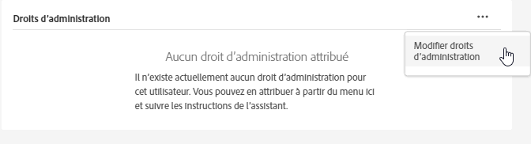
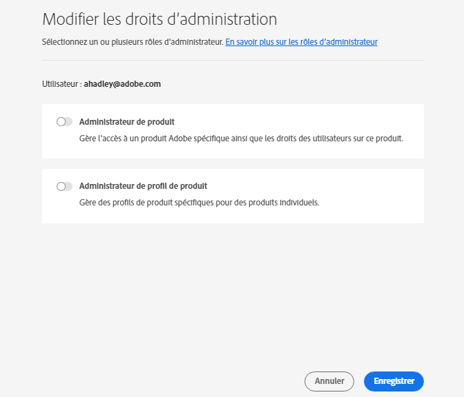

# Gestion des utilisateurs et des produits Experience Cloud

Découvrez-en plus sur la connexion à Admin Console, sur la gestion des autorisations d’utilisateurs, sur les profils de produits dans Experience Cloud et sur la prise en charge des navigateurs.

>[!IMPORTANT]
>
>Les informations suivantes concernent spécifiquement les applications Experience Cloud. Ces informations complètent les informations administratives générales du [Guide d’utilisation de l’administrateur Enterprise](https://helpx.adobe.com/fr/enterprise/admin-guide.html) pour tous les produits cloud d’Adobe.

Vous pouvez afficher une liste triable et filtrable de tous les utilisateurs d’Experience Cloud et de leurs informations dans l’outil d’administration. Voir [Affichage des utilisateurs d’Experience Cloud dans l’outil d’administration](admin-tool-experience-cloud.md).

## Qu’est-ce qu’un profil de produit ? {#section_AB50558124D541CF80A0D3D76D35A4BF}

Les [!UICONTROL profils de produits] sont des groupes de produits et de services que vous pouvez affecter aux utilisateurs. Dans Experience Cloud, les autorisations sont basées sur le profil d’un produit et non sur l’utilisateur. (Cependant, vous pouvez déléguer des droits d’administration à des utilisateurs spécifiques.)

Dans Analytics par exemple, vous pouvez configurer une collection d’outils de création de rapports, tels qu’Analysis Workspace et le Report Builder, parallèlement aux suites de rapports, aux mesures et aux dimensions. Vous pouvez octroyer une autorisation à un profil de produits en ajoutant des utilisateurs au profil.

* Voir [Attribution d’autorisations d’accès Analytics à un profil de produits](admin-getting-started.md#task_040673FE3E3E429B9531FBCB8B6A4391) sur cette page.
* Voir [Délégation de rôles d’administration aux utilisateurs](#delegate-rights) sur cette page

## Gestion des profils de produit Experience Cloud {#task_16335111C52D40E9BAC73D0699584DBF}

Vous pouvez créer un profil de produits et l’affecter à un groupe d’autorisations.

Lorsque vous invitez un utilisateur à rejoindre une organisation, vous pouvez lui donner accès à des produits et à des profils de produits. Vous pouvez également déléguer des autorisations d’administration limitées à un utilisateur. De même, vous pouvez créer des groupes d’utilisateurs, puis ajouter le groupe à un profil de produits pour activer l’accès.

1. Dans le [Admin Console](https://adminconsole.adobe.com/enterprise/), sélectionnez **[!UICONTROL Produits]**.
1. Sélectionnez le nom de votre organisation.
1. Sélectionnez **[!UICONTROL Nouveau profil]**.
1. Configurez les détails du profil, puis sélectionnez **[!UICONTROL Enregistrer]**.

Pour plus d’informations (et pour obtenir de l’aide sur la gestion des produits Creative Cloud et Document Cloud), voir [Identité](https://helpx.adobe.com/fr/enterprise/admin-guide.html/fr/enterprise/using/identity.ug.html) dans le [Guide d’utilisation de l’administrateur](https://helpx.adobe.com/fr/enterprise/admin-guide.html/fr/enterprise/using/users.ug.html).

**Aide connexe**

* [Gérez les produits et les profils](https://helpx.adobe.com/fr/enterprise/admin-guide.html/fr/enterprise/using/manage-products.ug.html) dans le Guide d’utilisation de l’administrateur.
* [Autorisations des utilisateurs d’entreprise](https://experienceleague.adobe.com/docs/target/using/administer/manage-users/enterprise/property-channel.html?lang=fr) dans l’aide d’Adobe Target pour plus d’informations.
* Vidéo : [Configuration des espaces de travail Adobe Target dans Adobe Admin Console](https://helpx.adobe.com/fr/target/kb/how-to-configure-target-workspaces-in-adobe-admin-console0.html)

<!-- ## What's new in Experience Cloud user management {#concept_06A0A13362F644FB90F947238407637A}

Learn about the latest features in Experience Cloud user and product management.

### Business ID type

Adobe is introducing an identity type called Business ID. This identity type improves the control of user and product management. Adobe is migrating all Adobe IDs (owned by individuals) that are used for business to the new enterprise Business IDs owned by your organization.

If you are an existing Experience Cloud customer, Adobe will migrate all your users with Adobe IDs in the Admin Console to Business IDs. If you are a new enterprise or teams customer, you will add users to the Admin Console using one of the available identity types: Business ID, Enterprise ID, or Federated ID.

What to do

* Your users will need to accept Terms of Use (TOU) changes prior to accounts being migrated to Type2e. 
* Users that belong to multiple organizations might see a Profile Selection screen during the login workflow and need to select the correct one. This ensures that they are logging into the correct organization. (There might be multiple profiles to choose from if a user was a member of multiple organizations before the migration.)

Beginning May 2020, enterprise administrators cannot use the Adobe ID for new organizations created in the Admin Console. Latest: https://wiki.corp.adobe.com/pages/viewpage.action?spaceKey=engage&title=Type2e+DX+GTM-->

## Délégation des rôles d’administration aux utilisateurs {#delegate-rights}

Dans Admin Console, vous pouvez déléguer des droits d’administration limités à d’autres membres de votre organisation. Les rôles délégués permettent aux utilisateurs d’administrer l’accès logiciel aux utilisateurs finaux, de fournir des capacités de déploiement d’accès et de fonctionner en tant que délégués du support technique.

Par exemple, vous pouvez effectuer les opérations suivantes :

* Autoriser votre directeur créatif à accorder l’accès à Creative Cloud
* Autoriser votre directeur marketing à accorder l’accès à Experience Cloud
* Garder ces deux rôles séparés de sorte qu’ils ne puissent pas outrepasser les rôles respectifs

En utilisant ces rôles, vous pouvez déléguer simultanément la gestion à d’autres personnes sans fournir plus de capacités que nécessaire.

1. Dans le Admin Console, sélectionnez **[!UICONTROL Utilisateurs]**, puis sélectionnez le nom de l’utilisateur.

   

1. Sélectionnez **[!UICONTROL Modifier les droits d’administrateur]**.

   

1. Spécifiez les droits d’administrateur de l’utilisateur.
1. Sélectionnez **[!UICONTROL Enregistrer]**.

## Gérer les utilisateurs et les produits Analytics {#section_97DE101F92CD494AB073893680992F1A}

Vous pouvez attribuer des autorisations d’accès aux rapports Analytics (suites de rapports, mesures, dimensions, etc.) à un profil de produits.

Par exemple, vous pouvez créer un profil de produit qui contient plusieurs outils Analytics ([!UICONTROL Analysis Workspace], [!UICONTROL Reports &amp; Analytics] et [!UICONTROL Report Builder]). Ces profils contiennent des autorisations d’accès à des mesures et dimensions spécifiques (y compris les eVars) et à des fonctionnalités telles que la création de segments ou de mesures calculées.

1. Connectez-vous au [Admin Console](https://adminconsole.adobe.com/enterprise), puis sélectionnez **[!UICONTROL Produits]**.
1. Sur la page [!UICONTROL Produits] , sélectionnez votre produit, puis **[!UICONTROL Autorisations]** (disponible uniquement pour les administrateurs).
1. Configurez les autorisations du profil :

| Élément | Description |
|--- |--- |
| Suites de rapports | Activez les autorisations pour des suites de rapports spécifiques. |
| Mesures | Activez les autorisations pour les événements personnalisés, de trafic, de conversion, de solution, la reconnaissance de contenu, etc. |
| Dimensions | Personnalisez l’accès des utilisateurs à un niveau plus détaillé, y compris les eVars, les rapports de trafic, les rapports de solution et les rapports de cheminement. |
| Outils de suites de rapports | Activez les autorisations d’utilisateurs pour les services web, la gestion des suites de rapports, les outils et les rapports, ainsi que les éléments de tableau de bord. |
| Outils Analytics | Activez les autorisations d’utilisateurs pour les éléments généraux (facturation, journaux, etc.), la gestion des entreprises, les outils, l’accès au service web, le Report Builder et l’intégration de Data Connectors. Les paramètres d’entreprise de la catégorie de personnalisation d’Admin Console ont été déplacés dans les outils Analytics. |

**Migration des comptes d’utilisateurs**

Dans Analytics, les administrateurs peuvent utiliser l’outil de migration des ID d’utilisateur pour migrer des comptes d’utilisateurs de la gestion des utilisateurs Analytics vers [Adobe Admin Console](https://adminconsole.adobe.com/enterprise/).

La migration des comptes est en cours de déploiement. Adobe vous avisera lorsqu’il sera temps de migrer vos comptes d’utilisateurs des **[!UICONTROL Outils d’administration]** > **[!UICONTROL Gestion des utilisateurs]** vers Admin Console et vous aidera à le faire.

Une fois la migration terminée, les utilisateurs se connectent à l’aide de leur Adobe ID (ou Enterprise ID) et s’authentifient dans les solutions et services Experience Cloud sur [experiencecloud.adobe.com](https://experience.adobe.com). Si les utilisateurs tentent de se connecter au moyen des comptes hérités ([!DNL my.omniture.com], [!DNL sc.omniture.com] et [!DNL experiencecloud.adobe.com]), ils sont redirigés vers [!DNL experience.adobe.com].

**Aide connexe**

Pour plus d’informations, voir [Migration des ID d’utilisateur Analytics](https://experienceleague.adobe.com/docs/analytics/admin/user-product-management/user-management/migrate-users/c-migration-tool.html?lang=fr).

## Gestion d’Adobe Target - profils de produits par rapport aux espaces de travail {#section_3860AF177C9E4C7E9C390D36A414F353}

Dans Adobe Target, un espace de travail est un profil de produits. Avec un espace de travail, une organisation peut allouer un groupe d’utilisateurs spécifique à un groupe de propriétés spécifique. Un espace de travail peut être comparé à une suite de rapports dans Adobe Analytics.

Voir :

* [Autorisations des utilisateurs d’Enterprise](https://experienceleague.adobe.com/docs/target/using/administer/manage-users/enterprise/property-channel.html?lang=en)
* [Gestion des produits et des profils](https://helpx.adobe.com/enterprise/admin-guide.html/enterprise/using/manage-products.ug.html)
* Vidéo : [Configuration des espaces de travail Adobe Target dans Adobe Admin Console](https://helpx.adobe.com/target/kb/how-to-configure-target-workspaces-in-adobe-admin-console0.html)

## Gestion de Campaign - profils de produits, clients et groupes de sécurité {#section_09CDF75366444CF5810CF321B7C712F3}

Un *client* dans Campaign s’affiche en tant que *produit* sur la page de produits dans Admin Console.

*Le groupe de sécurité* s’affiche en tant que profil de produits.

Voir [Gestion des groupes et des utilisateurs](https://experienceleague.adobe.com/docs/campaign-standard/using/administrating/users-and-security/managing-groups-and-users.html?lang=fr) pour en savoir plus sur les groupes de sécurité et l’affectation d’utilisateurs à des groupes de sécurité.

## Gestion de la collecte de données Experience Platform (Launch) {#section_F2DA6778DD2D48AA8F794041971EE6B1}

Experience Platform [!UICONTROL Data Collection] ([!UICONTROL Launch]) s’affiche sur la page [!UICONTROL Produits] dans [!UICONTROL Admin Console]. Vous pouvez inclure d’autres solutions et services dans un profil de produits Launch.

Invitez des utilisateurs dans [!UICONTROL Platform Launch] et attribuez des rôles et des droits d’utilisateur.

Voir [Autorisations des utilisateurs](https://experienceleague.adobe.com/docs/experience-platform/tags/admin/user-permissions.html?lang=en) pour en savoir plus sur les autorisations d’utilisateurs dans Admin Console et pour configurer des options spécifiques à Launch, y compris l’attribution de droits aux profils.

## Experience Manager as a Cloud Service

Les clients Adobe Enterprise sont représentés en tant qu’organisations dans Adobe [!UICONTROL Admin Console]. Les clients Experience Manager peuvent utiliser Adobe [!UICONTROL Admin Console] pour gérer les droits sur les produits et l’authentification IMS vers Experience Manager as a [!UICONTROL Cloud Service].

Voir [Prise en charge IMS d’Experience Manager as a Cloud Service](https://experienceleague.adobe.com/docs/experience-manager-cloud-service/security/ims-support.html?lang=fr).

## Audience Manager {#section_C31E3FA8A1E14463B1B3E07235F1983C}

Créez des utilisateurs d’Audience Manager et affectez-les à des groupes. Vous pouvez également consulter les limites (caractéristiques, segments, destinations et [!DNL AlgoModel]).

Voir [Administration](https://experienceleague.adobe.com/docs/audience-manager/user-guide/features/administration/administration-overview.html?lang=en) dans l’aide d’Audience Manager.

## Navigateurs pris en charge dans Experience Cloud

* [!DNL Microsoft® Edge] (Microsoft® a officialisé la [cessation de prise en charge](https://www.microsoft.com/fr-fr/WindowsForBusiness/End-of-IE-support) d’Internet Explorer 8, 9 et 10. Par conséquent, Adobe ne corrige pas les bugs signalés concernant ces versions spécifiques d’Internet Explorer.)
* [!DNL Google Chrome]
* [!DNL Firefox]
* [!DNL Safari]
* [!DNL Opera]

**Remarque** : bien que l’interface d’Experience Cloud prenne en charge ces navigateurs, les applications individuelles ne les prennent pas tous en charge. (Par exemple, [Analytics](https://experienceleague.adobe.com/docs/analytics/admin/sys-reqs.html?lang=fr) ne prend pas en charge [!DNL Opera] et [ Adobe Target](https://experienceleague.adobe.com/docs/target/using/implement-target/before-implement/supported-browsers.html?lang=fr) ne prend pas en charge [!DNL Safari].)

### Exigences des solutions et des produits

* [Analytics](https://experienceleague.adobe.com/docs/analytics/admin/sys-reqs.html?lang=en)
* [Report Builder](https://experienceleague.adobe.com/docs/analytics/analyze/report-builder/report-builder-setup/system-requirements.html?lang=fr)
* [Adobe Target](https://experienceleague.adobe.com/docs/target/using/implement-target/before-implement/supported-browsers.html?lang=en)
