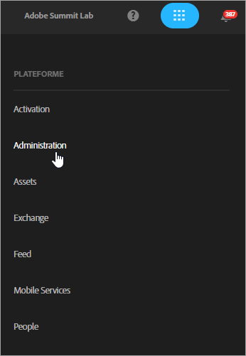
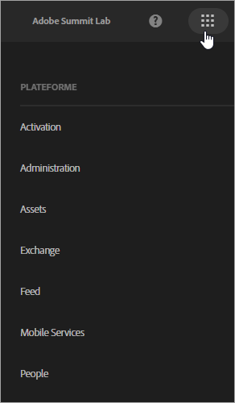
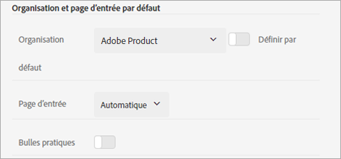
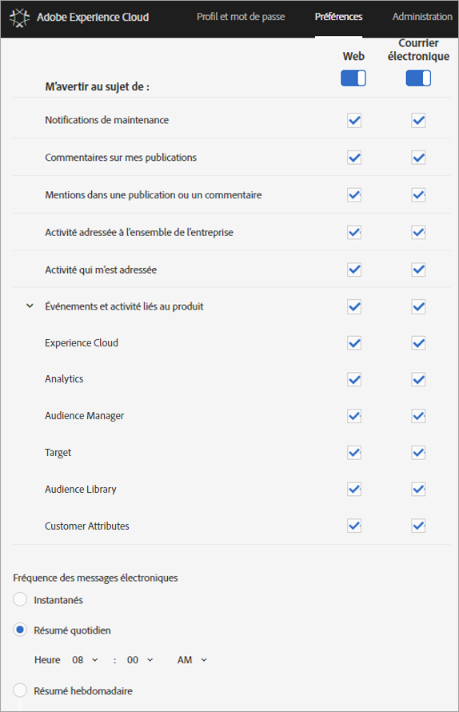

# Connectez-vous et gérez vos paramètres du profil Experience Cloud.

La connexion à Experience Cloud (plutôt que la connexion à une seule solution) permet l’authentification unique à toutes les solutions et services que vous détenez. Cette aide décrit comment se connecter à Experience Cloud, gérer les mots de passe et les notifications et spécifier un landing page par défaut.

>[!IMPORTANT]
>
>Si vous êtes administrateur, consultez [Administration](../admin-getting-started/admin-getting-started.md#topic_3FCB4099640647E3B2411ADBFCE81909) pour obtenir des informations sur les mises à jour de la gestion des utilisateurs et des produits.

## Connexion à Experience Cloud (administrateurs) {#task_034FC955031347F3B02B686A09801A08}

Connectez-vous et vérifiez que vous vous trouvez dans la bonne [organisation](../admin-getting-started/organizations.md#topic_C31CB834F109465A82ED57FF0563B3F1).

1. Cliquez sur le menu déroulant Experience Cloud ( ), puis sur **[!UICONTROL Administration]**.

   

   Si le lien **[!UICONTROL Administration]** n’apparaît pas, cela signifie que vous n’êtes pas un administrateur Experience Cloud pour l’[organisation](../admin-getting-started/organizations.md#topic_C31CB834F109465A82ED57FF0563B3F1) affichée (Adobe Corp dans cet exemple). Si vous avez besoin d’aide pour devenir administrateur, contactez l’assistance clientèle ou un autre administrateur Experience Cloud de votre entreprise.
1. Cliquez sur **[!UICONTROL Administration]**.

   
1. Poursuivez en cliquant sur l’un des liens suivants :

| Élément | Description |
|--- |--- |
| [Concepts de base de la console d’administration](https://helpx.adobe.com/fr/marketing-cloud/how-to/first-time-setup.html) | Découvrez les étapes initiales à suivre pour commencer à utiliser les solutions Experience Cloud. |
| [Configurer l&#39;identité](https://helpx.adobe.com/fr/enterprise/using/set-up-identity.html) | Définissez et configurez un système d&#39;identité sur lequel vos utilisateurs finaux seront authentifiés. |
| [Gestion des utilisateurs](https://helpx.adobe.com/fr/enterprise/using/users.html) | Découvrez-en plus sur la connexion à Admin Console et sur la gestion des autorisations d’utilisateurs et sur les profils de produits dans Experience Cloud. |
| [Lancement d’Admin Console](../admin-getting-started/admin-getting-started.md) | La console d’administration est l’emplacement central de la gestion des utilisateurs et des droits des produits Adobe au sein de l’ensemble de votre organisation. Vous pouvez également vous connecter à Admin Console à l’aide d’un [lien direct](https://auth.services.adobe.com/fr_FR/index.html?callback=https%3A%2F%2Fims-na1.adobelogin.com%2Fims%2Fadobeid%2FONESIE1%2FAdobeID%2Ftoken%3Fredirect_uri%3Dhttps%253A%252F%252Fadminconsole.adobe.com%252Fredirect.html%253Ftarget%253D%25252Foverview%2523from_ims%253Dtrue%2526old_hash%253D%2526api%253Dauthorize&amp;client_id=ONESIE1&amp;scope=openid%2CAdobeID%2Cadditional_info.projectedProductContext%2Cread_organizations%2Cread_members%2Cread_countries_regions%2Cadditional_info.roles%2Cadobeio_api%2Cread_auth_src_domains%2CauthSources.rwd&amp;denied_callback=https%3A%2F%2Fims-na1.adobelogin.com%2Fims%2Fdenied%2FONESIE1%3Fredirect_uri%3Dhttps%253A%252F%252Fadminconsole.adobe.com%252Fredirect.html%253Ftarget%253D%25252Foverview%2523from_ims%253Dtrue%2526old_hash%253D%2526api%253Dauthorize%26response_type%3Dtoken&amp;relay=6e938255-62f5-42c8-8176-178f6f1ab5bc&amp;locale=fr_FR&amp;flow_type=token&amp;ctx_id=admin_console_logo&amp;idp_flow_type=login#/). |
| [Gérer les utilisateurs de Creative Cloud](../experience-cloud-assets/t-admin-add-cc-user.md) | Experience Cloud Assets permet aux marketeurs de partager des dossiers, de les synchroniser et de collaborer avec les concepteurs et autres créatifs dans Creative Cloud. Vous pouvez gérer ici les utilisateurs Creative Cloud approuvés pour collaborer avec votre entreprise. |
| [Mappage de vos suites de rapports](../core-services/core-services.md) | (Analytics uniquement) Les services principaux Experience Cloud sont associés à une organisation plutôt qu’à une suite de rapports individuelle. Afin de garantir le bon fonctionnement de ces services, chaque suite de rapports Analytics doit être mappée à une organisation. (Cette tâche fait partie d’un processus permettant l’  [Activation d’Analytics pour les services principaux.](../core-services/core-services.md#concept_07ED1D5C64234E77976E6D572E78FB9C)) |
| [Organization ID (ID d’organisation)](../admin-getting-started/organizations.md) | L’*ID d’organisation* se trouve en bas de la page Administration. Il s’agit de l’identifiant associé à la société Experience Cloud configurée. Cet identifiant correspond à une chaîne de 24 caractères alphanumériques, suivie de @AdobeOrg (obligatoire). |

## Connexion à Experience Cloud (utilisateurs) {#task_1BFE87E20DCB44078CAC82F3CD44B985}

Cette section vise à aider les utilisateurs non-administrateurs qui se connectent à Experience Cloud.

1. Vérifiez auprès de votre administrateur que votre [organisation](../admin-getting-started/getting-started-experience-cloud.md#concept_384D169B0B724B799D573B8ECB5C39BF) a reçu les privilèges d’accès dans Experience Cloud.

1. Navigate to the [Adobe Experience Cloud](https://experiencecloud.adobe.com) ([!DNL experiencecloud.adobe.com]).
1. Cliquez sur **[!UICONTROL Se connecter avec l’Adobe ID]**.

   Votre administrateur Experience Cloud peut vous aider à déterminer le type de compte (Adobe ID ou Enterprise ID).

1. Sur votre landing page, cliquez sur l’icône de sélection  pour accéder au menu déroulant.

   

   Les services et solutions qui s’affichent dans ce menu dépendent de vos privilèges d’application définis par votre [administrateur](../admin-getting-started/admin-getting-started.md#topic_3FCB4099640647E3B2411ADBFCE81909).

## Configuration des paramètres du compte personnel par défaut {#task_73CBCAE6C91749D19C95421E5AC311BA}

Vous pouvez modifier des détails personnels et spécifier une [organisation](../admin-getting-started/admin-getting-started.md#concept_705C626560A54CA2A4215F1C870C42B2) et une page d’entrée par défaut, qui s’afficheront une fois que vous serez connecté à Experience Cloud.

1. Connectez-vous à Experience Cloud, puis cliquez sur votre icône de profil.

   
1. Cliquez sur **[!UICONTROL Modifier le profil]**.

   
1. Continuez à configurer et à modifier les informations personnelles, puis cliquez sur **[!UICONTROL Enregistrer les modifications]**.

## Activation des notifications {#concept_0105453AD71847B8BFCAF4A40915F157}

Recevez des notifications (par courrier électronique ou au sein du produit) concernant les mises à jour du système, les avis de maintenance, les publications, les mentions et les ressources partagées. Vous pouvez également spécifier les produits et solutions pour lesquels vous souhaitez recevoir des notifications, y compris l’état de transfert des attributs du client.

Pour accéder aux notifications, cliquez sur l’icône **[!UICONTROL Notifications]**, puis sur l’icône **[!UICONTROL Paramètres]**.

Vous pouvez trier l’affichage des notifications d’après les types de messages qui vous intéressent et rechercher des notifications. Vous pouvez également procéder comme suit :

* Triez par type de message important pour vous.
* Recherchez des notifications.

**Pour activer les notifications**

<!-- 
 <b>Analytics</b> 
 
<ul id="ul_91BF597858124FA5BF338C36F6C5533F"> 
 <li id="li_FAD3E93CDE6242F58F14D55C8A6E23D7">Contribution analysis completed </li> 
 <li id="li_03D33D3228884CECA371B58656B2F3E7">Guided analysis shared </li> 
 <li id="li_DCF710F89317487B8DAA86CC05C694CA">Scheduled report failure </li> 
</ul> 

 <b>Adobe Target</b> 
 

Test started or stopped 
 

 <b>Media Optimizer</b> 
 

Performance alerts 
 

 <b>Dynamic Tag Manager</b> 
 
<ul id="ul_9ACDA418933E40918744D9C32A57DD4B"> 
 <li id="li_4DD0FFD3D9F84A428703611EF767D4D0">New web property created </li> 
 <li id="li_C6B923012E9D40BA91F4CBF7D2D72986">New user added </li> 
 <li id="li_EB0B9D1CFDE24E6987935CCCBFC7892A">Approvals - publishing and approval status for new rules, data elements, and tools </li> 
 <li id="li_17B0B176FF85435FB7EDD4317BC18201">Property has been published </li> 
</ul> -->

## Gestion des profils et des mots de passe  {#task_7B89F4F38E5A4C4EB0FF842953856382}

Vous pouvez modifier votre profil Experience Cloud, définir une organisation et une page d’entrée par défaut, etc.

1. [Connexion à Experience Cloud](../admin-getting-started/getting-started-experience-cloud.md#task_1BFE87E20DCB44078CAC82F3CD44B985).

1. Dans le menu Experience Cloud, cliquez sur votre image de profil.

   
1. Cliquez sur **[!UICONTROL Modifier le profil]**.

   Sur la page Profil et mots de passe, renseignez les champs et options sous Détails personnels.

## Récupération du mot de passe  {#task_46541A2806164CB1A4AE8239604E4EB1}

1. Naviguez jusqu’à la page d’ouverture de session de votre solution.
1. Cliquez sur **[!UICONTROL Mot de passe oublié]**.

   La réinitialisation du mot de passe de la solution résout habituellement les problèmes de liaison de mots de passe pour Experience Cloud.

   For Adobe Analytics users, navigate to [https://sc2.omniture.com/password_recovery.html](https://sc2.omniture.com/password_recovery.html).

## Configuration de la connexion aux solutions à l’aide d’un lien direct {#concept_8BE493A08786469B88B210E13F78FF2F}

Vous pouvez éventuellement vous connecter à une page spécifique d’une solution à l’aide de l’authentification fournie par l’interface Experience Cloud.

### Modèle d’URL

`https://<tenantId>.experiencecloud.adobe.com/<solutionname>?destURL=<fullURL>`

Exemple d’URL :

`https://aem62tenant.experiencecloud.adobe.com/analytics?destURL=https%3A%2F%2Fsc.omniture.com%2Freports%2F11562.html`

>[!NOTE]
>
>Vous devez coder les URL avant de les transmettre au paramètre `destURL`. (Encoder sites like [URL Decoder / Encoder](https://meyerweb.com/eric/tools/dencoder/) are available.)

| Paramètre | Description | Exemple | Obligatoire / Facultatif |
|--- |--- |--- |--- |
| locataireId | Nom du client auquel l&#39;utilisateur doit se connecter. | aem62tenant | Facultative |
| destURL | URL complète vers l’emplacement où l’utilisateur doit être conduit. | https://sc.omniture.com/x/1_7xxzf | Facultative |
| solutionname | Nom de la solution MAC propriétaire du paramètre destURL. Il est utilisé pour vérifier que l’utilisateur a accès à la solution propriétaire de l’URL.  Il appartient aux solutions de s’assurer que le paramètre solutionname est synchronisé avec le paramètre destURL.  Par exemple : si le paramètre solutionname de l’URL a pour valeur « social » et que le paramètre destURL fourni est une URL Analytics, l’utilisateur sera redirigé vers l’URL même s’il n’a pas accès à Analytics. MAC ne vérifie PAS si le propriétaire de destURL est synchronisé avec le nom de la solution. | analytics | Obligatoire si le paramètre destURL est utilisé. |
