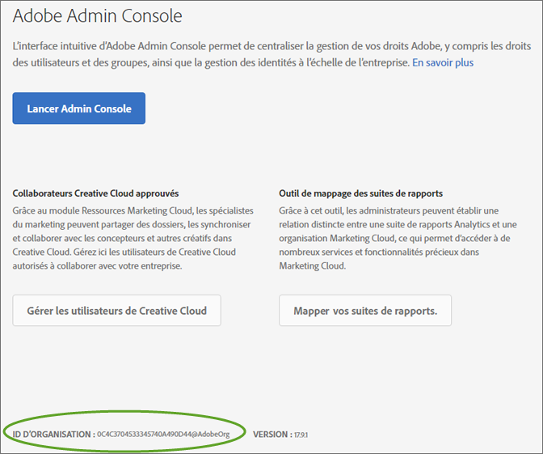

# Liaison d’organisations et de comptes

Découvrez la gestion des organisations et la liaison de comptes de solution à Experience Cloud.

## Identification de votre organisation {#concept_384D169B0B724B799D573B8ECB5C39BF}

Une *organisation* est l’entité qui permet à un administrateur de configurer des groupes et des utilisateurs et de contrôler l’authentification unique dans Experience Cloud. L’organisation fonctionne comme une société de connexion qui couvre tous les produits et solutions Experience Cloud. La plupart du temps, une organisation désigne votre nom de société. Cependant, une société peut avoir plusieurs organisations.

En outre, vous devrez peut-être localiser l’ID d’organisation à des fins d’assistance. Vous pouvez vérifier que vous vous trouvez dans la bonne organisation ou changer d’organisation à l’aide du menu **[!UICONTROL Organisation]**.

## Obtention de votre ID d’organisation {#concept_EA8AEE5B02CF46ACBDAD6A8508646255}

L’**ID d’organisation** est l’identifiant associé à la société Experience Cloud activée. Cet identifiant correspond à une chaîne de 24 caractères alphanumériques, suivie de @AdobeOrg (obligatoire).

Pour afficher votre ID d’organisation, accédez à la page d’entrée d’Experience Cloud ou cliquez sur ( ), puis sur **[!UICONTROL Administration]**. Vous pouvez trouver l’ID d’organisation en bas de la page [!UICONTROL Prise en main d’Experience Cloud] ou de la page [!UICONTROL Administration].

## Liaison d’un compte de solution à un Adobe ID {#task_FD389E78640848919E247AC5E95B8369}

En général, les administrateurs Experience Cloud accordent l’accès aux solutions et aux services. Dans de rares cas, vous devrez peut-être lier les informations de connexion de la solution à un Adobe ID.

1. Suivez les instructions fournies dans votre invitation par courrier électronique pour accéder à Experience Cloud.
1. Connectez-vous à l’aide de votre Adobe ID ou de votre Enterprise ID.
1. Cliquez sur le sélecteur de solutions. ().

   

   Les solutions auxquelles vous avez accès sont indiquées en couleur.
1. Cliquez sur la solution de votre choix.

   

   Si vous faites partie du groupe approprié (et disposez des autorisations nécessaires pour accéder à la solution), mais n’avez pas encore lié votre compte à votre Adobe ID, ce type de message s’affiche.
1. Cliquez sur **[!UICONTROL Lier le compte]**, puis fournissez vos informations de connexion.

## Définition d’une organisation et d’une page d’entrée par défaut {#concept_6A191B42A9874A9780882903BA18F071}

Vous pouvez définir une organisation et une page d’accueil par défaut à utiliser lorsque vous ouvrez une session.

Dans votre profil, cliquez sur **[!UICONTROL Modifier le profil]**.

Sous l’organisation et la page d’accueil par défaut, vous pouvez personnaliser votre expérience d’ouverture de session.

## Résoudre les problèmes de liaison de comptes {#concept_DFCB29A3B4834FC59AA29E0BBA301584}

Aide pour résoudre les problèmes qui se produisent lors de la liaison de comptes.

En règle générale, la liaison de comptes échoue, car l’Adobe ID est lié à un utilisateur précédent. Lorsque la liaison de comptes échoue, vous pouvez :

* [contacter l’assistance Adobe](https://helpx.adobe.com/fr/marketing-cloud/contact-support.html) ;
* accéder à votre solution en suivant la procédure de connexion standard pendant que nous résolvons le problème.
