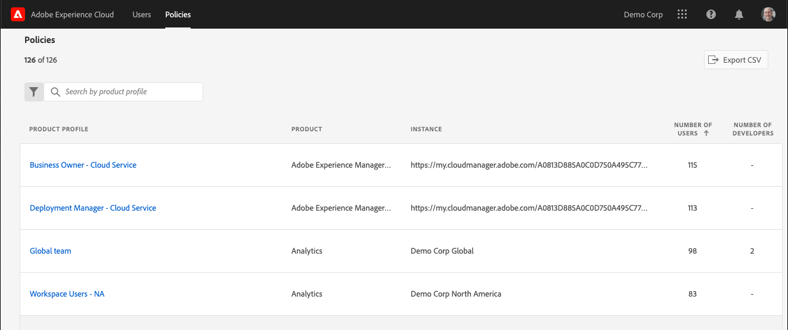

# Affichage des utilisateurs et politiques d’Experience Cloud dans l’outil d’administration

Les administrateurs peuvent afficher une liste triable et filtrable de tous les utilisateurs et politiques d’Experience Cloud avec leurs informations dans l’outil d’administration. Les détails de l’utilisateur incluent l’accès au produit d’un utilisateur, ses rôles et les informations de dernier accès. Les détails de la politique incluent l’utilisateur, le groupe, le développeur, l’intégration et la liste d’administration de la politique (profil de produits), ainsi que des informations détaillées sur les autorisations et les ressources pour la politique.

>[!NOTE]
>
>La gestion des utilisateurs et des produits est configurée dans [Admin Console](admin-getting-started.md).

1. Connectez-vous à `https://experience.adobe.com/.`

   

1. Sous [!UICONTROL Accès rapide], sélectionnez **[!UICONTROL Outil dʼadministration.]**

   (Vous pouvez également remplacer la _page d’accueil_ par _admin_ dans l’URL de la page d’accueil.)

   La page [!UICONTROL Utilisateurs] s’affiche.

## Page Utilisateurs

Cette page affiche la liste complète des utilisateurs ayant accès à Experience Cloud dans votre entreprise. Il fournit des informations sur les droits de l’application et la dernière connexion. Vous pouvez rechercher, trier et filtrer des affichages personnalisés de la liste des utilisateurs.

| Élément | Description |
|---|---|
| [!UICONTROL Nom] | Prénom et nom de l’utilisateur. Vous pouvez trier cette colonne de A à Z et inversément. Sélectionnez le nom dʼun utilisateur pour afficher plus de détails à son sujet. |
| [!UICONTROL E-mail] | Adresse e-mail associée à l’utilisateur. La colonne peut être triée des manières suivantes : A->Z, Z->A. |
| [!UICONTROL Type d’ID] | Type d’identité du compte de l’utilisateur. Le filtre peut être appliqué aux types d’ID spécifiques à un affichage. Voir [Gestion des types d’identité](https://helpx.adobe.com/fr/enterprise/using/identity.html) pour plus d’informations. |
| [!UICONTROL Solutions] | Résumé des applications Experience Cloud auxquelles l’utilisateur peut accéder. Vous pouvez appliquer des filtres pour réduire la liste des utilisateurs disposant d’un accès aux applications spécifique. |
| [!UICONTROL Dernière connexion] | Heure et date de la dernière connexion de l’utilisateur à Experience Cloud. Cette colonne peut être triée par date ascendante ou descendante.   **Important :** à compter du 13 janvier 2020, les données concernant la dernière connexion de l’utilisateur seront conservées pendant 365 jours. Ces informations ont pour but d’afficher l’activité de connexion actuelle dans Experience Cloud et non de recommander une action sur les comptes inactifs avant le 13 janvier 2020. |

## Personnalisation de l’affichage de la liste des utilisateurs

Vous pouvez rechercher, trier ou filtrer les colonnes pour personnaliser la liste des utilisateurs.

* Recherchez des utilisateurs par nom ou adresse e-mail. Les recherches correspondent à la chaîne de texte que vous saisissez.
* Triez la colonne par valeurs ascendantes ou descendantes. Ce tri s’applique aux colonnes [!UICONTROL Nom], [!UICONTROL Adresse e-mail] et [!UICONTROL Dernière connexion].
* Pour appliquer plusieurs filtres aux utilisateurs de la liste selon des critères spécifiques, sélectionnez lʼicône **[!UICONTROL Filtrer par]**. Lorsque plusieurs catégories de filtres sont appliquées, les recherches contiennent Domaine de messagerie `AND` TYPE D’ID `AND` Solution.

| Élément | Description |
|---------|----------|
| Filtre [!UICONTROL Domaine de messagerie] | Recherchez des chaînes de caractères dans la colonne E-mail pour restreindre les résultats à un ou plusieurs domaines. Ajoutez plusieurs filtres en appuyant sur la touche Entrée après chaque terme de recherche. |
| Filtre [!UICONTROL Type d’ID] | Choisissez parmi les types d’ID disponibles. Plusieurs types d’ID peuvent être utilisés comme filtre. |
| Filtre [!UICONTROL Solution] | Choisissez parmi les applications disponibles. Plusieurs filtres d’application recherchent des résultats contenant la solution 1 `OR` Solution 2. |

## Affichage des informations sur les utilisateurs

Sur la page [!UICONTROL Utilisateurs], pour afficher les informations dʼun utilisateur, sélectionnez son adresse e-mail.

Une vue détaillée de chaque utilisateur affiche des détails importants sur l’accès à l’application de l’utilisateur, les rôles d’administrateur et de produit, ainsi que les dernières informations consultées.

## Section À propos

Cette section présente un résumé du compte d’utilisateur, notamment :

* Avatar et badge d’administration système (le cas échéant) de l’utilisateur
* Nom
* E-mail
* Nom d’utilisateur (les comptes Federated ID peuvent avoir des noms d’utilisateur différents de ceux de l’adresse e-mail)
* [Type d’ID](https://helpx.adobe.com/enterprise/using/identity.html)
* Pays
* Dernière connexion

## Résumé des solutions

Cette section présente un résumé des applications Experience Cloud auxquelles l’utilisateur peut accéder. Inclut le rôle administratif du produit, le cas échéant.

## Liste détaillée d’accès aux produits

Cette section affiche une liste complète de tous les profils d’adhésion de produit pour l’utilisateur.

| Élément | Description |
|---------|----------|
| [!UICONTROL Produit] | Nom du produit associé au profil de produits. |
| [!UICONTROL Instance] | Nom de l’instance (telle que la société de connexion ou le client) associée au produit et au profil de produits. |
| [!UICONTROL Profil de produits] | Nom unique du profil de produits. |
| [!UICONTROL Attribué par groupe] | Nom du groupe d’utilisateurs qui associe l’utilisateur à un profil de produits. Les résultats vides indiquent que l’utilisateur a été affecté au profil de produit de manière directe, et non par l’intermédiaire d’un groupe. |
| [!UICONTROL Rôles de produit] | Affectation de rôle de l’utilisateur dans le profil de produits. Actuellement, ces informations s’appliquent uniquement aux profils de produits Adobe Target. |

## Page Politiques

Cette page affiche la liste complète des politiques Experience Cloud de votre organisation. Elle fournit des informations sur les produits, les instances, les utilisateurs et les développeurs. Vous pouvez rechercher, trier et filtrer des affichages personnalisés de la liste des politiques.

| Élément | Description |
|---|---|
| [!UICONTROL Profil de produits] | Le nom du profil de produits. La colonne peut être triée des manières suivantes : A->Z, Z->A. Pour afficher plus dʼinformations sur la stratégie, sélectionnez le nom dʼun profil de produit. |
| [!UICONTROL Produit] | Le produit associé au profil de produits. La colonne peut être triée des manières suivantes : A->Z, Z->A. |
| [!UICONTROL Instance] | L’instance (par exemple, société de connexion ou client) associée au profil de produit. Les produits qui n’ont pas d’instances ou de clients uniques affichent un « - » comme valeur. La colonne peut être triée des manières suivantes : A->Z, Z->A. |
| [!UICONTROL Nombre d’utilisateurs] | Nombre unique d’utilisateurs associés au profil de produits, y compris l’affectation directe et l’affectation de groupe. La colonne peut être triée du plus petit au plus grand ou du plus grand au plus petit. |
| [!UICONTROL Nombre de développeurs] | Nombre de rôles de développeur associés au profil de produits. La colonne peut être triée du plus petit au plus grand ou du plus grand au plus petit. |

## Personnalisation de l’affichage de la liste des politiques

Vous pouvez rechercher, trier ou filtrer les colonnes pour personnaliser la liste des politiques.

* Rechercher les profils de produits par nom. Les recherches correspondent à la chaîne de texte que vous saisissez.
* Triez la colonne par valeurs ascendantes ou descendantes. Ce tri s’applique aux colonnes [!UICONTROL Profil de produit], [!UICONTROL Produit], [!UICONTROL Instance], [!UICONTROL Nombre d’utilisateurs] et [!UICONTROL Nombre de développeurs].
* Sélectionnez lʼicône **[!UICONTROL Filtrer par]** pour appliquer plusieurs filtres à la liste des profils de produits selon des critères spécifiques. Lorsque plusieurs catégories de filtres sont appliquées, les recherches contiennent la solution d’`AND` Instance `AND` associée aux groupes.

| Élément | Description |
|---------|----------|
| Filtre [!UICONTROL Instance] | Recherchez des chaînes de caractères dans la colonne Instance pour restreindre les résultats à une ou plusieurs instances. Ajoutez plusieurs filtres en appuyant sur la touche Entrée après chaque terme de recherche. |
| Filtre [!UICONTROL Solution] | Choisissez parmi les applications disponibles. Plusieurs filtres d’application recherchent des résultats contenant la solution 1 `OR` Solution 2. |

## Affichage des détails sur la politique

Sur la page [!UICONTROL Stratégies], pour afficher les détails dʼune stratégie, sélectionnez le nom du profil de produit.

Une vue détaillée de chaque profil de produits présente des détails importants sur les sujets du profil de produits (utilisateurs, groupes, etc.). Elle affiche également les autorisations et les ressources activées par le profil de produits.

Les détails du profil du produit peuvent être exportés dans des fichiers CSV. L’option [!UICONTROL Exporter CSV] produit deux fichiers CSV :

* Détails du sujet (utilisateurs, groupes d’utilisateurs, développeurs, intégrations, administrateurs)
* Autorisations et éléments de ressources

## Section Résumé

Cette section présente un résumé du profil de produits, notamment :

* Nom du profil de produits
* Nombre d’utilisateurs
* Nombre de développeurs
* Nombre d’intégrations
* Produits associés
* Instance

## Liste détaillée des sujets

Cette section présente une liste complète de tous les utilisateurs, groupes d’utilisateurs, développeurs, intégrations et administrateurs affectés au profil de produits.

| Tabulation | Description |
|---------|----------|
| [!UICONTROL Utilisateurs] | Liste des utilisateurs inclus dans le profil de produits. L’association de groupes d’utilisateurs apparaît dans la colonne [!UICONTROL Affecté par groupe]. |
| [!UICONTROL Groupes d’utilisateurs] | Liste des groupes d’utilisateurs associés au profil de produits. |
| [!UICONTROL Développeurs] | Liste des développeurs associés au profil de produits. |
| [!UICONTROL Intégrations] | Liste des intégrations associées au profil de produits. |
| [!UICONTROL Administrateurs] | Liste des administrateurs associés au profil de produits. |

## Listes détaillées des autorisations et des ressources

Cette section présente une liste complète des autorisations et des ressources disponibles pour le profil de produits. Les autorisations et les ressources qui ont été incluses dans le profil de produits ont été marquées d’un « ✔ ». Les listes d’autorisations et de ressources ont été classées en onglets et en colonnes pour faciliter l’affichage. Les onglets et les colonnes affichent la liste des sections qui s’appliquent au produit actif.
