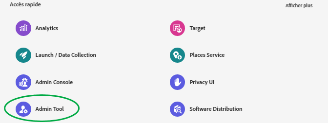
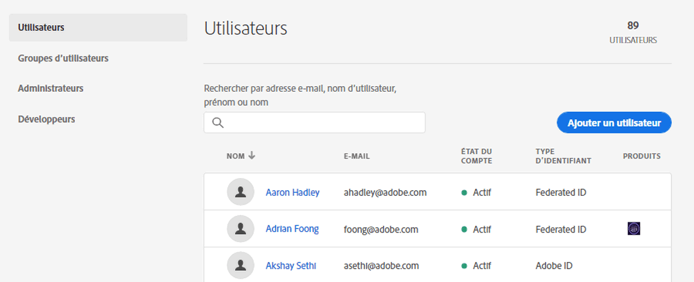
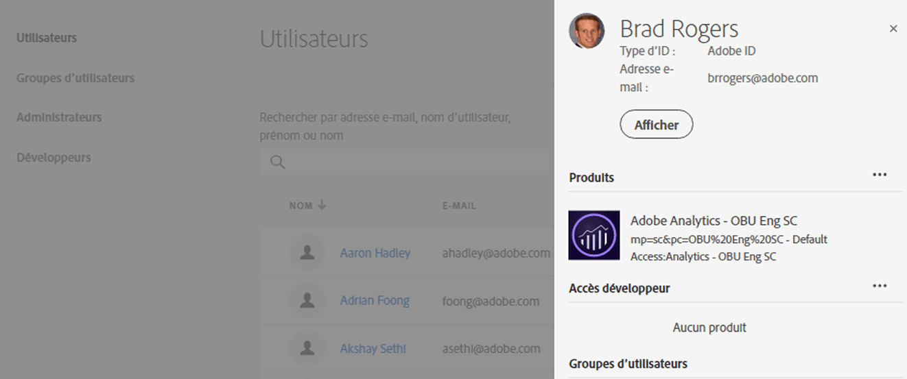
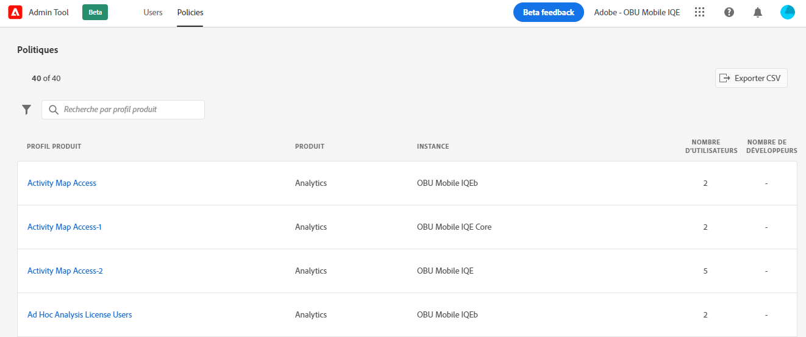
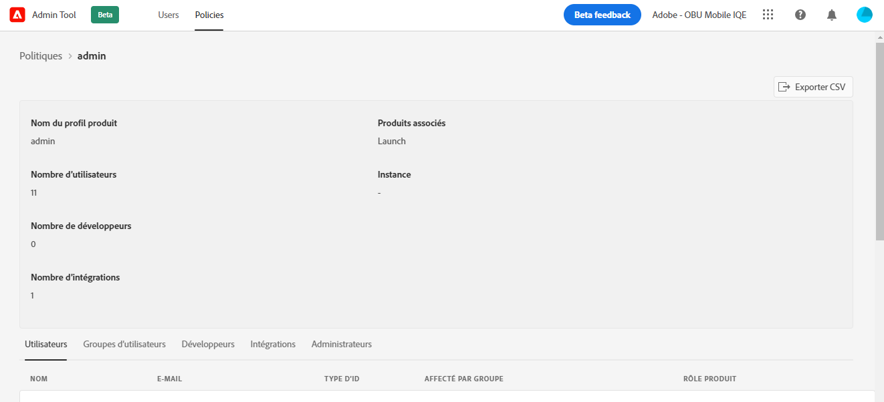

# [!UICONTROL Admin Tool] d’entreprise CX

Les administrateurs peuvent afficher une liste triable et filtrable de tous les utilisateurs et stratégies CX Enterprise avec des détails dans le [!UICONTROL Admin Tool]. Les détails de l’utilisateur incluent l’accès au produit d’un utilisateur, ses rôles et les dernières informations consultées. Les détails de la politique incluent la liste des utilisateurs, des groupes, des développeurs, des intégrations et des administrateurs d’une politique (profil de produit), ainsi que des informations détaillées sur les autorisations et les ressources pour la politique.

1. Connectez-vous à `https://experience.adobe.com/.`

   

1. Sous [!UICONTROL Quick Access], cliquez sur **[!UICONTROL Admin Tool]**.

   (Vous pouvez également remplacer la _page d’accueil_ par _admin_ dans l’URL de la page d’accueil.)

   La page [!UICONTROL Users] s’affiche.

## Page Utilisateurs

Cette page affiche la liste complète des utilisateurs ayant accès à CX Enterprise dans votre entreprise. Il fournit des informations sur les droits d’application et la dernière connexion. Vous pouvez rechercher, trier et filtrer des affichages personnalisés de la liste des utilisateurs.

| Élément | Description |
| --- | ---|
| [!UICONTROL Name] | Prénom et nom de l’utilisateur. Vous pouvez trier cette colonne de A à Z et de Z à A. Cliquez sur le nom d’un utilisateur pour afficher plus de détails sur cet utilisateur. |
| [!UICONTROL Email] | Adresse e-mail associée à l’utilisateur. La colonne peut être triée des manières suivantes : A->Z, Z->A. |
| [!UICONTROL ID Type] | Type d’identité du compte de l’utilisateur. Le filtre peut être appliqué aux types d’ID spécifiques à un affichage. Voir [Gestion des types d’identité](https://helpx.adobe.com/fr/enterprise/using/identity.html) pour plus d’informations. |
| [!UICONTROL Solutions] | Résumé des applications CX Enterprise auxquelles l&#39;utilisateur peut accéder. Vous pouvez appliquer des filtres pour réduire la liste des utilisateurs disposant dʼun accès aux applications spécifiques. |
| [!UICONTROL Last Login] | Heure et date de la dernière connexion de l&#39;utilisateur à CX Enterprise. Cette colonne peut être triée par date ascendante ou descendante.   **Important :** à compter du 13 janvier 2020, les dernières données de connexion d’un utilisateur seront conservées pendant 365 jours. Ces informations sont destinées à afficher l’activité de connexion actuelle dans CX Enterprise et non à recommander une action sur les comptes inactifs avant le 13 janvier 2020. |

## Personnalisation de la vue Liste des utilisateurs et utilisatrices

Vous pouvez rechercher, trier ou filtrer les colonnes pour personnaliser la liste des utilisateurs.

* Recherchez des utilisateurs par nom ou adresse e-mail. Les recherches correspondent à la chaîne de texte que vous saisissez.
* Triez la colonne par valeurs ascendantes ou descendantes. Ce tri s’applique aux [!UICONTROL Email,] [!UICONTROL Name,] et aux colonnes [!UICONTROL Last Login].
* Pour appliquer plusieurs filtres aux utilisateurs de la liste selon des critères spécifiques, cliquez sur **[!UICONTROL Filter By]**. Lorsque plusieurs catégories de filtres sont appliquées, les recherches contiennent Domaine de messagerie `AND` TYPE D’ID `AND` Solution.

| Élément | Description |
| ---------| ----------|
| filtre [!UICONTROL Email Domain] | Recherchez des chaînes de caractères dans la colonne E-mail pour restreindre les résultats à un ou plusieurs domaines. Ajoutez plusieurs filtres en appuyant sur la touche Entrée après chaque terme de recherche. |
| filtre [!UICONTROL ID Type] | Choisissez parmi les types d’ID disponibles. Plusieurs types d’ID peuvent être utilisés comme filtre. |
| filtre [!UICONTROL Solution] | Choisissez parmi les applications disponibles. Plusieurs filtres applicatifs recherchent des résultats contenant la solution 1 `OR` la solution 2. |

## Affichage des informations sur les utilisateurs

Sur la page [!UICONTROL Users], pour afficher les détails d’un utilisateur, cliquez sur son adresse e-mail.

Une vue détaillée de chaque utilisateur affiche des détails importants sur l’accès à l’application de l’utilisateur, les rôles d’administrateur et de produit, ainsi que les dernières informations consultées.

## Section À propos

Cette section présente un résumé du compte d’utilisateur, notamment :

* Avatar et badge d’administration système (le cas échéant) de l’utilisateur
* Nom
* E-mail
* Nom d’utilisateur (les comptes Federated ID peuvent avoir des noms d’utilisateur différents de ceux de l’adresse e-mail)
* [Type d’ID](https://helpx.adobe.com/fr/enterprise/using/identity.html)
* Pays
* Dernière connexion

## Résumé des solutions

Cette section présente un résumé des applications CX Enterprise auxquelles l&#39;utilisateur peut accéder. Inclut le rôle administratif du produit, le cas échéant.

## Liste détaillée d’accès aux produits

Cette section affiche une liste complète de tous les profils d’abonnement de produit pour l’utilisateur ou l’utilisatrice.

| Élément | Description |
| ---------| ----------|
| [!UICONTROL Product] | Nom du produit associé au profil de produits. |
| [!UICONTROL Instance] | Nom de l’instance (telle que la société de connexion ou le client) associée au produit et au profil de produits. |
| [!UICONTROL Product profile] | Nom unique du profil de produits. |
| [!UICONTROL Assigned by Group] | Nom du groupe d’utilisateurs qui associe l’utilisateur à un profil de produits. Les résultats vides indiquent que l’utilisateur a été affecté au profil de produit de manière directe, et non par l’intermédiaire d’un groupe. |
| [!UICONTROL Product Roles] | Affectation de rôle de l’utilisateur dans le profil de produits. Actuellement, ces informations s’appliquent uniquement aux profils de produits Adobe Target. |

## Page Politiques

Cette page affiche la liste complète des stratégies CX Enterprise de votre entreprise. Elle fournit des informations sur les produits, les instances, les utilisateurs et les développeurs. Vous pouvez rechercher, trier et filtrer des affichages personnalisés de la liste des politiques.

| Élément | Description |
| ---| ---|
| [!UICONTROL Product rofile] | Le nom du profil de produits. La colonne peut être triée des manières suivantes : A->Z, Z->A. Pour afficher plus dʼinformations sur la politique, sélectionnez le nom dʼun profil de produit. |
| [!UICONTROL Product] | Le produit associé au profil de produits. La colonne peut être triée des manières suivantes : A->Z, Z->A. |
| [!UICONTROL Instance] | L’instance (par exemple, société de connexion ou client) associée au profil de produit. Les produits qui n’ont pas d’instances ou de clients uniques affichent un « - » comme valeur. La colonne peut être triée des manières suivantes : A->Z, Z->A. |
| [!UICONTROL Number of Users] | Nombre unique d’utilisateurs associés au profil de produits, y compris l’affectation directe et l’affectation de groupe. La colonne peut être triée du plus petit au plus grand ou du plus grand au plus petit. |
| [!UICONTROL Number of Developers] | Nombre de rôles de développeur associés au profil de produits. La colonne peut être triée du plus petit au plus grand ou du plus grand au plus petit. |

## Personnalisation de la vue Liste des politiques

Vous pouvez rechercher, trier ou filtrer les colonnes pour personnaliser la liste des politiques.

* Rechercher les profils de produits par nom. Les recherches correspondent à la chaîne de texte que vous saisissez.
* Triez la colonne par valeurs ascendantes ou descendantes. Ce tri s’applique aux [!UICONTROL product profile,] [!UICONTROL Product,] [!UICONTROL Instance,] [!UICONTROL Number of users,] et [!UICONTROL Number of Developers,] colonnes.
* Cliquez sur l’icône **[!UICONTROL Filter By]** pour appliquer plusieurs filtres afin de répertorier les profils de produit selon des critères spécifiques. Lorsque plusieurs catégories de filtres sont appliquées, les recherches contiennent la solution d’`AND` Instance `AND` associée aux groupes.

| Élément | Description |
| ---------| ----------|
| filtre [!UICONTROL Instance] | Recherchez des chaînes de caractères dans la colonne Instance pour restreindre les résultats à une ou plusieurs instances. Ajoutez plusieurs filtres en appuyant sur la touche Entrée après chaque terme de recherche. |
| filtre [!UICONTROL Solution] | Choisissez parmi les applications disponibles. Plusieurs filtres applicatifs recherchent des résultats contenant la solution 1 `OR` la solution 2. |

## Affichage des détails sur la politique

Sur la page [!UICONTROL Policies], pour afficher les détails d’une politique, sélectionnez le nom du profil de produit.

Une vue détaillée de chaque profil de produit affiche des détails importants sur les sujets du profil de produit (utilisateurs, groupes, etc.). Elle affiche également les autorisations et les ressources activées par le profil de produits.

Les détails du profil du produit peuvent être exportés dans des fichiers CSV. L’option [!UICONTROL Export CSV] génère deux fichiers CSV :

* Détails du sujet (utilisateurs, groupes d’utilisateurs, développeurs, intégrations, administrateurs)
* Autorisations et éléments de ressources

## Section Résumé

Cette section présente un résumé du profil de produits, notamment :

* Nom du profil de produits
* Nombre d’utilisateurs
* Nombre de développeurs
* Nombre d’intégrations
* Produits associés
* Instance

## Liste détaillée des sujets

Cette section présente une liste complète des utilisateurs et utilisatrices, groupes d’utilisateurs et d’utilisatrices, responsables du développement ou de l’intégration et membres de l’administration affectés au profil de produits.

| Tabulation | Description |
| ---------| ----------|
| [!UICONTROL Users] | Liste des utilisateurs inclus dans le profil de produits. L’association de groupes d’utilisateurs apparaît dans [!UICONTROL Assigned by group] colonne. |
| [!UICONTROL User Groups] | Liste des groupes d’utilisateurs associés au profil de produits. |
| [!UICONTROL Developers] | Liste des développeurs associés au profil de produits. |
| [!UICONTROL Integrations] | Liste des intégrations associées au profil de produits. |
| [!UICONTROL Administrators] | Liste des administrateurs associés au profil de produits. |

## Listes détaillées des autorisations et des ressources

Cette section présente une liste complète des autorisations et des ressources disponibles pour le profil de produits. Les autorisations et ressources incluses dans le profil de produit ont été marquées d’un « ✔ ». Les listes d’autorisations et de ressources ont été classées en onglets et en colonnes pour faciliter l’affichage. Les onglets et les colonnes affichent la liste des sections qui s’appliquent au produit actif.

## Informations connexes

* [Gérer les utilisateurs](https://helpx.adobe.com/fr/enterprise/using/users.html) dans le [!DNL Admin Console]
