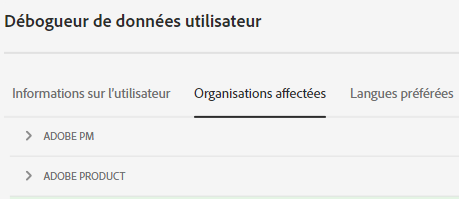
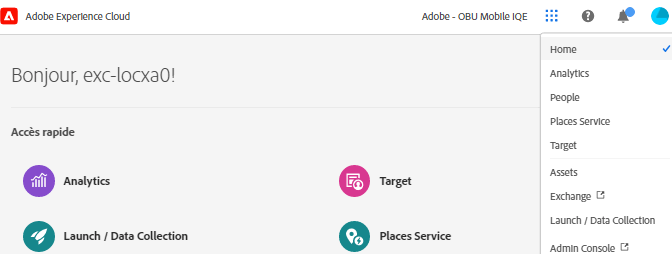
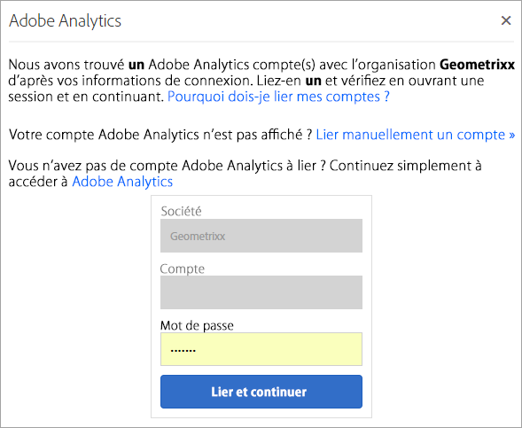

# Liaison d’organisations et de comptes

Un *organisation* (ID d’organisation) est l’entité qui permet à un administrateur de configurer des groupes et des utilisateurs et de contrôler l’authentification unique dans l’entreprise CX.

L&#39;organisation fonctionne comme une société de connexion qui couvre tous les produits et applications CX Enterprise. La plupart du temps, une organisation désigne votre nom de société. Cependant, une société peut avoir plusieurs organisations.

Pour vérifier que vous vous êtes connecté à l’organisation appropriée, cliquez sur **[!UICONTROL Profile]** pour afficher le nom d’organisation par défaut. Si vous avez accès à plusieurs organisations, vous pouvez également afficher et passer à une autre organisation dans la barre d’en-tête.

>[!NOTE]
>
>Le passage d’une organisation à l’autre vous permet d’accéder à Admin Console pour cette organisation spécifique. Si l’organisation souhaitée n’apparaît pas dans la liste, vous devrez peut-être demander l’accès à un administrateur ou une administratrice de cette organisation. (Si vous devez fusionner plusieurs Admin Consoles, contactez le service clientèle d’Adobe pour obtenir de l’aide.)

## Federated ID

Si votre entreprise utilise des Federated ID, CX Enterprise vous permet de vous connecter à l’aide de l’authentification unique de votre entreprise sans avoir à saisir votre adresse e-mail et votre mot de passe. Ajoutez `#/sso:@domain` à l&#39;URL d&#39;entreprise CX (`https://experience.adobe.com`) pour accomplir cette tâche.

Par exemple, pour une organisation avec des Federated ID et le domaine `example.com`, définissez votre lien URL sur `https://experience.adobe.com/#/sso:@example.com`. Vous pouvez également accéder directement à une application spécifique en marquant cette URL avec le chemin de l’application. (Par exemple, pour Adobe Analytics, `https://experience.adobe.com/#/sso:@example.com/analytics`.)

## Afficher l’ID de votre organisation

Vous pouvez localiser l’ID d’organisation affecté à des fins d’assistance. Vous pouvez vérifier que vous vous trouvez dans la bonne organisation ou changer d’organisation à l’aide du sélecteur **[!UICONTROL Organization]** dans l’en-tête.

L’ID d’organisation est l’identifiant associé à votre entreprise CX configurée. Cet identifiant est une chaîne alphanumérique de 24 caractères, suivie de (et qui doit inclure) `@AdobeOrg`.

Vous pouvez afficher votre ID d’organisation ainsi que d’autres informations de compte à l’aide du raccourci clavier **Ctrl+i** depuis n’importe quelle page sur `https://experience.adobe.com`.

**Pour afficher l’ID de votre organisation**

1. Dans [CX Enterprise](https://experience.adobe.com?lang=fr), appuyez sur **Ctrl+i** sur le clavier.

   

1. Sous **[!UICONTROL User Information]**, recherchez **[!UICONTROL Current Org ID]** et vous pouvez localiser l’ID d’organisation.

   Les administrateurs peuvent également se connecter à Admin Console (en accédant à [https://adminconsole.adobe.com](https://adminconsole.adobe.com)) et afficher votre ID d’organisation dans l’URL.

   Par exemple, dans l’URL suivante :

   `https://adminconsole.adobe.com/C538193582390300A495CC9@AdobeOrg/overview`

   L’ID est :

   `C538193582390300A495CC9@AdobeOrg`

## Liaison dʼun compte dʼapplication à un Adobe ID

En règle générale, les administrateurs CX Enterprise accordent l’accès aux applications et services. Dans de rares cas, vous pouvez lier les informations d’identification de l’application à une Adobe ID.

1. Suivez les étapes de votre invitation par e-mail à CX Enterprise.

1. Connectez-vous à l’aide de votre Adobe ID ou de votre Enterprise ID.

1. Cliquez sur le **[!UICONTROL Application selector]** . ( ).

   

   Les applications auxquelles vous avez accès sont indiquées à l’aide d’une couleur.

1. Cliquez sur l’application de votre choix.

   

   Si vous faites partie du groupe approprié (et disposez des autorisations nécessaires pour accéder à lʼapplication), mais nʼavez pas encore lié les informations d’identification de votre compte à votre Adobe ID, ce type de message sʼaffiche.

1. Cliquez sur **[!UICONTROL Link Account]**, puis fournissez vos informations d’identification.

## Spécifier une organisation par défaut

Vous pouvez spécifier une organisation par défaut à utiliser lorsque vous vous connectez.

1. Dans l&#39;en-tête, cliquez sur **[!UICONTROL Profile]**, puis sur Préférences.

1. Sous [!UICONTROL General], sélectionnez une organisation par défaut.

## Résoudre les problèmes de liaison de comptes

Aide pour résoudre les problèmes qui se produisent lors de la liaison de comptes.

En règle générale, la liaison de comptes échoue, car l’Adobe ID est lié à un utilisateur précédent. Lorsque la liaison de comptes échoue, vous pouvez :

* [contacter l’assistance Adobe](https://experienceleague.adobe.com/?support-solution=General&lang=fr#support) ;
* Accédez à votre application à l’aide de la connexion standard pendant la résolution du problème.

