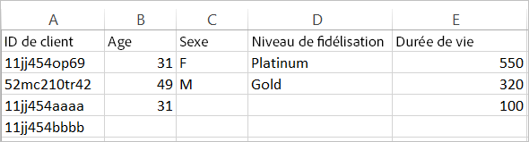

# À propos du fichier de données et des sources de données pour les attributs du client

Exigences en matière de fichiers de données et sources de données multiples pour transférer les attributs du client vers Experience Cloud.

Vous allez devoir accéder à la gestion de la relation client ou à d’autres données du même type de votre société. Les données que vous transférez vers Experience Cloud doivent être regroupées dans un fichier `.csv`. Si vous transférez le fichier par FTP ou sFTP, vous devez également transférer un fichier `.fin`.

La fonction Attributs du client est conçue pour gérer quelques fichiers par jour. Pour atténuer le problème lié au retardement du traitement dû à un grand nombre de petits fichiers, les fichiers envoyés dans les 30 minutes suivant un lot précédent depuis une même organisation sont acheminés vers une file d’attente de priorité inférieure.

## Types de fichiers autorisés et exigences en termes d’attribution de noms {#section_6F64FA02ACCC4215B0862CB6A1821FBF}

<table id="table_C27955F6B52A45B28BEEAAF14FFC86D8"> 
 <thead> 
  <tr> 
   <th colname="col1" class="entry"> Type de fichier </th> 
   <th colname="col2" class="entry"> Description </th> 
  </tr> 
 </thead>
 <tbody> 
  <tr> 
   <td colname="col1"> <p> <span class="filepath"> .csv </span> </p> </td> 
   <td colname="col2"> <p>Fichier de valeurs séparées par des virgules (tels ceux créés dans Excel). Il s’agit du fichier qui contient les données d’attribut du client. </p> <p> <b>Exigences en matière de nommage :</b> assurez-vous que les extensions de nom de fichier ne contiennent pas d’espaces vides. </p> </td> 
  </tr> 
  <tr> 
   <td colname="col1"> <p> <span class="filepath"> .fin </span> </p> </td> 
   <td colname="col2"> <p>(Requis) Le fichier <span class="filepath">.fin</span> indique au système quand le transfert des données est terminé. Le nom du fichier <span class="filepath">.fin</span> doit correspondre au nom du fichier <span class="filepath">.csv</span>. </p> <p>Adobe recommande de créer un fichier texte vide avec une extension <span class="filepath">.fin</span>. Un fichier vide permet de gagner de l’espace et d’accélérer le transfert. </p> <p> <p>Remarque : Il n’est pas possible de renommer le fichier <span class="filepath">.fin</span> après son transfert. Le fichier <span class="filepath">.fin</span> doit être transféré séparément ; il ne peut pas s’agir d’un fichier précédemment transféré et renommé. </p> </p> <p>Après avoir téléchargé le fichier <span class="filepath">.fin</span> via le système FTP des attributs du client, le système extrait rapidement les données (en moins d’une minute). Cette configuration diffère des autres systèmes FTP d’Adobe, qui captent les données moins fréquemment (environ une fois par heure). </p> <p>Le fichier <span class="filepath">.fin</span> n’est pas nécessaire en cas de transfert par glisser-déplacer. </p> </td> 
  </tr> 
  <tr> 
   <td colname="col1"> <p> <span class="filepath"> .gz</span> ou <span class="filepath">.zip </span> </p> </td> 
   <td colname="col2"> <p> <span class="filepath"> .gz</span> (gzip) ou <span class="filepath">.zip</span> – pour les fichiers compressés. Un fichier <span class="filepath">.zip</span> ne peut pas contenir plus d’un fichier dans l’archive. </p> <p> <b>Exigences en termes d’attribution de nom :</b> le nom du fichier <span class="filepath">.zip</span> ou <span class="filepath">.gz</span> doit correspondre au nom du fichier <span class="filepath">.csv</span>. Si, par exemple, votre fichier <span class="filepath">.csv</span> se nomme <span class="filepath">crm_petit.csv</span>, le fichier <span class="filepath">.zip</span> doit se nommer <span class="filepath">crm_petit.csv.zip</span>. </p> <p>Le fichier .fin doit correspondre au fichier .csv. </p> </td> 
  </tr> 
 </tbody> 
</table>

## Conditions requises pour les fichiers de données d’attributs {#section_169FBF5B7BBA47CE825B7A330CF3FE98}

**Exemple de fichier CSV**

Le fichier CSV doit respecter le format suivant :



Le même fichier affiché dans un éditeur de texte :


**Instructions**

<table id="table_A9849CC9AA784763921DE057F0F61515"> 
 <thead> 
  <tr> 
   <th colname="col1" class="entry"> Élément </th> 
   <th colname="col2" class="entry"> Description </th> 
  </tr> 
 </thead>
 <tbody> 
  <tr> 
   <td colname="col1"> <p>Glisser-déposer </p> </td> 
   <td colname="col2"> <p>Le fichier glissé-déposé doit être inférieur à 100 mégaoctets. </p> <p>Le fichier <span class="filepath">.fin</span> n’est pas nécessaire en cas de transfert par glisser-déplacer. </p> </td> 
  </tr> 
  <tr> 
   <td colname="col1"> <p>Colonne d’ID de client </p> </td> 
   <td colname="col2"> <p> La première colonne doit être un ID de client unique. L’ID utilisé doit correspondre à l’ID transmis au service Experience Cloud ID. </p> <p>Pour Analytics, l’ID est stocké dans une prop ou une eVar. </p> <p>Pour Target, il s’agit de la valeur setCustomerID. (Voir <a href="../core-services/core-services.md#section_AD473A6A21C1446498E700363F9A8437" format="dita" scope="local"> Analytics et Adobe Target - Synchronisation de l’ID de client </a>) </p> <p> Cet ID de client est l’identifiant unique utilisé par la gestion de la relation client pour chaque personne de votre base de données. Les autres colonnes contiennent les attributs issus de la gestion de la relation client. Vous choisirez le nombre d’attributs à charger. </p> <p>Il est préférable d’utiliser des noms lisibles et faciles à retenir pour les titres de colonne, mais cela n’est pas obligatoire. Lorsque vous validez le schéma après le chargement, vous pouvez mapper des noms conviviaux aux lignes et colonnes chargées. </p> <p> <b>À propos des ID de client</b> </p> <p>En règle générale, une entreprise utilise un ID de client provenant d’un système de gestion de la relation client. L’ID est défini par l’appel <span class="codeph">setCustomerIDs</span> lorsqu’une personne se connecte. Cet ID sert également de clé dans le fichier de gestion de la relation client qui est transféré vers Experience Cloud. Un <a href="../attributes/t-crs-usecase.md#task_09DAC0F2B76141E491721C1E679AABC8" format="dita" scope="local">ID d’alias</a> est un nom convivial pour un magasin de données dans Audience Manager, où les données d’alias sont stockées. Le système envoie des alias à ce magasin de données (via setCustomerIDs). Le fichier de gestion de la relation client (CRM) est appliqué aux données de ce magasin de données. </p> <p>Pour plus d’informations sur <span class="codeph">setCustomerIDs</span>, voir <a href="https://docs.adobe.com/content/help/fr-FR/id-service/using/reference/authenticated-state.html" format="https" scope="external">ID de client et états d’authentification</a>. </p> </td> 
  </tr> 
  <tr> 
   <td colname="col1"> <p>En-têtes et colonnes suivants </p> </td> 
   <td colname="col2"> <p>Les en-têtes suivants doivent représenter le nom de chaque attribut. </p> <p> Ces colonnes doivent contenir les attributs du client issus de la gestion de la relation client. </p> </td> 
  </tr> 
  <tr> 
   <td colname="col1"> <p>Limites d’attribut </p> </td> 
   <td colname="col2"> <p>Vous pouvez transférer des centaines de colonnes <span class="filepath">.csv</span> vers le service d’attributs du client dans Experience Cloud. Toutefois, lors de la configuration des abonnements et de la sélection des attributs, les restrictions suivantes s’appliquent, selon les solutions que vous détenez : </p> <p> 
     <ul id="ul_2BB85067918D4BB3B59394F3E3E37A6D"> 
      <li id="li_93703988B9934384B4B94A839D028380"> <b>Analytics Standard</b> : 3 au total </li> 
      <li id="li_D1E5E7BD24C54591B14D15DE97447835"> <b>Analytics Premium</b> : 200 par suite de rapports </li> 
      <li id="li_8C891FE3D1EF49FA9F81E2E32CD0B9CA"> <b>Adobe Target Standard :</b> 5 </li> 
      <li id="li_2B66D43023F34EA685CE2C38A9250CEA"> <b>Adobe Target Premium :</b> 200 </li> 
     </ul> </p> </td> 
  </tr> 
  <tr> 
   <td colname="col1"> <p>Limites de ligne </p> </td> 
   <td colname="col2"> <p>Il n’existe aucune limite connue quant au nombre de lignes. </p> </td> 
  </tr> 
  <tr> 
   <td colname="col1"> <p>Limites de colonne </p> </td> 
   <td colname="col2"> <p>Pour des raisons pratiques, limitez le nombre de colonnes à environ 200. </p> </td> 
  </tr> 
  <tr> 
   <td colname="col1"> <p>Limites de caractères </p> </td> 
   <td colname="col2"> <p>Lors de la création d’un abonnement Analytics, la longueur des champs des fichiers chargés est tronquée à 255. </p> </td> 
  </tr> 
  <tr> 
   <td colname="col1"> <p>Instructions et limites de taille FTP </p> </td> 
   <td colname="col2"> <p> 
     <ul id="ul_E157EE6F98914EADA0C103D1D1E705D3"> 
      <li id="li_84FBD455DD164A28AC16F4A5AB19E4B3">Pour chaque transfert par FTP, le fichier ne doit pas dépasser 4 Go. </li> 
      <li>Pour chaque transfert, la limite de la taille minimale de fichier est de 10 Mo. </li>
      <li>Vous pouvez télécharger un fichier toutes les demi-heures. </li>
      <li id="li_B69A20C51D824727AA99C1F6F78537A4"> Déposez de préférence vos fichiers <span class="filepath">.csv</span> et <span class="filepath">.fin</span> dans le dossier racine du site FTP. </li> 
     </ul> </p> <p> <p>Important : l’espace total autorisé pour le compte FTP est de 40 Go. Il est de votre responsabilité de supprimer les fichiers traités. </p> </p> </td> 
  </tr> 
  <tr> 
   <td colname="col1"> <p>Exigences relatives aux fichiers </p> </td> 
   <td colname="col2"> <p> Chaque source d’attribut doit contenir le même nombre de champs séparés par des virgules. </p> <p> Les champs contenant un saut de ligne, un guillemet double ou des virgules doivent être placés entre guillemets. </p> <p> Les guillemets doubles d’un champ doivent être précédés d’une séquence d’échappement à l’aide d’une barre oblique inverse (\). </p> <p> Les colonnes vierges sont stockées comme <span class="term">valeur nulle</span>. </p> </td> 
  </tr> 
  <tr> 
   <td colname="col1"> <p>Fichiers multiples </p> </td> 
   <td colname="col2"> <p>Lors du transfert des données d’attributs du client, si vous souhaitez transférer plusieurs fichiers en succession rapide, en particulier si les fichiers sont volumineux, vérifiez que le fichier précédent a été traité avant de télécharger le fichier suivant. Vous pouvez vous en assurer en vérifiant le moment où le fichier précédent a été déplacé vers le dossier traité ou en échec dans votre compte FTP d’attributs du client. </p> <p> Le fait de diviser un fichier volumineux en fichiers plus petits et de les envoyer rapidement peut ralentir le traitement, sauf si vous pouvez vérifier que chaque fichier est complètement traité avant d’envoyer le suivant. </p> </td> 
  </tr> 
  <tr> 
   <td colname="col1"> <p>Encodage des caractères </p> </td> 
   <td colname="col2"> <p>Pour le Japon, l’UTF-8 est obligatoire. </p> </td> 
  </tr> 
   <tr> 
   <td colname="col1"> <p>Données historiques </p> </td> 
   <td colname="col2"> <p> Les attributs du client sont liés au profil du visiteur sous-jacent dans Analytics. Ainsi, les attributs du client sont associés au visiteur pendant toute la durée de vie de ce profil du visiteur dans Analytics. Cela inclut le phénomène qui s’est produit avant la première connexion du client. </p> <p> Si vous utilisez la méthode de renvoi de l’entrepôt de données, les données sont liées à un post_visid_high/low qui repose sur l’Analytics ID (AID). Si vous utilisez le service Experience Cloud ID, les données sont liées à un post_visid_high/low basé sur Experience Cloud ID (MID). </p> </td> 
  </tr> 
  <tr> 
   <td colname="col1"> <p>Flux de données </p> </td> 
   <td colname="col2"> <p>Les attributs du client ne sont pas disponibles dans les flux de données. </p> </td> 
  </tr> 
 </tbody> 
</table>

## Utilisation de plusieurs sources de données {#section_76DEB6001C614F4DB8BCC3E5D05088CB}

Lorsque vous créez, modifiez ou supprimez une source d’attributs du client, la synchronisation des ID avec la nouvelle source de données peut prendre jusqu’à une heure.

L’ID d’alias de chaque source d’attributs du client doit être unique. Si plusieurs sources de données utilisent le même ID, elles doivent être configurées comme suit :

**Dans VisitorAPI.js ou l’outil Experience Cloud ID de Dynamic Tag Management :**

Définissez deux ID de client qui correspondent aux sources de données adéquates :

```
Visitor.setCustomerIDs({ 
     "ds_id1”:"123456", 
     "ds_id2":"123456" 
});
```

(Pour plus d’informations, voir [ID de client et états de l’authentification.)](https://docs.adobe.com/content/help/fr-FR/id-service/using/reference/authenticated-state.html)

Dans **[!UICONTROL Experience Cloud]** > **[!UICONTROL Personnes]** > **[!UICONTROL Attributs du client]** :

Créez deux sources d’attributs du client à l’aide d’ID d’alias uniques correspondant aux ID de client ci-dessus. L’utilisation de cette méthode permet l’envoi du même ID de référence à plusieurs sources d’attributs du client.
