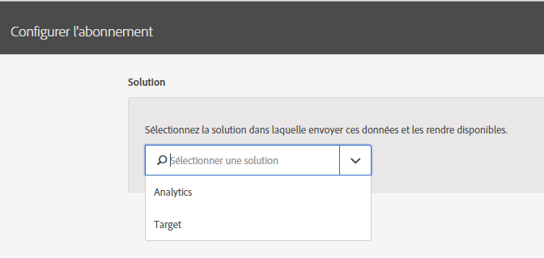

# Configuration des abonnements

Découvrez les sources de données des solutions et comment configurer les abonnements. Les abonnements permettent d’établir le flux de données d’attributs du client entre Experience Cloud et les solutions (Analytics et Target).

Un abonnement à Adobe Analytics permet par exemple d’activer les données dans les rapports. Si vous utilisez Adobe Target, vous pouvez télécharger les attributs de client pour le ciblage et la segmentation.

**[!UICONTROL Sources d’attributs cliente]** &gt; **[!UICONTROL Créer une source d’attributs cliente]** &gt; **[!UICONTROL Nouveau]**

| Élément | Description |
|--- |--- |
| Solution | **Adobe Analytics** Sélectionnez Analytics, spécifiez les suites de rapports destinées à recevoir les données d’attribut, ainsi que les attributs à inclure. **Adobe Target** Vous pouvez télécharger des attributs de client pour le ciblage et la segmentation. Cette fonctionnalité est utile si vous souhaitez cibler un test sur la base de données d’attribut, ou rendre les données disponibles pour la segmentation dans Analytics. Les données d’attribut du client chargées pour un visiteur sont disponibles lors de la connexion dans Target &gt; Audiences. Plusieurs sources de données sont prises en charge. Lorsque vous [définissez des ID client](../core-services/core-services.md) sur votre site web, vérifiez qu’au moins un des alias est abonné à Target. |
| Suite de rapports (Analytics) | Suites de rapports issues d’Analytics. Vous ne pouvez pas ajouter plus de 10 suites de rapports aux abonnements Analytics au sein d’une même source d’attributs. Au moment de choisir quelles suites de rapports vous souhaitez inclure, tenez compte des suggestions suivantes :<ul><li>Choisissez des suites de rapports ayant un jeu commun de clients authentifiés. Si les clients authentifiés dans une suite de rapports diffèrent des clients authentifiés dans une autre suite de rapports, séparez chacune d’elles dans des sources d’attributs distinctes.</li><li>Si possible, le volume du trafic doit être le même dans les suites de rapports incluses dans une source d’attributs.</li></ul> Si vous détenez plus de dix suites de rapports avec un jeu commun de clients authentifiés, vous pouvez configurer d’autres sources d’attributs du client, chacune d’elles pouvant contenir jusqu’à dix suites de rapports. |
| Attributs à inclure (Analytics et Target) | Attributs que vous souhaitez envoyer à la solution. Lors de la configuration des abonnements et de la sélection des attributs, les restrictions suivantes s’appliquent, selon les solutions que vous détenez :<ul><li>Foundation : 0</li><li>Select : 3</li><li>Prime : 15</li><li>Ultimate : 200</li><li>Standard : 3 au total</li><li>Premium : 200 par suite de rapports</li><li>Target Standard : 5</li><li>Target Premium : 200</li></ul> **Remarque :** Lorsque vous effectuez la mise à niveau vers Analytics Premium, un délai de 24 heures est nécessaire avant que des attributs supplémentaires soient disponibles. Il se peut que l’erreur Nombre maximal d’abonnements des attributs s’affiche durant ce délai. |
