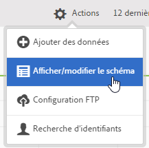
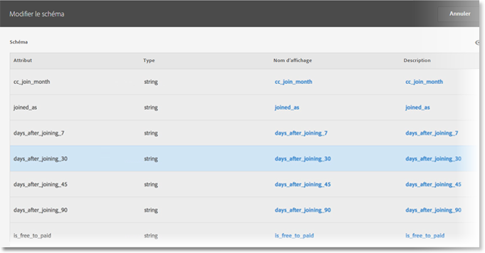

# Validation du schéma

Le processus de validation permet de mapper les noms affichés et les descriptions aux attributs transférés (chaînes, nombres entiers, numéros, etc.). Un schéma est créé d’après ces paramètres. Il permet de valider toutes les données transférées par la suite vers cette source de données. Ce processus de mappage ne modifie pas les données d’origine.

>[!NOTE]
>
>La mise à jour du schéma après validation supprime les attributs du client. Voir [Mise à jour du schéma (supprime également les attributs)](../attributes/t-crs-usecase.md#task_6568898BB7C44A42ABFB86532B89063C).

**[!UICONTROL Source]** d’attributs cliente > **[!UICONTROL Créer une source]** d’attributs cliente > **[!UICONTROL Vue/Modifier le Schéma]**

Sur la page [!UICONTROL Valider le schéma], chaque ligne du schéma représente une colonne du fichier CSV transféré.

* **[!UICONTROL Ajouter des données :]** téléchargez de nouvelles données d’attribut vers cette source de données.

* **[!UICONTROL Afficher/modifier le schéma :]** mappez des noms d’affichage aux données d’attribut, comme décrit à l’étape suivante.

* **[!UICONTROL Configuration FTP :]**[ téléchargez les données par FTP](../attributes/t-upload-attributes-ftp.md#task_591C3B6733424718A62453D2F8ADF73B).

* **[!UICONTROL Recherche d’identifiants :]** entrez un ID de client (CID) issu du fichier `.csv` pour rechercher les informations Experience Cloud relatives à cet identifiant. Cette fonction s’avère utile pour résoudre les problèmes de non-affichage des données d’attribut d’un visiteur :

   * **[!UICONTROL ECID (Experience Cloud ID) :]** S’affiche si vous utilisez le dernier service d’identification d’Experience Cloud. Si vous avez souscrit au service MCID, mais qu’aucun identifiant n’est répertorié ici, cela signifie qu’Experience Cloud n’a reçu aucun alias pour cet ID de client. En d’autres termes, le visiteur n’a pas encore ouvert de session ou votre mise en œuvre ne transmet pas cet identifiant.

   * **[!UICONTROL ID de client (CID) :]** attributs associés à cet ID de client. Si vous utilisez une prop ou une eVar pour transférer les ID de client (AVID) et que les attributs sont affichés, mais pas les identifiants AVID, cela signifie que le visiteur n’a pas encore ouvert de session sur votre site.

   * **[!UICONTROL Identifiant de visiteur Analytics (AVID) :]** s’affiche si vous utilisez une prop ou une eVar pour le transfert des ID de client. Si ces identifiants sont transmis à Experience Cloud, tous les identifiants de visiteur associés à l’ID de client que vous avez entré s’affichent ici.

Vous pouvez également transférer les données par FTP après avoir créé une source d’attributs du client et un compte FTP dans Experience Cloud. Créez un compte FTP par source d’attributs. Les fichiers transférés sont stockés dans le dossier racine de ce compte. Les données doivent être au format .csv, avec un second fichier .fin pour indiquer que le transfert est terminé.

Les noms que vous appliquez aux chaînes, aux nombres entiers et aux numéros servent à créer des mesures [!DNL Analytics]. Pour plus d’informations, voir Rapport [Attributs](https://docs.adobe.com/help/en/analytics/components/variables/dimensions-reports/reports-customer-attributes.html) du client dans [!DNL Analytics] l’aide.

* **[!UICONTROL Attribut :]** données d’attribut lues à partir du fichier `.csv` transféré.

* **[!UICONTROL Type :]** type de données, par exemple :

   * **Chaîne :** Séquence de caractères.

   * **Entiers :** Des nombres entiers.

   * **Nombres :** Peut contenir jusqu’à deux décimales.

* **[!UICONTROL Nom d’affichage :]** nom convivial de l’attribut. Par exemple, vous pouvez changer l’attribut *âge du client* en *Client depuis*.

* **[!UICONTROL Description :]** description conviviale de l’attribut.
