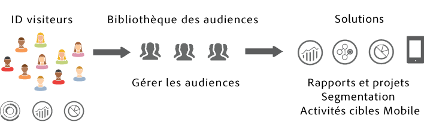
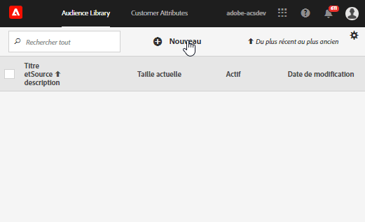

# Audiences Experience Cloud {#topic_679810123CAA4E0CA4FA3417FB0100C7}

Les audiences sont des collections de visiteurs (une liste d’identifiants visiteur). La bibliothèque d’audiences d’Adobe vous permet de gérer la traduction des données de visiteur en segmentation de l’audience. Ainsi, la création et la gestion d’audiences est similaire à la création et à l’utilisation de segments. Vous pouvez également partager les segments ciblés avec des produits et services dans [!DNL Experience Cloud].

Les audiences peuvent être créées ou dérivées à partir de diverses sources, par exemple :

* Nouvelles audiences créées dans [!DNL Experience Cloud]
* [!DNL Analytics] segments publiés dans [!DNL Experience Cloud]
* [!DNL Audience Manager]

**Audiences en temps réel et historiques**

Toutes les audiences, quelle que soit leur origine, sont accessibles pour un ciblage en temps réel. Toutefois, les audiences partagées à partir d’Analytics vers Audience Manager ne sont pas accessibles pour le ciblage en temps réel. Le système évalue les audiences de deux manières :

* Les audiences historiques d’Analytics sont évaluées toutes les quatre heures. Le temps total de traitement et de partage prend jusqu’à huit heures. Les audiences historiques incluent toujours les visiteurs récurrents.
* Les audiences en temps réel sont issues des audiences Experience Cloud et évaluées en temps réel.

## Utilisation des audiences par les solutions {#concept_01EB9345C5344597BC94A864EDD38EE1}

Le tableau suivant décrit l’utilisation des audiences dans les solutions Experience Cloud :

| Solution | Description |
|--- |--- |
| Audiences Experience Cloud | Créez, gérez et partagez des audiences de manière native à l’aide de l’interface [Bibliothèque d’audiences](audience-library.md). Vous pouvez :<ul><li>utiliser des audiences en temps réel à l’aide d’attributs Analytics bruts.</li><li>combiner des audiences pour en créer des composites, en associant les données en temps réel aux données historiques.</li><li>afficher des vues graphiques de la taille estimée des audiences.</li></ul> Pour obtenir des suggestions sur le type d’audience à créer, voir : [Audiences Experience Cloud](https://experienceleague.adobe.com/docs/experience-cloud-kcs/kbarticles/KA-16471.html?lang=en). |
| Analytics | Dans la segmentation, vous pouvez créer un segment, le combiner avec une suite de rapports, puis le publier dans Experience Cloud. La publication du segment l’affiche sur la page [!UICONTROL Bibliothèque d’Audiences] dans Experience Cloud. (Voir [Publication de segments dans Experience Cloud](https://experienceleague.adobe.com/docs/analytics/components/segmentation/segmentation-workflow/seg-publish.html?lang=en) dans l’aide d’Analytics pour en savoir plus.) L’audience est également disponible en tant qu’audience ciblée pour un contenu de campagne fourni par Adobe Target et dans Audience Manager. Une fois que vous avez partagé une audience à partir d’Adobe Analytics et que vous l’avez sélectionnée pour l’utiliser dans une principale campagne, les profils du visiteur répondant aux critères de définition du segment pour les 90 derniers jours sont envoyés à [!UICONTROL Services d’audience]. La limite pour les audiences partagées a été portée à 75. Les audiences partagées avec Experience Cloud depuis Analytics ne doivent pas dépasser 20 millions de membres uniques. De plus, en raison de la mise en cache, les suites de rapports supprimées dans Analytics ne disparaîtront pas d’Experience Cloud avant 12 heures. |
| Mobile Services | Analysez le trafic mobile à l’aide de la visualisation radiale dans le rapport [!UICONTROL Types d’appareils]. |
| [!DNL Target] | Le [service d’ID](https://experienceleague.adobe.com/docs/id-service/using/home.html?lang=fr) regroupe les ID de visiteur et les données dans un profil exploitable unique pouvant être utilisé dans plusieurs solutions différentes. La fonction [Publier dans Experience Cloud](audience-library.md), qui s’affiche pendant le processus de création d’un segment dans Adobe Analytics, rend le segment disponible dans la bibliothèque d’audiences personnalisées d’Adobe Target. Un segment créé dans Analytics ou dans Audience Manager peut être utilisé pour des activités dans [!DNL Target]. Vous pouvez par exemple créer des activités de campagne d’après les mesures de conversion d’[!DNL Analytics] et les segments d’audience créés dans [!DNL Analytics]. |
| Audience Manager | Les audiences partagées sont disponibles dans la segmentation Audience Manager. Toutes les audiences Experience Cloud sont disponibles de manière native dans Audience Manager, qui permet ce qui suit :<ul><li>Automatisation intégrée relative à la façon dont elles sont partagées et consommées dans les workflows de solution</li><li>Destinations hors site</li><li>Modélisation analogue</li></ul> |
| Campaign | <ul><li>Importer les audiences partagées de différentes solutions Adobe Experience Cloud dans Adobe Campaign.</li><li>Exporter les listes de destinataires sous la forme d’audiences partagées. Ces audiences partagées peuvent être utilisées dans les différentes solutions Adobe Experience Cloud que vous utilisez.</li></ul> |
| Advertising Cloud | Utilisez l’audience comme cibles. |

{style=&quot;table-layout:auto&quot;}

>[!IMPORTANT]
>
>Une fois qu’un visiteur se qualifie pour l’audience partagée depuis Analytics, un délai de 4 à 8 heures est nécessaire avant que les informations soient exploitables dans [!DNL Target], Ad Cloud et Campaign Standard.

## Plus d’aide : questions, conseils et cas d’utilisation {#section_C7F151644D8A45F7B6FC54F58845635D}

| Aide avec | Ressource |
|--- |--- |
| Audiences introuvables ? | Vérifiez que des privilèges d’accès vous ont été attribués. Voir [Prise en main - Activation de vos solutions pour les services principaux](core-services.md). Cliquez [ici](https://adobe.allegiancetech.com/cgi-bin/qwebcorporate.dll?idx=X8SVES) pour demander l’accès au service principal Profils et audiences (formulaire de configuration des intégrations). |
| Cas d’utilisation | Pour plus d’informations sur la solution à utiliser, consultez [Options de création d’audiences](https://experienceleague.adobe.com/docs/experience-cloud-kcs/kbarticles/KA-16471.html?lang=en) dans la base de connaissances. |
| Forum | Le [forum Audiences](https://experienceleaguecommunities.adobe.com/t5/Adobe-Experience-Cloud-Audiences/ct-p/experience-cloud-audiences-community) est une autre ressource pour obtenir de l’aide sur les audiences. |

{style=&quot;table-layout:auto&quot;}

## Éléments de l’interface de la bibliothèque d’audiences {#section_D04ACEF61CEF4B189AE6BA9F40D0DBF4}

[!DNL Experience Cloud] fournit une bibliothèque pour la création et la gestion des audiences, avec une identification d’audience native en temps réel.

**[!UICONTROL Experience Cloud]** > **[!UICONTROL Experience Platform]** > **[!UICONTROL Personnes]** > **[!UICONTROL Bibliothèque d’audiences]**

| Élément | Description |
|--- |--- |
| Nouveau | [Création d’une audience](audience-library.md). |
| Titre et description | En-tête de colonne qui identifie et décrit l’audience. |
| Auteur | Personne qui a créé le segment d’audience. |
| Source | Identifie l’emplacement où l’audience a été créée.<ul><li>**Analytics :** segment créé dans Adobe Analytics, puis [publié dans Experience Cloud](audience-library.md).</li><li>**Experience Cloud :** nouvelle audience [créée dans la page Audiences Experience Cloud](audience-library.md).</li><li>**Audience Manager :** les audiences créées par Audience Manager s’affichent automatiquement dans la page Audiences Experience Cloud.</li></ul> |
| Taille actuelle | Taille actuelle de l’audience. |
| Actif | État actif du segment. |

{style=&quot;table-layout:auto&quot;}
