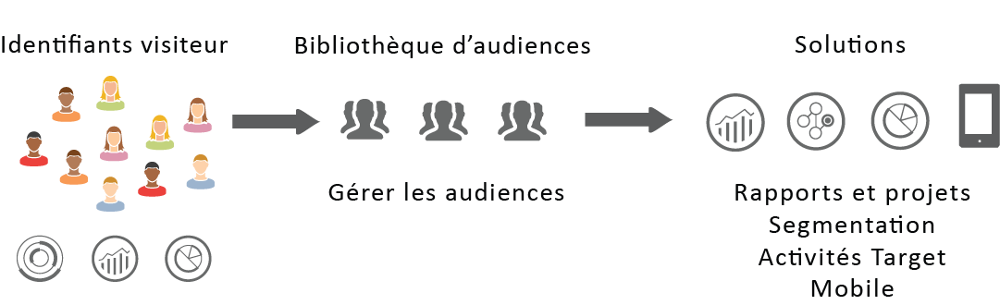
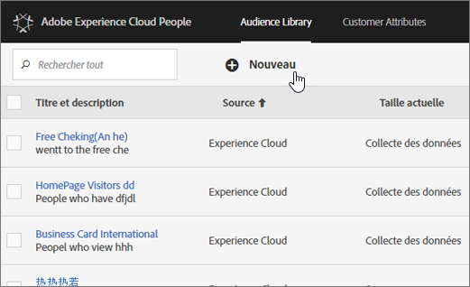

# Audiences {#topic_679810123CAA4E0CA4FA3417FB0100C7}

Les audiences sont des collections de visiteurs (une liste d’identifiants visiteur). Les services d’audience d’Adobe gèrent la conversion des données de visiteur en segmentation de l’audience. Ainsi, la création et la gestion des audiences sont similaires à la création et à l’utilisation de segments, avec la possibilité de partager les segments d’audience dans [!DNL Experience Cloud].

Les audiences peuvent être créées ou dérivées à partir de diverses sources, par exemple :

* Nouvelles audiences créées dans [!DNL Experience Cloud]
* Segments [!DNL Analytics] publiés dans [!DNL Experience Cloud]
* De [!DNL Audience Manager]

**Audiences en temps réel et historiques**

Toutes les audiences, quelle que soit leur origine, sont accessibles pour un ciblage en temps réel. Toutefois, les audiences partagées à partir d’Analytics vers Audience Manager ne sont pas accessibles pour le ciblage en temps réel. Le système évalue   de deux manières :

* Les  historiques  d’Analytics sont évalués toutes les 4 heures. Le temps total de traitement et de partage peut prendre jusqu&#39;à 8 heures.  Les  historiques  toujours les de retour.
* Les audiences en temps réel sont issues des audiences Experience Cloud et évaluées en temps réel.

## Utilisation des audiences par les solutions {#concept_01EB9345C5344597BC94A864EDD38EE1}

Le tableau suivant décrit l’utilisation des  de  dans les solutions Experience Cloud :

| Solution | Description |
|--- |--- |
| Audiences Experience Cloud | Créez, gérez et partagez des audiences de manière native à l’aide de l’interface [Bibliothèque d’audiences](../audience-library/audience-library.md). Vous pouvez :<ul><li>Utiliser des  en temps réel  à l’aide d’attributs d’analyse bruts</li><li>Combiner   de pour créer des données composites, en associant des données en temps réel et historiques</li><li>Voir les  graphiques de la taille estimée </li></ul> Pour obtenir des suggestions sur le type de   que vous souhaitez créer, voir : [Experience Cloud](https://helpx.adobe.com/marketing-cloud-core/kb/People/Audience-Creation-Options.html). |
| Analytics | Dans la segmentation, vous pouvez créer un segment, le combiner avec une suite de rapports, puis le [publier dans Experience Cloud](../audience-library/audience-library.md). La publication du segment l’affiche sur la page [Audiences](../audience-library/audience-library.md). L’audience est également disponible en tant qu’audience ciblée pour un contenu de campagne fourni par Adobe Target et dans Audience Manager. Once an audience is shared from Analytics, and selected for use in an active campaign, all the visitor profiles who met the segment definition criteria for the past 90 days are sent to the Experience Cloud [!UICONTROL Audience Services] platform. La limite pour les  partagés a été augmentée à 75. Les audiences partagées avec Experience Cloud depuis Analytics ne doivent pas dépasser 20 millions de membres. En outre, en raison de la mise en cache, les suites de rapports supprimées dans Analytics nécessitent 12 heures avant que la suppression ne s’affiche dans Experience Cloud. |
| Mobile Services | Analysez le trafic mobile à l’aide de la visualisation de l’écran solaire dans le rapport Types de [!UICONTROL périphériques] . |
| [!DNL Target] | The [ID service](https://docs.adobe.com/content/help/en/id-service/using/home.html) unifies visitor IDs and data into a single, actionable profile for use across solutions. La fonction [Publier dans Experience Cloud](../audience-library/audience-library.md), qui s’affiche pendant le processus de création d’un segment dans Adobe Analytics, rend le segment disponible dans la bibliothèque d’audiences personnalisées d’Adobe Target. Un segment créé dans Analytics ou dans Audience Manager peut être utilisé pour des activités dans  [!DNL Target].  Vous pouvez par exemple créer des activités de campagne d’après les mesures de conversion d’Analytics et les segments d’audience créés dans Analytics. |
| Audience Manager | Les audiences partagées sont disponibles dans la segmentation Audience Manager. Toutes les audiences Experience Cloud sont disponibles de manière native dans Audience Manager, qui permet ce qui suit :<ul><li>Automatisation intégrée concernant la manière dont ils sont partagés et consommés dans le de solutions </li><li>Destinations hors site</li><li>Modélisation identique</li></ul> |
| Campaign | <ul><li>Importer les audiences partagées de différentes solutions Adobe Experience Cloud dans Adobe Campaign.</li><li>Exporter les listes de destinataires sous la forme d’audiences partagées. Ces  partagées  peuvent être utilisées dans les différentes solutions Adobe Experience Cloud que vous utilisez.</li></ul> |
| Media Optimizer | Utilisez le   comme . |

>[!IMPORTANT]
>
>Once a visitor qualifies for the audience shared from Analytics, there is a 4-8 hour delay before that information is actionable in [!DNL Target], Ad Cloud, and Campaign Standard.

## Plus d’aide : questions, conseils et cas d’utilisation {#section_C7F151644D8A45F7B6FC54F58845635D}

| Aide avec | Ressource |
|--- |--- |
| Impossible de trouver   ? | Vérifiez que des privilèges d’accès vous ont été attribués. Voir [Prise en main - Activation de vos solutions pour les services principaux](../core-services/core-services.md). Cliquez [ici](https://www.adobe.com/go/audiences) pour demander l&#39;accès aux  de et aux  de (formulaire de configuration des intégrations). |
| Cas d’utilisation | Pour plus d’informations sur la solution à utiliser, consultez la section Options [de création de  de](https://helpx.adobe.com/marketing-cloud-core/kb/People/Audience-Creation-Options.html) dans la base de connaissances. |
| Forum | The [Audiences forum](https://forums.adobe.com/community/experience-cloud/platform/core-services/people-service/audiences) is an additional resource to get help with audiences. |

## Éléments de l’interface de la bibliothèque d’audiences {#section_D04ACEF61CEF4B189AE6BA9F40D0DBF4}

[!DNL Experience Cloud] fournit une bibliothèque pour la création et la gestion des audiences, avec une identification d’audience native en temps réel.

**[!UICONTROL Experience Cloud]** > **[!UICONTROL Experience Platform]** > **[!UICONTROL Personnes]** > **[!UICONTROL bibliothèque  de]**

| Elément | Description |
|--- |--- |
| Nouveau | [Création d’une audience](../audience-library/audience-library.md). |
| Titre et description | En-tête de colonne qui identifie et décrit l’audience. |
| Auteur | Personne qui a créé le segment  . |
| Source | Identifie l’emplacement de création du  de .<ul><li>**Analytics :** segment créé dans reports &amp; analytics ou ad hoc analysis, puis [publié dans Experience Cloud](../audience-library/audience-library.md).</li><li>**Experience Cloud :** nouvelle audience [créée dans la page Audiences Experience Cloud](../audience-library/audience-library.md).</li><li>**Audience Manager :** les audiences créées par Audience Manager s’affichent automatiquement dans la page Audiences Experience Cloud.</li></ul> |
| Taille actuelle | Taille  du  actuel. |
| Actif | Statut actif du segment. |
