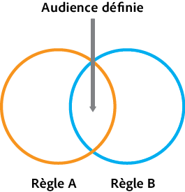
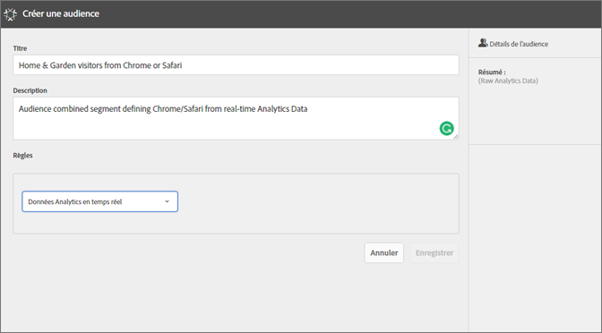
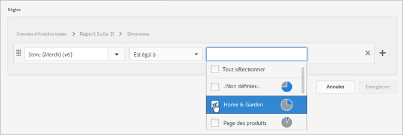
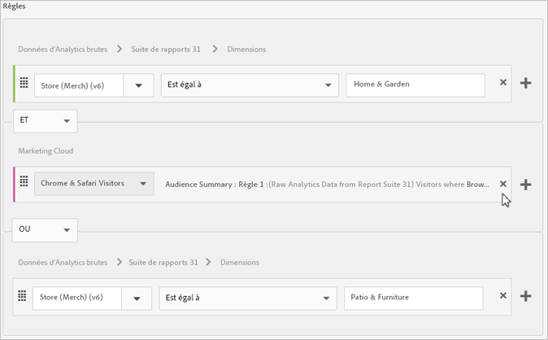
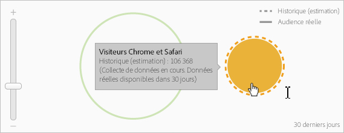

# Création d’une audience

Découvrez comment utiliser les règles d’attributs pour créer une audience et définir une audience composite dans Experience Cloud.

Cet article vous aidera à accomplir ce qui suit :

* Création d’une audience
* Création d’une règle
* Utilisation de règles pour définir une audience composite

L’illustration ci-après représente deux règles dans une audience composite.

Chaque cercle représente une règle qui définit l’adhésion à l’audience. Les visiteurs pouvant être membres dans les deux règles d’audience se confondent pour former une audience définie composite.

>[!NOTE]
>
>L&#39;audience est entièrement définie une fois la collecte de données terminée pour la période spécifiée.
L’exemple suivant explique comment créer des règles pour une audience composite. L’audience se compose comme suit :

* Section Home &amp; Garden (Maison et jardin) dérivée des données de la page ou des données d’Analytics brutes.
* Utilisateurs Chrome et Safari dérivés d&#39;un [!DNL Adobe Analytics] segment [publié](../audience-library/audience-library.md#task_32FEEFE0B32E4E388CD4D892D727282A) sur [!DNL Experience Cloud]le

   

1. Dans [!DNL Experience Cloud]la, cliquez **[!UICONTROL sur Personnes]** &gt; **[!UICONTROL Bibliothèque d&#39;audiences]**.
1. Dans la page [!UICONTROL Audiences]**, cliquez sur[!UICONTROL Nouveau]**. 

1. Dans la page [!UICONTROL Créer une audience], fournissez un titre et une description.
1. Sous [!UICONTROL Règles], sélectionnez une source d’attribut : 

* **[!UICONTROL Données Analytics en temps réel :]** (ou données brutes) ces données d’attributs provenant de demandes d’images Analytics en temps réel incluent des données telles que des eVars et des événements. Lorsque vous utilisez cette source d’attribut, vous devez sélectionner une suite de rapports et définir la dimension ou l’événement à inclure. Cette sélection de suite de rapports fournit la structure de variable utilisée par la suite de rapports.

   >[!NOTE]
   >
   >En raison de la mise en cache, les suites de rapports supprimées dans Analytics nécessitent 12 heures avant que la suppression ne s&#39;affiche dans Experience Cloud.

* **[!UICONTROL Experience Cloud :]** Données d&#39;attribut provenant des [!DNL Experience Cloud] sources. Il peut, par exemple, s’agir de données de segments d’audience que vous créez dans [!DNL Analytics], ou de données d’[!DNL Audience Manager].

1. Définissez des règles d’audience.

>[!NOTE]
>
>Vous devez comprendre les variables de mise en œuvre lors de la définition de règles d&#39;audience.

Sous [!UICONTROL Règles], définissez les sélections *`Home & Garden`* d&#39;attributs :

* **[!UICONTROL Source d’attribut :]** données Analytics brutes
* **[!UICONTROL Suite de rapports :]** suite de rapports 31
* Dimension = **[!UICONTROL Magasin (Merch) (v 6)]** &gt; **[!UICONTROL Egal]** &gt; **[!UICONTROL Maison et jardin]**

   

   Les visiteurs *Chrome et Safari* sont un segment d&#39;audience partagé à partir d&#39;Analytics :

* **[!UICONTROL Source d’attribut :]** Experience Cloud
* **[!UICONTROL Dimension :]** visiteurs Chrome et Safari

   

   Pour comparaison, vous pouvez ajouter une *règle OU* pour afficher tous les visiteurs d&#39;une section de site, comme Patio et meubles.

   

1. Visualisez les résultats.

La règle obtenue est une audience définie composée des utilisateurs Chrome et Safari ayant visité Home &amp; Garden (Maison et jardin). Le segment Patio et meubles donne des informations supplémentaires sur tous les visiteurs qui accèdent à cette section du site.

**Historique (estimation) :** (Cercle en pointillé) représente les règles créées en fonction des données [!DNL Analytics].

**Audience réelle :** (cercle plein) règle créée qui possède 30 jours de données d’Audience Manager. Lorsque les données d’Audience Manager ont 30 jours, le trait devient plein et représente les chiffres réels.

Une fois la collection des données terminée pour la période spécifiée, les cercles se combinent pour montrer une audience définie.

1. Après avoir défini les règles, cliquez **[!UICONTROL sur Enregistrer]**.

Une fois l’audience enregistrée, elle est disponible pour les autres solutions. Par exemple, vous pouvez inclure une audience partagée dans une activité Target.
