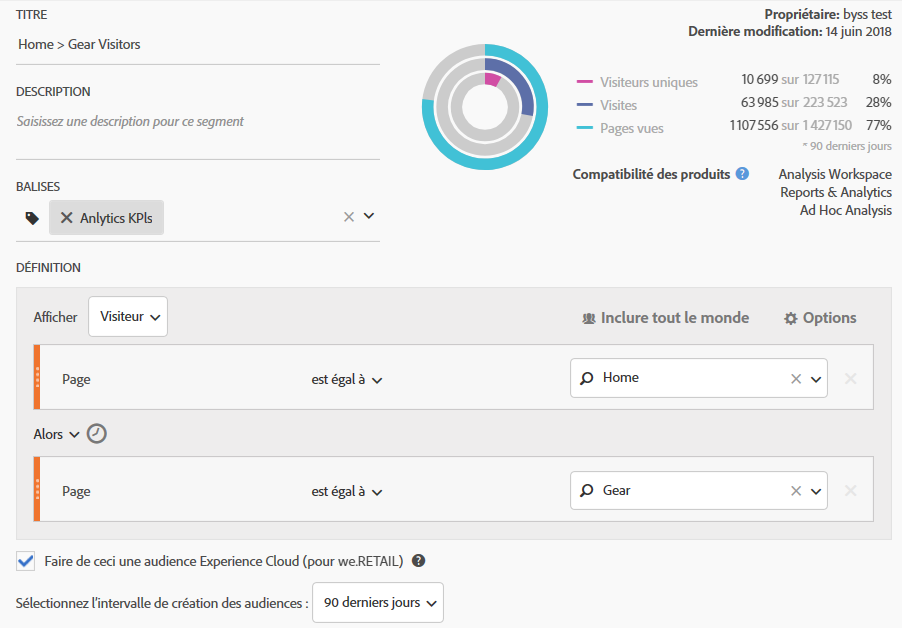

# Publication d’un segment d’audience Analytics

Publiez un segment d’audience Analytics dans Experience Cloud et dans Adobe Target pour les activités de marketing liées aux audiences.

1. Dans Analytics, [créez un segment](https://marketing.adobe.com/resources/help/fr_FR/analytics/segment/?f=seg_build).
1. Dans le créateur de segments, activez l’option **[!UICONTROL Faire de ceci une audience Experience Cloud]**.

   

   | Élément | Description |
   |--- |---|
   | Faire de ceci une audience Experience Cloud (pour &lt;nom de la suite de rapports&gt;) | Publie ce segment dans Experience Cloud. Vous pouvez utiliser l’audience pour vos activités marketing dans Adobe Target et pour la segmentation dans Audience Manager. Pour que le segment soit publié, les champs Titre et Description doivent être renseignés. Lorsque cette option est cochée, le titre et la définition de segment de l’audience sont partagés, mais pas les données. Lorsqu’une audience est associée à une activité dans Target, Analytics commence à envoyer les identifiants des visiteurs à inclure dans cette audience Experience Cloud et Target. À ce stade, le nom de l’audience et les données correspondantes commencent à s’afficher sur la page Audiences d’Experience Cloud. Les audiences partagées avec Experience Cloud depuis Analytics ne doivent pas dépasser 20 millions de membres. En raison de la mise en cache, les suites de rapports supprimées dans Analytics ne disparaîtront pas d’Experience Cloud avant 12 heures. Dans Analytics, vous pouvez modifier ou supprimer un segment publié. Si le segment est en cours d’utilisation, un message d’avertissement s’affiche lorsque vous le modifiez. Vous ne pouvez pas supprimer un segment publié en cours d’utilisation par Adobe Target. Une fois qu’un visiteur se qualifie pour l’audience partagée depuis Analytics, un délai de 24 à 48 heures est nécessaire avant que les informations soient exploitables dans Target, Advertising Cloud et Campaign. **Confidentialité des données** Les audiences ne sont pas filtrées d’après l’état d’authentification d’un visiteur. Si un visiteur peut parcourir votre site qu’il soit authentifié ou non, les actions qui se produisent lorsqu’il n’est pas authentifié peuvent avoir pour conséquence que le visiteur est inclus dans une audience. Passez en revue la [Présentation de la Politique de confidentialité d’Analytics](https://marketing.adobe.com/resources/help/fr_FR/reference/?f=c_Privacy_Overview) pour comprendre les implications complètes de la confidentialité du partage d’audience. |
   | Sélectionner l’intervalle de création des audiences | Notez qu’il s’agit d’un **intervalle** aléatoire et non fixe. |

1. Cliquez sur **[!UICONTROL Enregistrer]**.
1. Accédez à [!DNL Adobe Target], cliquez sur [!UICONTROL Audiences].
1. Sur la page [!UICONTROL Audiences], recherchez l’audience provenant d’Experience Cloud.

   Ces audiences peuvent être utilisées dans des activités.
