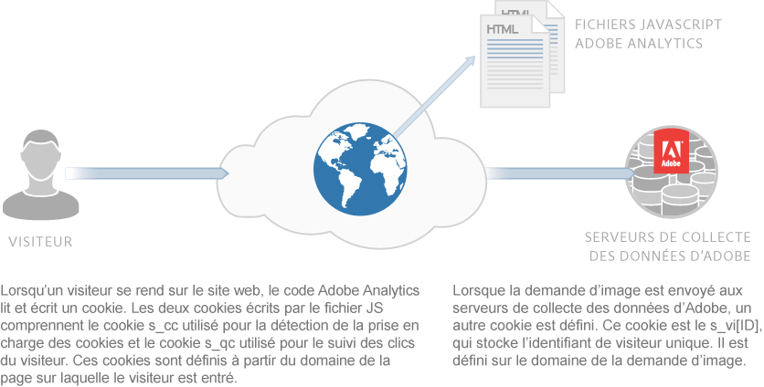
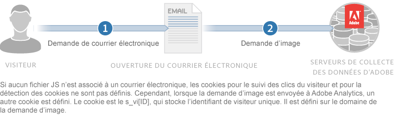

# À propos des cookies et de la confidentialité {#about-cookies-and-privacy}

Le respect de la vie privée des clients et la sécurité des données sont les priorités d’Adobe. Adobe s’associe à de multiples organisations œuvrant à la protection de la vie privée. En outre, l’entreprise travaille en coopération avec des organismes réglementant la protection de la vie privée et respecte les principes d’autoréglementation. Cette coopération comprend le programme AdChoices de Digital Advertising Alliance, qui fournit aux clients des informations sur l’utilisation de leurs informations personnelles et les choix qu’ils peuvent faire concernant cette utilisation.

La plupart des cookies définis par les produits Experience Cloud ne contiennent aucune information d’identification personnelle. Ces cookies et les données associées sont sécurisés et utilisés uniquement pour les rapports de votre société, ainsi que pour fournir des publicités et du contenu pertinents. Les données ne sont accessibles ni par des tiers, ni par les autres clients Adobe, sauf si elles sont utilisées dans des rapports d’industrie agrégés. Par exemple, le [!DNL Digital Marketing Insight Report] analyse les données agrégées et anonymes entre les détaillants.

Adobe ne fusionne pas d’informations au niveau du navigateur entre différentes entreprises. Afin de garantir la sécurité et la confidentialité des données des clients, certains services Experience Cloud offrent aux sociétés la possibilité d’utiliser un jeu distinct de cookies pour chaque site suivi. Certaines solutions de la suite permettent également aux clients d’offre d’utiliser leur propre nom de domaine comme propriétaire du cookie. Cette pratique crée une couche supplémentaire de confidentialité et de sécurité, dans la mesure où elle fait des cookies Experience Cloud des *cookies propriétaires*, appartenant de manière permanente au site de la société.

Les cookies peuvent stocker et fournir uniquement les informations qui y ont été déposées. Ils ne peuvent pas exécuter de code ni accéder à d’autres informations stockées sur l’ordinateur. En outre, les navigateurs web limitent l’accès aux données des cookies. Les navigateurs appliquent une stratégie de sécurité des cookies qui rend toutes les données des cookies disponibles uniquement pour le site web qui a défini les informations à l’origine.

Par exemple, les données contenues dans les cookies définis à partir du site web Adobe.com ne peuvent pas être consultées par un autre site web qu’Adobe.com.

Le schéma suivant illustre l’utilisation des cookies pour une demande d’image standard :

Le schéma suivant illustre l’utilisation des cookies pour une demande d’image directe (utilisée dans les scénarios où un fichier JS n’est pas chargé) :

