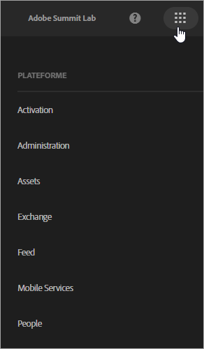

# À propos des services principaux {#topic_C1087DCC538F4F9A99D983C1BB29EBE0}

Dans Experience Cloud, cliquez sur l’icône  pour accéder au menu déroulant.

Adobe Experience Platform centralise et normalise les données et le contenu dans l’ensemble de votre entreprise. Product documentation is located on [Adobe.io](https://www.adobe.io/apis/experienceplatform/home/services.html).

| Élément | Description |
|--- |--- |
| [Administration](admin-getting-started/admin-getting-started.md) | Gérez les droits et les profils de produit des utilisateurs Experience Cloud. |
| [Assets](experience-cloud-assets/experience-cloud-assets.md) | Experience Cloud Assets constitue un référentiel unique et centralisé de ressources prêtes pour le marketing que vous pouvez partager dans toutes les solutions. |
| [Exchange](https://experiencecloud.adobeexchange.com/) | Développez vos fonctionnalités Adobe Experience Cloud avec les meilleures extensions, scripts et plus encore. Explorez avec la barre de recherche ou triez par produit ou par type d’application. |
| [Launch](activation/activation.md) | Solution de collecte de données et d’activation de la technologie pour les sites et les applications. Comprend :<ul><li>Experience Platform Launch (la toute dernière solution de gestion des balises)</li><li>Dynamic Tag Management</li><li>Triggers</li></ul> |
| [Offres](offer-management/getting-started.md) | Créez, gérez et prenez des décisions sur tous les canaux dans Experience Cloud. [!UICONTROL La gestion des] offres sert de catalogue d’offres central dans lequel vous pouvez associer des règles d’éligibilité et plusieurs éléments de contenu à chaque &quot;objet&quot; d’offre, publier ces offres sur les canaux et les emplacements et proposer la meilleure offre pour chaque client à chaque interaction. |
| [Mobile Services](https://docs.adobe.com/content/help/en/mobile-services/using/home.html) | Mobile Services réunit l’ensemble des fonctionnalités de marketing mobile pour les applications mobiles d’Adobe Experience Cloud, ce qui vous permet d’analyser et d’améliorer l’engagement des utilisateurs de vos applications mobiles. |
| [Personnes](audience-library/audience-library.md) | Dans la Bibliothèque d’audiences, vous pouvez créer des audiences, combiner les audiences existantes pour créer des audiences composites et afficher toutes les audiences partagées. Dans Attributs du client, vous pouvez également charger des données client d’entreprise dans Experience Cloud. |
