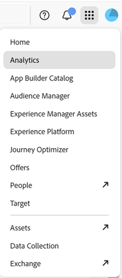

# Services d’Experience Cloud {#topic_C1087DCC538F4F9A99D983C1BB29EBE0}

Les services Adobe Experience Cloud comprennent les services [!UICONTROL People] (audiences et attributs du client), Experience Platform Launch et Mobile Services. Vous trouverez également de l’aide sur la gestion des utilisateurs et des produits Experience Cloud.

Pour accéder à ces services dans Experience Cloud, cliquez sur le **[!UICONTROL Sélecteur d‘applications]**
.

>[!NOTE]
>
>La documentation produit pour Experience Platform se trouve [ici](https://experienceleague.adobe.com/docs/experience-platform/landing/home.html?lang=en). La documentation technique pour les développeurs [!UICONTROL Experience Platform] se trouve sur [Adobe.io](https://www.adobe.io/apis/experienceplatform/home/services.html).

Cette aide décrit les produits et services suivants :

| Service principal | Description |
|--- |--- |
| [Activation](activation.md) | Systèmes de gestion des balises (Experience Platform Launch et Dynamic Tag Management). Avec Triggers, vous pouvez agir en temps réel dans Adobe Campaign en fonction des informations récupérées dans Adobe Analytics. |
| [Assets](experience-cloud-assets.md) | Centralisez facilement le stockage, la synchronisation et le partage de toutes vos ressources numériques, afin de gagner du temps et de proposer une navigation plus cohérente aux utilisateurs. |
| [Experience Platform Launch/Collecte de données](https://experienceleague.adobe.com/docs/launch/using/home.html?lang=en) | [!UICONTROL Experience Platform Launch] est la prochaine génération de collecte de données et de mise en œuvre technologique pour les sites et les applications. [!UICONTROL Experience Platform Launch] offre aux clients un moyen simple de déployer et de gérer toutes les balises d’analyse, de marketing et de publicité nécessaires pour offrir des expériences client pertinentes. |
| [Journey Orchestration](https://experienceleague.adobe.com/docs/journeys/using/journey-orchestration-home.html?lang=fr) | Créez des cas d’utilisation d’orchestration en temps réel à l’aide de données contextuelles stockées dans des événements ou des sources de données. [!UICONTROL Journey Orchestration] est un service d’application intégré à Experience Platform. |
| [Location Service](https://experienceleague.adobe.com/docs/places/using/home.html?lang=en) | Adobe [!UICONTROL Experience Platform Location Service] est un service de géolocalisation. Il permet aux applications mobiles reconnaissant l’emplacement de l’utilisateur de comprendre le contexte de l’emplacement en utilisant des interfaces SDK riches et faciles à utiliser, accompagnées d’une base de données flexible de points ciblés (POI). |
| [Mobile Services](https://experienceleague.adobe.com/docs/mobile-services/using/home.html?lang=en) | Adobe Mobile Services réunit l’ensemble des fonctionnalités de marketing mobile pour les applications mobiles d’Experience Cloud, ce qui vous permet d’analyser et d’améliorer l’engagement des utilisateurs de vos applications mobiles. |
| People | Créez une vue d’ensemble exhaustive des clients individuels en connectant vos données Adobe et non-Adobe à vos solutions Experience Cloud. Déterminez ce qui importe le plus à leurs yeux quand ils interagissent sur les points tactiles. Reconnaissez les consommateurs réguliers qui visitent votre site à partir de nouveaux appareils. Regroupez les utilisateurs en audiences pour vos efforts de marketing ciblé. [Audiences](audience-library.md)  : catégorisez les différents types de clients sous forme d’audiences, puis partagez ces audiences dans l’ensemble des applications Experience Cloud. [Attributs du client](attributes.md)  : enrichissement d’audience qui vous permet de connecter les informations de consommateur que vous avez collectées à l’extérieur d’un Experience Cloud. |
