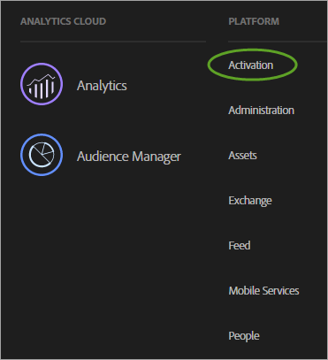
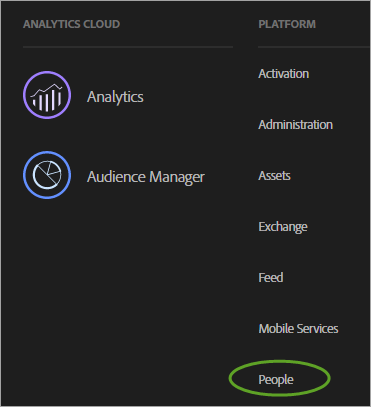

# Activation des solutions pour les services principaux

Mettez en œuvre Experience Cloud et devenez administrateur. Ce processus modernise vos solutions en ajoutant des fonctionnalités de services principaux tels que les attributs du client et les audiences.

<!-- 
https://marketing-beta.adobe.com/resources/help/core/core-services.html 
 

https://adobe.sharepoint.com/sites/AGSConsulting/CoreServices/PA/_layouts/15/start.aspx#/ 
 -->

<!-- Core services architecture and data flow wiki: https://wiki.corp.adobe.com/pages/viewpage.action?pageId=1004285689 -->

## Étape 1. Rejoindre Experience Cloud et devenir administrateur {#section_2423F0BD3DF642658103310EE5EA6154}

Procédez comme suit pour rejoindre Experience Cloud :

 Assurez-vous d’être en possession des SKU d’Adobe Analytics ou d’Adobe Target appropriées.

* **Adobe Analytics :** Standard ou Premium (et non la SKU SiteCatalyst héritée).
* **Adobe Target :** Standard ou Premium.

>[!NOTE]
>
>Pour Target, [migrez vers at.js depuis mbox.js](https://marketing.adobe.com/resources/help/fr_FR/target/ov2/?f=t_target-migrate-atjs).

 Modernisez votre mise en œuvre et configurez votre statut d’administrateur.

1. Suivez les étapes indiquées ci-dessous dans [Déploiement du service d’Experience Cloud ID](../core-services/core-services.md#section_3C9F6DF37C654D939625BB4D485E4354).
1. Contactez votre gestionnaire de compte et commencez le processus de configuration pour Experience Cloud.

 Gestion des utilisateurs et des produits dans Admin Console.

**Accès administrateur**

Une fois votre statut d’administrateur acquis, vous pouvez vous connecter à [marketing.adobe.com](https://marketing.adobe.com/).

Le lien **[!UICONTROL Administration]** apparaît dans le menu Experience Cloud.

Voir [Administration des utilisateurs et des produits Experience Cloud](../admin-getting-started/admin-getting-started.md#topic_3FCB4099640647E3B2411ADBFCE81909) pour obtenir de l’aide.

**Accès utilisateur**

Pour se connecter à Experience Cloud, les utilisateurs doivent remplir les conditions suivantes :

1. Posséder un Adobe ID.
1. Se connecter à [!DNL marketing.adobe.com].
1. Appartenir à un groupe de solutions mappé à un groupe d’entreprise.
1. Si nécessaire, liez leurs comptes de solution à leur Adobe ID (comme décrit ci-après).

 Facultatif : liez les comptes d’utilisateurs existants.

Certains utilisateurs sont probablement déjà membres de groupes de solutions, par exemple un groupe Analytics que vous avez géré dans Analytics &gt; Outils d’administration.

Lorsque vous mappez ces groupes à des groupes d’entreprise Experience Cloud, ces utilisateurs doivent lier manuellement les informations de connexion de leur compte de solution à leur Adobe ID.

Voir [Liaison de comptes dans Experience Cloud](../admin-getting-started/organizations.md#topic_C31CB834F109465A82ED57FF0563B3F1).

> [!NOTE]
> 
> Une fois le mappage de groupes d’entreprise et de solution effectué, les nouveaux utilisateurs sont liés automatiquement. (Les informations de connexion de la solution sont automatiquement créées et liées à leur Adobe ID.)

Les sections suivantes expliquent comment moderniser votre mise en œuvre. Ceci permet d’activer les services principaux dans Experience Cloud.

## Étape 2. Mettre en œuvre le service d’Experience Cloud ID à l’aide de Dynamic Tag Manager ou de Experience Platform Launch {#section_3C9F6DF37C654D939625BB4D485E4354}

La méthode la plus simple pour activer les services principaux Experience Cloud consiste à les activer automatiquement pour Analytics et Target à l’aide de l’outil [Service Experience Cloud ID](https://marketing.adobe.com/resources/help/fr_FR/mcvid/?f=mcvid-dtm-implement) dans Dynamic Tag Manager. (ou Experience Platform Launch).

Pour le service Experience Cloud ID complet (anciennement, le service d’identification des visiteurs), rendez-vous [ici](https://marketing.adobe.com/resources/help/fr_FR/mcvid/).

De plus, la gestion des balises de nouvelle génération est [Experience Platform Launch](https://marketing.adobe.com/resources/help/en_US/experience-cloud/launch/)

**Vous n’utilisez pas Dynamic Tag Management ou Launch ?**

Si vous n’utilisez pas Dynamic Tag Management, mettez en œuvre manuellement le service d’identification par le biais du déploiement de JavaScript ([!DNL VisitorAPI.js]), en procédant comme suit :

1. Suivez les étapes décrites dans [Mise en œuvre du service Experience Cloud ID pour Analytics](https://marketing.adobe.com/resources/help/fr_FR/mcvid/?f=mcvid-setup-analytics).

   Adobe recommande également de définir des [ID clients supplémentaires](https://marketing.adobe.com/resources/help/fr_FR/mcvid/?f=mcvid-authenticated-state). Ces identifiants sont associés à chaque visiteur ; ils donnent accès aux fonctions existantes et à venir des services principaux Experience Cloud.

1. Mettez à jour le fichier [!DNL s_code] existant vers la version H.27.3 ou ultérieure ou le fichier [!DNL AppMeasurement.js] vers la version 1.4 ou ultérieure.

   Ces fichiers peuvent être téléchargés dans le [Gestionnaire de code](https://marketing.adobe.com/resources/help/fr_FR/reference/?f=code_manager_admin) dans les Outils d’administration Analytics.

   (Le guide [Mise en œuvre JavaScript](https://marketing.adobe.com/resources/help/fr_FR/sc/implement/?f=js_implementation) est disponible si vous avez besoin d’informations supplémentaires sur [!DNL AppMeasurement.js].)

1. Synchronisez l’ID client pour Analytics. Voir [Analytics - Synchronisation de l’ID client](../core-services/core-services.md#section_AD473A6A21C1446498E700363F9A8437) (ci-dessous).

## Analytics et Target - Synchronisation de l’ID client {#section_AD473A6A21C1446498E700363F9A8437}

Dans le cadre de la configuration du service Experience Cloud ID, Adobe recommande, pour Analytics et Target, de synchroniser vos [ID clients](https://marketing.adobe.com/resources/help/fr_FR/mcvid/?f=mcvid-authenticated-state) avec Experience Cloud.

Dans Target, le paramètre [!DNL mbox3rdpartyid] doit obtenir l’ID client et l’envoyer à Target. (Voir [Utilisation des attributs du client](https://marketing.adobe.com/resources/help/fr_FR/target/target/?f=c_working-with-customer-attributes) dans Target).

Chaque fois qu’un visiteur s’authentifie sur votre site ou s’identifie d’une autre manière, votre mise en œuvre doit afficher l’ID client CRM sur la page dans l’application. Par la suite, vous pouvez utiliser l’appel de fonction approprié pour synchroniser votre ID client avec Experience Cloud. Cette synchronisation stocke l’ID client CRM du visiteur dans Experience Cloud et active les attributs de ce client en vue d’utiliser Experience Cloud.

Par exemple, supposons que Robert a l’identifiant de client `52mc210tr42` dans votre système de gestion de la relation client. Quand Robert s’authentifie sur votre site, vous devez exposer cet identifiant sur la page, puis le synchroniser de l’une des deux façons suivantes :

* Appelez `visitor.setCustomerIDs({"crm_id":"52mc210tr42"})` à l’aide du service d’identification des visiteurs. Ou,
* Renseignez  *`Customer ID (52mc210tr42)`* dans une prop ou une eVar.

L’identifiant de client doit être défini dans chaque appel au serveur [!DNL Analytics] où il est connu.

**SDK mobiles**

Voir la section *Service Experience Cloud ID* pour consulter des exemples de syntaxe sur la manière de définir d’autres ID clients dans les applications mobiles [Android](https://marketing.adobe.com/resources/help/fr_FR/mobile/android/?f=methods) et [iOS](https://marketing.adobe.com/resources/help/fr_FR/mobile/ios/?f=methods).

**Activation des attributs pour les données d’historique**

Les données d’attribut du client sont disponibles une fois les visiteurs connectés. Si vous n’avez pas encore mis en œuvre le dernier service d’Experience Cloud ID et que vous avez effectué le suivi historique des ID client dans une variable prop ou eVar, vous pouvez appeler un processus qui envoie les connexions historiques vers Experience Cloud. Grâce à ce processus, vous pouvez commencer à utiliser immédiatement les attributs du client.

Contactez l’assistance clientèle pour activer les données d’historique.

## Étape 3. Mapper des suites de rapports à une organisation Experience Cloud {#section_7B08516B01BA421681DF03D0E86CE3BA}

Les services Experience Cloud (tels que le service Experience Cloud ID et le service Personnes) sont associés à une organisation Experience Cloud plutôt qu’à une suite de rapports individuelle. Afin de garantir le bon fonctionnement de ces services, chaque suite de rapports doit être mappée à une organisation Experience Cloud.

Voir [Mappage de suites de rapports à une organisation](report-suite-mapping.md).

## Étape 4. (Adobe Analytics) Moderniser le code AppMeasurement d’Analytics {#section_1798D9D0F05C47E29816AC4EEB9A0913}

Vérifiez que vous vous trouvez sur le réseau RDC (regional data collection). Si votre domaine de collecte des données est [!DNL omtrdc.net] ou si votre CNAME est mappé à [!DNL omtrdc.net], vous utilisez le service RDC. Voir [Transition vers RDC](https://marketing.adobe.com/resources/help/fr_FR/whitepapers/rdc/?f=rdc_transition) pour plus d’informations. Si vous utilisez des cookies propriétaires, consultez [CNAME et le service d’identification des visiteurs](https://marketing.adobe.com/resources/help/fr_FR/mcvid/?f=mcvid_cname) pour plus d’informations sur les CNAME de collecte de données et le suivi inter-domaines.

Il vous est recommandé d’actualiser votre mise en œuvre Analytics en mettant à jour vos bibliothèques JavaScript, y compris l’API visiteur. Un moyen simple d’accomplir cette procédure consiste à ajouter un outil [!DNL Adobe Analytics] à Dynamic Tag Management, en spécifiant *`Automatic`* comme méthode de configuration.

Dans Dynamic Tag Management, cliquez sur **[!UICONTROL <Web Property Name>]**&gt;**[!UICONTROL Aperçu]**&gt;**[!UICONTROL Ajouter un outil]**&gt;**[!UICONTROL Adobe Analytics]**. Voir[Paramètres Adobe Analytics](https://marketing.adobe.com/resources/help/fr_FR/dtm/?f=analytics_dtm)dans Dynamic Tag Management pour en savoir plus sur le déploiement.

## Etape 5. (Adobe Target) Moderniser la mise en œuvre d’Adobe Target {#section_C2F4493C7A36406DAE2266B429A4BD24}

* Il est recommandé d’ajouter un [outil Adobe Target](https://marketing.adobe.com/resources/help/fr_FR/dtm/?f=target) à Dynamic Tag Management, de sorte que la récupération de la bibliothèque soit automatique. Dans Dynamic Tag Management, cliquez sur **[!UICONTROL <Web Property Name>]**&gt;**[!UICONTROL Aperçu]**&gt;**[!UICONTROL Ajouter un outil]**&gt;**[!UICONTROL Adobe Target]**.** Remarque :**Vous pouvez également utiliser Dynamic Tag Management pour déployer le service d’Experience Cloud ID pour Target (et d’autres solutions). Le service d’Experience Cloud ID** doit être mis à jour **pour que Target puisse utiliser les services principaux.
* Si vous n’utilisez pas Dynamic Tag Management, [mettez à jour votre bibliothèque mbox](https://marketing.adobe.com/resources/help/fr_FR/target/ov/?f=t_mbox_download) manuellement.
* Demandez l’accès afin d’utiliser Adobe Analytics comme source de création de rapports pour Adobe Target. Les données de Target et Analytics des données sont combinées dans le même appel serveur durant le traitement afin que les visiteurs soient connectés entre les deux solutions. Voir [Mise en œuvre d’Analytics pour Target](https://marketing.adobe.com/resources/help/fr_FR/target/a4t/?f=a4t).
* 
   >[!IMPORTANT]
   >
   >Tous les clients d’Analytics sont déjà configurés pour les services principaux ainsi que pour les attributs du client. Si vous n’êtes pas client d’Analytics, contactez le service à la clientèle pour demander à recevoir les privilèges d’accès.

## Etape 6. Vérifier la mise en œuvre des services principaux {#section_E641782A0F4F44AF8C9C91216BE330D5}

Appliquez la procédure suivante pour vérifier que le service d’Experience Cloud ID est correctement mis en œuvre sur votre site.

1. Effacez les cookies de votre site afin de pouvoir visualiser la requête du service d’Experience Cloud ID (cette requête est émise lors de la première visite, puis environ une fois par visiteur et par semaine).1. À l’aide d’un analyseur de paquets ou du volet des réseaux dans un débogueur de navigateur web, recherchez une requête envoyée à [!DNL dpm.demdex.net].
1. Vérifiez que la réponse contient `d_mid` et une valeur, par exemple : `_setMarketingCloudFields({"d_mid":"4235...`
1. Vérifiez que la requête d’Analytics contient le paramètre « mid » (Experience Cloud ID). Durant la période de grâce (le cas échéant), un paramètre « aid » doit également s’afficher (l’identifiant de visiteur Analytics).

Réponse attendue contenant le service d’Experience Cloud ID :

Demande d’image Analytics contenant le service d’Experience Cloud ID (mid) :

Experience Cloud ID dans la requête de mbox :

**Qu’est-ce que la période de grâce ?**

Une fois le service d’identification des visiteurs déployé, les nouveaux visiteurs ne reçoivent plus d’identifiant de visiteur Analytics de votre serveur de collecte de données. Si le service d’identification des visiteurs n’a pas encore été mis en œuvre sur certaines sections de votre site, l’Experience Cloud ID n’est pas reconnu lorsque les visiteurs parcourent ces sections et un identifiant de visiteur Analytics hérité est attribué aux visiteurs. Ce comportement peut être à l’origine d’un certain nombre de problèmes, notamment des visites en double et des attributions incorrectes.

Si, par exemple, la section Assistance de votre site est gérée dans un système de gestion de contenu distinct, il se peut que vous ayez un fichier JavaScript Analytics différent pour cette section. Si vous déployez l’identifiant de visiteur sur votre site principal avant de déployer le service d’identification des visiteurs sur le site d’assistance, les nouveaux visiteurs recevront un identifiant Analytics hérité lorsqu’ils se rendent dans la section d’assistance ; les visites qui portent sur les deux sections du site seront alors signalées comme deux visites distinctes.

Le déploiement du service d’identification des visiteurs sur les sites qui utilisent plusieurs fichiers JavaScript ou d’autres technologies (telles que Flash) peut provoquer des problèmes de coordination puisque vous devez activer le service d’identification des visiteurs en même temps sur toutes les portions de votre site. Si vous configurez une période de grâce, les nouveaux visiteurs peuvent continuer à recevoir un identifiant de visiteur Analytics du service d’identification des visiteurs, de sorte que les visiteurs puissent être identifiés de manière cohérente sur les sections de votre site qui n’ont pas été mises à niveau pour utiliser le service d’identification des visiteurs.

## Étape 7. Gérer les utilisateurs et les produits {#section_B6E95F4E0E12483CB9DA99CBC0C5A4AF}

Quand vous êtes opérationnel, sélectionnez **[!UICONTROL Administration]** &gt; **[!UICONTROL Lancer Admin Console]** afin de gérer les utilisateurs et les profils de produits.

Voir [Gestion des utilisateurs et des produits Experience Cloud](../admin-getting-started/admin-getting-started.md#topic_3FCB4099640647E3B2411ADBFCE81909).

**Attributs du client**

<!-- 
 
 <note type="important">
  To use the Customer Attributes feature, users must belong to the 
   Adobe Customer Attributes group, and to solution-level groups (Analytics or Target). 
 </note> 
 
 -->

Les utilisateurs membres du groupe Attributs du client ont accès aux options du menu [!UICONTROL Attributs du client] sur le côté gauche de l’interface d’Experience Cloud.

## Étape 8. Commencer à utiliser les services principaux {#section_960C06093623462E8EA247B3E97274A1}

Profitez des fonctions de services principaux suivantes :

**Personnes &gt; Attributs du client**

Si vous capturez les données clients d’entreprise dans une base de données de gestion de la relation client, vous pouvez les transférer dans une source de données d’attributs du client dans Experience Cloud. Une fois le transfert effectué, utilisez les données dans [!DNL Adobe Analytics] et [!DNL Adobe Target].

Voir [Attributs du client](../attributes/attributes.md#concept_ACFEE7C8B8E94875BA0825CDF4913AF1)

**Personnes &gt; Bibliothèque d’audiences**

Dans l’interface Audiences Experience Cloud, vous pouvez créer des audiences, combiner les audiences existantes pour créer des audiences composites et afficher toutes les audiences partagées.

Voir [Audiences](../audience-library/audience-library.md#topic_679810123CAA4E0CA4FA3417FB0100C7)

<!-- aam_mc.xml -->

## Informations sur le stockage des données et sur la divulgation des données confidentielles

Le recours au profilage d’audiences en temps réel et à d’autres services principaux du composant Personnes d’Adobe [!DNL Experience Cloud] peut avoir une influence sur le centre de données (et le pays) où se trouvent vos données. En particulier, dans la mesure où les services principaux d’Adobe [!DNL Experience Cloud] exploitent Adobe Audience Manager, les données utilisées dans le service principal Personnes doivent se trouver sur les serveurs Audience Manager situés aux États-Unis.

Lors de l’utilisation des services principaux accessibles par le biais du service principal Personnes, les types de données envoyés depuis d’autres produits Adobe à la gestion de l’audience sont les suivants :

* Paires clé/valeur [!DNL Analytics] (Props, eVars, variables de liste, etc.). Par défaut, les lignes des journaux contiennent l’adresse IP, notamment le dernier octet de l’adresse IP (en supposant que l’adresse IP n’a pas été modifiée par les paramètres de masquage d’Adobe [!DNL Analytics]).
* Caractéristiques et segments pour lesquels les visiteurs sont inclus selon les règles configurées dans Audience Manager.
* (Facultatif) Un ou plusieurs de vos identifiants. Selon votre mise en œuvre du service d’identifiant, vous envoyez peut-être également un ou plusieurs de vos identifiants, tels que les identifiants CRM ou des adresses électroniques hachées. Si ces données sont envoyées à Adobe [!DNL Analytics], elles sont transférées à la gestion de l’audience d’Adobe. Adobe recommande de ne pas fournir de données personnelles à Adobe [!DNL Analytics]. Utilisez un hachage à sens unique pour rendre anonymes les données avant de les envoyer à Adobe.
* Segments provenant d’[!DNL Analytics] au moyen de la fonctionnalité de partage des segments principale.
* Le cookie demdex.net est défini si les cookies tiers ne sont pas bloqués. Le cookie propriétaire `AMCV_###@AdobeOrg` est toujours défini avec l’Experience Cloud ID (ancien service d’identification des visiteurs).

Tous ces éléments de données sont transmis à Adobe Audience Manager sous forme de fichiers journaux. Audience Manager traite et stocke ces données aux États-Unis. Audience Manager ne permet pas de stocker ni de traiter ces données en dehors des États-Unis.

**Cookies et exclusions**

Le recours au profilage d’audiences en temps réel entraîne l’utilisation du cookie d’Audience Manager, en plus des cookies utilisés pour [!DNL Analytics] et [!DNL Target].

Si vous souhaitez proposer la fonctionnalité d’exclusion adaptée, les visiteurs de votre site doivent ajouter l’exclusion d’Audience Manager à votre processus d’exclusion.

Voir [Adobe Experience Cloud - Mise en œuvre d’exclusions Adobe](https://marketing.adobe.com/resources/help/fr_FR/sc/implement/?f=opt_out) pour obtenir des instructions.

Voir [CNAME de collecte de données et suivi inter-domaines](https://marketing.adobe.com/resources/help/fr_FR/mcvid/?f=mcvid_cname) pour activer le suivi inter-domaines.
