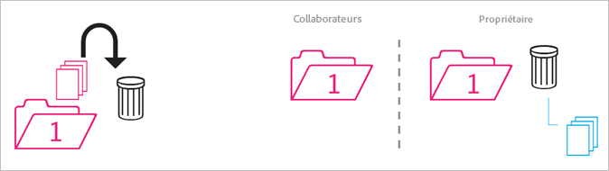
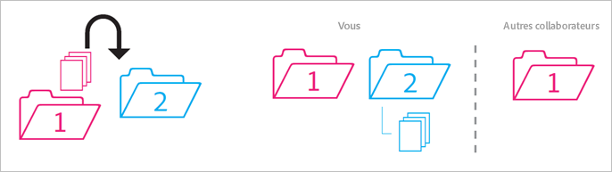
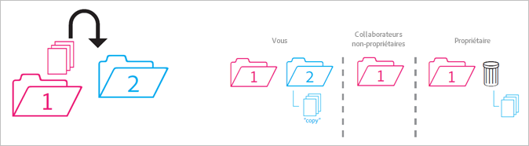
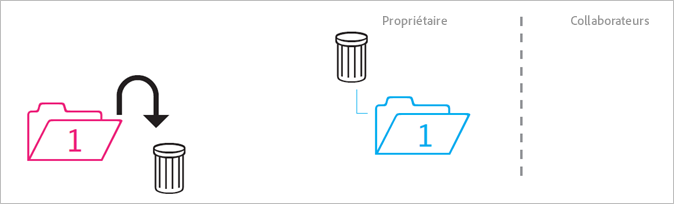
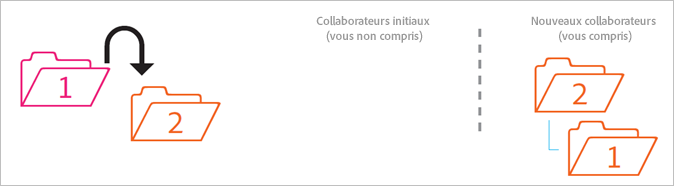
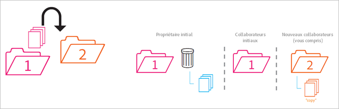
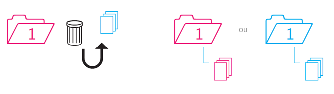

# Comportement des dossiers partagés

Règles relatives au comportement des dossiers partagés lorsqu’ils sont déplacés, supprimés et restaurés.

>[!NOTE]
>
>Les dossiers et ressources Experience Cloud partagés sont mis en miroir dans l’application de bureau Creative Cloud dans le cadre d’une relation 1:1. Si un utilisateur Experience Cloud change un dossier (supprime, ajoute ou supprime le partage), l’action est mise en miroir dans les applications de bureau et web Creative Cloud. En tant que tel, si le partage d’un dossier est annulé, le dossier et les ressources sont supprimés de l’ordinateur local. Une fois le partage supprimé, le dossier et son contenu sont déplacés dans la corbeille de l’ordinateur local, où vous pouvez les restaurer manuellement sur votre machine.

## Dossier non partagé dans un dossier partagé {#section_A9BAC1A244A246A984AC62660E61E0C0}

Vous déplacez un dossier non partagé dans un dossier partagé :

**Résultat** : les deux dossiers sont partagés.

## Dossier partagé dans un dossier non partagé {#section_8BA83001DCEC4CF084B980C4A660F59A}

Vous déplacez un dossier partagé dans un dossier non partagé.

**Résultat** : le dossier non partagé reste non partagé. Le dossier partagé reste partagé.

## Contenu du dossier non partagé dans un dossier partagé {#section_2941ED0DC52E4573AC1AB4C22313DD8E}

Vous déplacez le contenu d’un dossier non partagé dans un dossier partagé.

**Résultat :** le contenu est maintenant partagé et tous les collaborateurs peuvent le voir. Le stockage augmente en fonction de la taille du contenu.

## Contenu partagé archivé et supprimé {#section_5210D5F4943A44D0BA675D8EB4EAE20F}

Vous archivez ou supprimez du contenu résidant dans un dossier partagé.

**Résultat :** le contenu est archivé pour le propriétaire du dossier. Les collaborateurs qui ne détiennent pas le contenu ne peuvent plus y accéder.

## Contenu partagé détenu dans un dossier non partagé {#section_3810A364B67E4B8C9CA244BC52BF91BB}

Vous déplacez le contenu d’un dossier partagé que vous détenez dans un dossier non partagé.

**Résultat :** le contenu n’est maintenant plus partagé. Les collaborateurs du dossier partagé n’ont plus accès au contenu.

## Contenu non détenu dans un dossier non partagé {#section_310766EBF0DC4C0BB4AB3E8A4DAEBE07}

Vous déplacez le contenu d’un dossier partagé détenu par une autre personne dans un dossier non partagé.

**Résultat :** le contenu apparaît dans le dossier non partagé et est supprimé du dossier partagé. Les collaborateurs du dossier partagé n’ont plus accès au contenu. Le contenu est archivé pour le propriétaire du dossier partagé.

Contrairement aux observateurs, les propriétaires et éditeurs peuvent déplacer le contenu qu’ils ne détiennent pas. Si les propriétaires et les éditeurs déplacent du contenu, celui-ci n’est disponible dans un dossier partagé pour aucun utilisateur.

## Dossier détenu archivé ou supprimé {#section_B314B13512A5409C87C49DFDB7602E14}

Vous archivez (via le Web) ou supprimez (via le bureau) un dossier partagé que vous détenez.

**Résultat :** le partage du dossier est annulé, puis le dossier est archivé. Les collaborateurs n’ont plus accès au dossier.

## Dossier partagé dans un autre dossier partagé {#section_0A3F203D048D4D1586E9850DC92C51E9}

Vous déplacez un dossier partagé que vous détenez dans un autre dossier partagé que vous détenez ou non.

**Résultat :** lorsque le dossier est déplacé dans le dossier 2, il est alors partagé avec les nouveaux collaborateurs.

## Contenu partagé dans un autre dossier partagé {#section_69F6C312792A4CD2831BD14A340F850E}

Vous déplacez le contenu d’un dossier partagé dans un autre dossier partagé.

**Résultat :** le contenu apparaît dans le dossier 2 et est maintenant partagé avec les nouveaux collaborateurs. Le contenu est supprimé du dossier 1 et le propriétaire le voit comme archivé, tandis que les autres collaborateurs n’y ont plus accès.

## Contenu restauré issu de l’archive {#section_DEA990B3581741F89FBB81D18C2AB449}

Vous restaurez le contenu d’une archive qui appartenait à un dossier partagé. Vous déteniez le contenu au moment de son archivage.

**Résultat :** le contenu est restauré dans le dossier partagé et tous les collaborateurs peuvent de nouveau y accéder. Si le dossier partagé n’existe plus, le contenu est placé dans une copie non partagée de son ou ses dossier(s) parent(s) d’origine.
