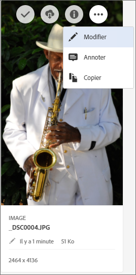
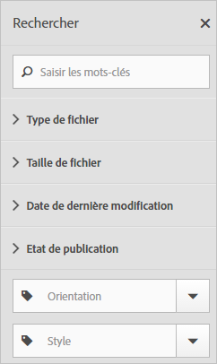
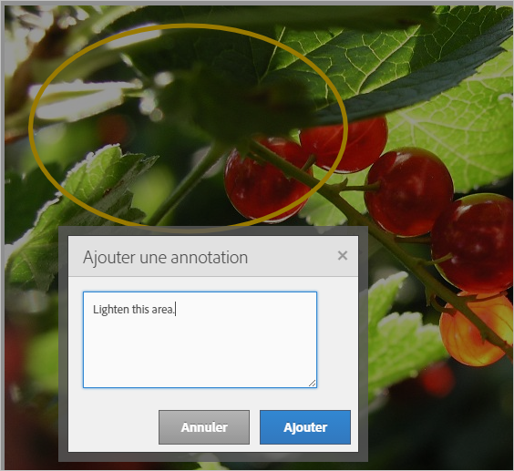
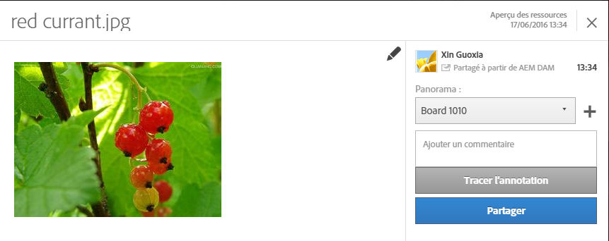
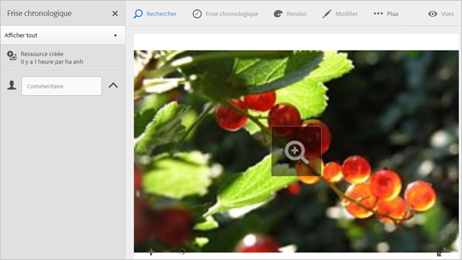
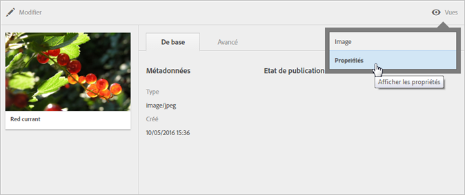

# Assets

Experience Cloud Assets constitue un référentiel unique et centralisé de ressources prêtes pour le marketing que vous pouvez partager dans toutes les solutions. Une ressource est un document numérique, une image, une vidéo ou de l’audio (en tout ou en partie) qui peut comporter plusieurs rendus et des sous-ressources (par exemple, les calques d’un fichier Photoshop, les diapositives d’un fichier PowerPoint, les pages d’un PDF, les fichiers d’un ZIP).

<!-- asset.xml -->
Les services de ressources comprennent ce qui suit :

* Stockage des ressources, interface de gestion, interface de sélection incorporée (accessible dans les solutions).
* Intégrations à Creative Cloud, collaboration Experience Cloud et solutions Experience Cloud.

L’utilisation des ressources améliore la cohérence et l’homogénéité de la marque et accélère la mise sur le marché. Vous pouvez rationaliser les processus dans les solutions :

* **[!DNL Social]** : publiez du contenu dans les propriétés sociales, Facebook, Twitter, LinkedIn, Google+.
* **[!DNL Target]** : créez du contenu pour des tests A/B et multivariés.
* **[!DNL Media Optimizer]** : développez des unités d’annonce à l’échelle de différents canaux et campagnes.
* **[!DNL Campaign]** : placez des ressources dans les bulletins électroniques et les campagnes.

Dans [!UICONTROL Experience Cloud Assets], vous pouvez effectuer les opérations suivantes :

* [Accéder à Experience Cloud Assets](../experience-cloud-assets/experience-cloud-assets.md#section_3657039DD3524F2AA88753BFF4781125)
* [Accéder à la barre d’outils](../experience-cloud-assets/experience-cloud-assets.md#section_EC2E401D225148818F3753248556BE6B)
* [Modification de ressources ](../experience-cloud-assets/experience-cloud-assets.md#section_CD3C55A9D4574455B94D0955391C8FEC)
* [Recherche de ressources](../experience-cloud-assets/experience-cloud-assets.md#section_50FE049010B446FC9640AA6A30E5A730)
* [Annoter des ressources](../experience-cloud-assets/experience-cloud-assets.md#section_67FE1DFAAB744DA5B1CD3AD3CCEABF7A)
* [Partager une ressource avec votre flux](../experience-cloud-assets/experience-cloud-assets.md#section_2CD53A99600D4A3D9AA82C3CDA666E6B)
* [Afficher des ressources en plein écran et en mode zoom](../experience-cloud-assets/experience-cloud-assets.md#section_A9F50D7D6BE341A2AB8244A4E42A4EF7)
* [Afficher les propriétés des ressources](../experience-cloud-assets/experience-cloud-assets.md#section_FED28711DAB14E1BBEEA7CA890EE9573)
* [Exécuter des rapports sur l’utilisation](../experience-cloud-assets/experience-cloud-assets.md#section_15D782FFB8D74CF4A735116CC03AD902)
* [Partager des ressources avec Experience Manager](../experience-cloud-assets/experience-cloud-assets.md#section_45C1B72F4D274F54BC6CCB64D2580AC5)

## Accéder à Experience Cloud Assets {#section_3657039DD3524F2AA88753BFF4781125}

## Accéder à la barre d’outils {#section_EC2E401D225148818F3753248556BE6B}

Accédez à une ressource (ou un répertoire de ressources), puis cliquez sur **[!UICONTROL Sélectionner]**.

La barre d’outils permet d’accéder rapidement aux fonctionnalités telles que la recherche, le journal, les rendus, la modification, les annotations et le téléchargement.

## Modification de ressources  {#section_CD3C55A9D4574455B94D0955391C8FEC}

La modification d’une ressource active certaines fonctionnalités, notamment les suivantes :

* Recadrage
* Rotation
* Retournement

## Recherche de ressources {#section_50FE049010B446FC9640AA6A30E5A730}

Vous pouvez effectuer une recherche par mot clé, type de fichier, taille, date de dernière modification, statut de publication, orientation et style.

## Annotation de ressources {#section_67FE1DFAAB744DA5B1CD3AD3CCEABF7A}

Cliquez sur **[!UICONTROL Annoter]** en dessinant des cercles ou des flèches sur une image et annotez la ressource pour permettre sa consultation par vos collaborateurs.

## Partage d’une ressource avec votre flux {#section_2CD53A99600D4A3D9AA82C3CDA666E6B}

**Le flux Experience Cloud ne sera plus pris en charge à compter du 1er novembre 2019 et sera abandonné d’ici décembre 2019.**

Cliquez sur **[!UICONTROL Partager]** dans la barre d’outils pour partager le fichier comme [flux](../feed.md#concept_9256B8768A294009A777282DD8719213) avec d’autres utilisateurs d’Experience Cloud.

Le partage permet d’afficher l’image sur votre page de flux, ainsi que les personnes avec lesquelles vous avez partagé la carte.

## Affichage des ressources en plein écran et en mode zoom {#section_A9F50D7D6BE341A2AB8244A4E42A4EF7}

Cliquez sur **[!UICONTROL Vues]** &gt; **[!UICONTROL Image]** pour afficher l’image complète de la ressource et activer le zoom.

## Affichage des propriétés des ressources {#section_FED28711DAB14E1BBEEA7CA890EE9573}

Choisissez entre l’affichage des cartes avec les propriétés, la vue sous forme de liste et sous forme de colonnes afin de localiser plus facilement vos ressources.

Cliquez sur **[!UICONTROL Vues]** &gt; **[!UICONTROL Propriétés]** pour afficher les propriétés d’une ressource :

## Exécution des rapports sur l’utilisation {#section_15D782FFB8D74CF4A735116CC03AD902}

Affichez le nombre d’utilisateurs, l’espace de stockage utilisé et le nombre total de ressources.

Cliquez sur **[!UICONTROL Outils]** &gt; **[!UICONTROL Rapports]** &gt; **[!UICONTROL Rapport d’utilisation]**

