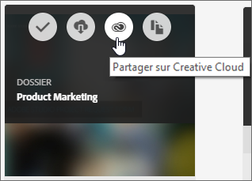
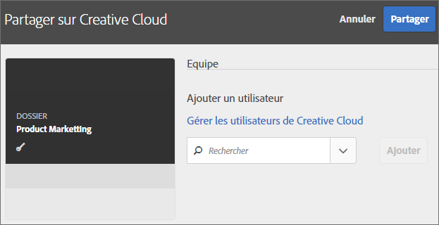
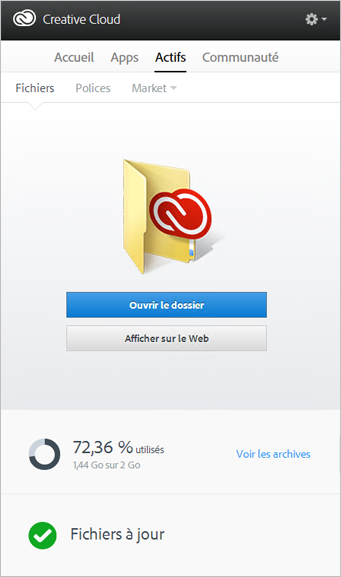
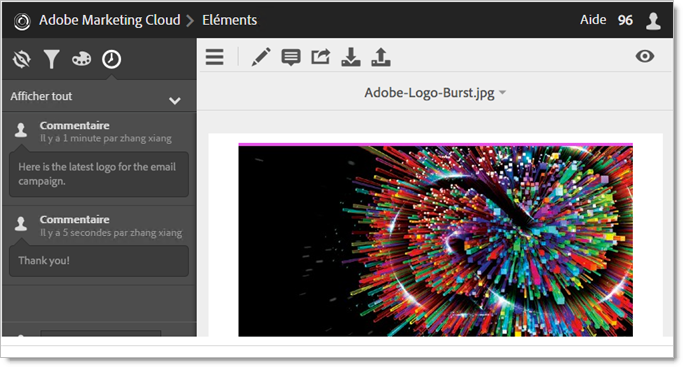
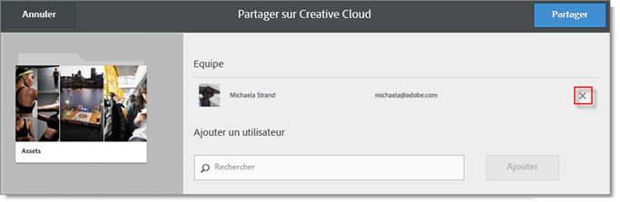

# Partage d’un dossier de ressources Experience Cloud

Partagez un dossier de ressources Experience Cloud avec des utilisateurs Creative Cloud.

1. Sur un dossier de ressources, cliquez sur **[!UICONTROL Partager sur Creative Cloud]**.

   
1. Sur la page Partager sur Creative Cloud, recherchez un utilisateur, puis cliquez sur **[!UICONTROL Ajouter]**.

   

1. Cliquez sur **[!UICONTROL Partager]**.
1. Ouvrez l’application de bureau [!DNL Creative Cloud] (ou accédez à la page [!UICONTROL Fichiers Creative Cloud] dans un navigateur), puis recherchez la notification de la demande.

   
1. Ouvrez la demande, puis cliquez sur **[!UICONTROL Accepter]**.

   
1. Pour accéder au contenu du dossier, cliquez sur **[!UICONTROL Ouvrir le dossier]** (ou **[!UICONTROL Afficher sur le Web]**).

   
1. Continuez en ajoutant les commentaires à la ressource partagée :

   Dans Creative Cloud, cliquez sur une image, puis sur **[!UICONTROL Activité]** pour ajouter un commentaire sur celle-ci. Les commentaires sont synchronisés sur les ressources dans [!DNL Creative Cloud] et dans [!DNL Experience Cloud].

   

   Dans Experience Cloud, cliquez sur une image, puis sur l’icône de frise chronologique pour ajouter un commentaire à l’image. Les commentaires sont synchronisés sur les ressources dans Creative Cloud et Experience Cloud.

   

1. Pour annuler le partage d’un dossier, cliquez sur **[!UICONTROL Partager sur Creative Cloud]** (comme à l’[étape 3](../experience-cloud-assets/t-share-creative-cloud.md#step_BA17CFA185284641A9B878BA29551996)), supprimez les utilisateurs en cliquant sur l’icône de croix (X), puis cliquez sur **[!UICONTROL Partager]**.

Une fois tous les utilisateurs Creative Cloud supprimés, le partage du dossier est annulé et les utilisateurs de Creative Cloud n’y ont plus accès.

Voici quelques autres moyens d’utiliser une ressource partagée :

* Utilisez les ressources du [!UICONTROL Sélecteur de ressources] dans [!DNL Adobe Social] pour les publications sociales.
* Chargez ou permutez des fichiers dans la [bibliothèque d’offres](https://docs.adobe.com/help/fr-FR/target/using/experiences/offers/manage-content.html) dans [!DNL Adobe Target] pour les images dans les activités.

Une fois que vous avez partagé un dossier sur Creative Cloud, le logo Creative Cloud apparaît sur le dossier.

Aide connexe :

* [Aide de Creative Cloud - Gestion et synchronisation des fichiers](https://helpx.adobe.com/fr/creative-cloud/help/sync-files.html)
* [Aide de Creative Cloud - Collaboration avec d’autres utilisateurs](https://helpx.adobe.com/fr/creative-cloud/help/collaboration.html)
* [Aide de Creative Cloud - FAQ sur la collaboration](https://helpx.adobe.com/fr/creative-cloud/help/collaboration-faq.html)
