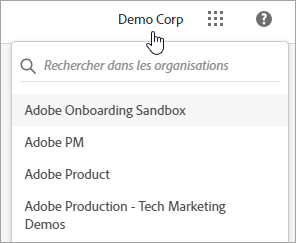
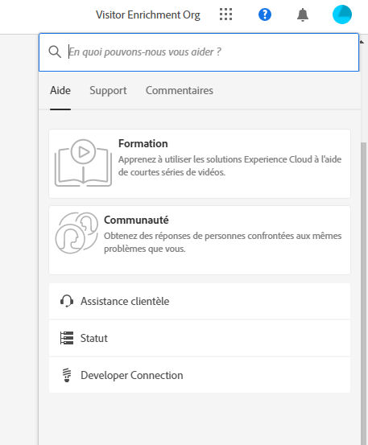
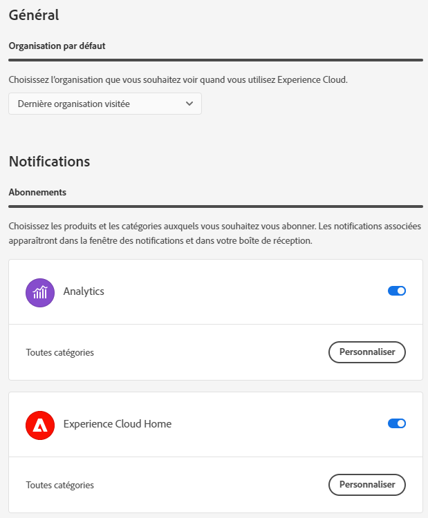
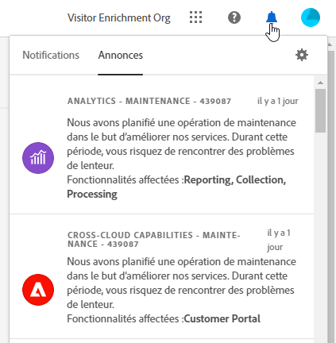

# Composants de l’interface centrale d’entreprise CX

Les composants de l’interface centrale d’CX Enterprise comprennent des fonctionnalités qui vous permettent de :

* Connexion et accès à vos applications et services
* Recherche d’objets commerciaux et d’aide sur un produit à l’aide d’une recherche globale
* Gestion des préférences du compte (alertes, notifications et abonnements)

## Prise en charge des navigateurs dans CX Enterprise

Pour des performances optimales, CX Enterprise est optimisé pour les navigateurs les plus populaires, y compris la dernière version, ainsi que les deux versions précédentes.

* Chrome
* Edge
* Firefox
* Opera
* Safari

Si votre navigateur n’est pas répertorié, il peut tout de même être pris en charge, mais il est recommandé d’utiliser l’un des navigateurs répertoriés.

>[!NOTE]
>
>Toutes les applications s’exécutant sur le domaine CX Enterprise ne prennent pas en charge tous les navigateurs. Si vous n’êtes pas sûr, consultez la documentation d’une application spécifique.

## Prise en charge linguistique dans CX Enterprise

CX Enterprise prend en charge les langues préférées de chaque utilisateur, telles que définies dans les préférences de votre compte utilisateur Adobe. Les langues actuellement prises en charge sont les suivantes :

* Chinois
* Anglais
* Français
* Allemand
* Italien
* Japonais
* Coréen
* brésilien
* Espagnol
* Taïwanais

Bien que toutes les équipes d’applications se soient engagées à assurer la prise en charge linguistique globale, toutes les applications ne sont pas proposées dans toutes les langues mentionnées ci-dessus. Si votre langue principale n’est pas prise en charge dans une application d’entreprise CX, vous pouvez également définir une langue secondaire par défaut, le cas échéant. Vous pouvez le faire dans [Préférences utilisateur CX Enterprise](https://experience.adobe.com/preferences).

## Se connecter à CX Enterprise

Connectez-vous et vérifiez que vous vous trouvez dans la bonne organisation.

1. Accédez à [Adobe CX Enterprise](https://experience.adobe.com?lang=fr).
1. Cliquez sur **[!UICONTROL Se connecter avec un Adobe ID]**.
1. Vérifiez que vous vous trouvez dans la bonne organisation.

   

   Pour vérifier que vous vous êtes connecté à l’organisation appropriée, cliquez sur **[!UICONTROL Profil]** pour afficher le nom de l’organisation. Si vous avez accès à plusieurs organisations, vous pouvez également afficher une autre organisation et passer à une autre à l’aide du sélecteur **[!UICONTROL Organisation]**.

   Si votre entreprise utilise des Federated ID, CX Enterprise vous permet de vous connecter à l’aide de l’authentification unique de votre entreprise sans avoir à saisir votre adresse e-mail et votre mot de passe. Ajoutez `#/sso:@domain` à l&#39;URL d&#39;entreprise CX (`https://experience.adobe.com`) pour accomplir cette tâche.

   Par exemple, pour une organisation avec des Federated ID et le domaine `example.com`, définissez votre lien URL sur `https://experience.adobe.com/#/sso:@example.com`. Vous pouvez également accéder directement à une application spécifique en marquant cette URL avec le chemin de l’application. (Par exemple, pour Adobe Analytics, `https://experience.adobe.com/#/sso:@example.com/analytics`.)

## Accès aux applications CX Enterprise

Après vous être connecté à CX Enterprise, vous pouvez accéder rapidement à l’ensemble de vos applications, services et organisations à partir de l’en-tête unifié.

Cliquez sur le sélecteur d’applications  pour accéder aux services CX Enterprise que vous détenez.

## Recherche et assistance dans CX Enterprise

La recherche Entreprise CX vous permet de rechercher de l’aide (documentation, tutoriels et cours) sur .

Le menu [!UICONTROL Aide] vous donne également accès aux éléments suivants :

* **[!UICONTROL Assistance] :** créez un ticket d’assistance ou contactez l’[!UICONTROL assistance] sur Twitter.
* **[!UICONTROL Commentaires] :** contactez Adobe à l’aide des Commentaires et faites-nous savoir ce que vous pensez.
* **[!UICONTROL Statut] :** accédez à `https://status.adobe.com/experience_cloud` et vérifiez le statut opérationnel du produit et [!UICONTROL Gérer les abonnements].
* **:** Navigation vers `adobe.io` et trouver la documentation destinée aux développeurs.

## Préférences de compte

Dans le menu des préférences du compte, vous pouvez :

* Spécifier un thème sombre (toutes les applications ne prennent pas en charge ce thème) ;
* Rechercher des organisations
* Vous déconnecter ;
* Configurer des [préférences, notifications et abonnements](#preferences) relatives au compte ;

### Gérer CX Enterprise [!UICONTROL Préférences]

Les préférences CX Enterprise incluent les notifications, les abonnements et les alertes.

* Cliquez sur **[!UICONTROL Préférences]** dans le menu de votre compte  pour gérer les préférences.

Dans les préférences [!UICONTROL CX Enterprise], vous pouvez configurer les fonctionnalités suivantes :

| Fonctionnalité | Description |
| --- | --- |
| Organisation par défaut | Sélectionnez l&#39;organisation que vous voulez voir lorsque vous lancez CX Enterprise. |
| [!UICONTROL Abonnements] | Sélectionnez les produits et catégories auxquels vous souhaitez vous abonner. Notifications dans la fenêtre contextuelle [!UICONTROL  Notifications ] et dans votre e-mail. |
| [!UICONTROL Priorité] | Sélectionnez les catégories qui doivent être considérées comme prioritaires. Ces catégories sont marquées d’une balise Élevée et peuvent être configurées pour une diffusion telle que des alertes. |
| [!UICONTROL Alertes ] | Sélectionnez les notifications pour lesquelles vous souhaitez afficher les alertes dans votre navigateur. Les alertes s’affichent dans le coin supérieur droit de la fenêtre pendant quelques secondes. |
| E-mails | Indiquez la fréquence à laquelle vous souhaitez recevoir les e-mails de notification. (Non envoyé, instantané, quotidien ou hebdomadaire.) |

{style="table-layout:auto"}

## Notifications et annonces

Cliquez sur **[!UICONTROL Notifications]** pour afficher les notifications qui sont importantes pour vous et les annonces d’Adobe.

Vous pouvez configurer des notifications dans [Préférences CX Enterprise](#preferences).
