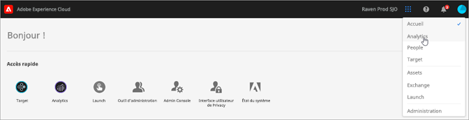

# Services d’Experience Cloud et administration

Experience Cloud désigne la famille intégrée de solutions et de services de marketing numérique d’Adobe. Il s’agit également d’une interface intuitive qui vous permet d’accéder rapidement à vos solutions cloud et services principaux.

Ce guide permet d’accéder à l’aide relative à l’administration des produits et des utilisateurs Experience Cloud dans Admin Console et d’activer ainsi des solutions pour les services de plateforme. Vous pouvez également accéder à l’aide de la bibliothèque d’audiences, des attributs du client, d’Experience Cloud Assets, etc. :

* [[!UICONTROL Bibliothèque d’audiences]](audience-library/audience-library.md)
* [[!UICONTROL Attributs du client]](attributes/attributes.md)
* [[!UICONTROL Triggers]](activation/triggers.md)
* [Ressources [!UICONTROL Experience Cloud]](experience-cloud-assets/experience-cloud-assets.md)
* [Cookies Experience Cloud](cookies/cookies-privacy.md)
* [Gestion des utilisateurs et des produits](admin-getting-started/admin-getting-started.md) (Admin Console)
* [Activation des solutions pour les services principaux](core-services/core-services.md)
* [Questions fréquentes](admin-getting-started/admin-getting-started.md)
* [Liaison d’organisations et de comptes](admin-getting-started/organizations.md)
* [Intégrations](marketing-cloud-integrations.md)
* [Intégration d’Adobe Target avec Experience Cloud](https://docs.adobe.com/content/help/fr-FR/target/using/integrate/a4t/a4t.html)
* [Présentation de la confidentialité et de la sécurité d’Experience Cloud](assets/Adobe-Marketing-Cloud-Privacy-and-Security-Overview.pdf)
* [Prérécupération DNS](admin-getting-started/admin-getting-started.md#concept_6BC8C6856E3644F8956D7AD0A96383B7)

## Guides

Les guides Experience Cloud associés sont les suivants :

* [Adobe Mobile](https://docs.adobe.com/content/help/fr-FR/mobile-services/using/home.html)
* [Graphique Co-Op pour Experience Platform](https://docs.adobe.com/content/help/fr-FR/device-co-op/using/home.html)
* [Exchange](https://experiencecloud.adobeexchange.com/)
* [Service Experience Cloud ID](https://docs.adobe.com/content/help/fr-FR/id-service/using/home.html)
* [Experience Platform Launch](https://docs.adobe.com/content/help/fr-FR/launch/using/overview.html)
* [Experience Cloud Debugger](https://docs.adobe.com/content/help/fr-FR/debugger/using/experience-cloud-debugger.html)
* [API relative au Règlement général sur la protection des données (RGPD)](https://www.adobe.io/apis/experiencecloud/gdpr.html)
* [[!UICONTROL Dynamic Tag Management]](https://docs.adobe.com/content/help/fr-FR/dtm/using/dtm-home.html)

## Tutoriels

Profitez des tutoriels d’aide autonome et des instructions rapides dans Experience League :

* [Tous les tutoriels dans Experience League](https://experienceleague.corp.adobe.com/?lang=en#quick-how-tos)
* [Tutoriels Experience Platform](https://experienceleague.corp.adobe.com/docs/core-services-learn/tutorials/overview.html?lang=en)
* [Plateforme de données clients en temps réel](https://experienceleague.corp.adobe.com/docs/platform-learn/tutorials/rtcdp/understanding-the-real-time-customer-data-platform.html?lang=en)

## Notes de mise à jour et aide Experience Cloud associée

* [Documentation sur les produits pour toutes les solutions Experience Cloud](https://docs.adobe.com/content/help/fr-FR/experience-cloud/user-guides/home.html) - Recherchez de l’aide sur le site Formation et support d’Experience Cloud.
* [Notes de mise à jour et mises à jour des produits](https://docs.adobe.com/content/help/fr-FR/release-notes/experience-cloud/current.html) - Découvrez les nouveautés d’Experience Cloud et abonnez-vous pour vous tenir informé.
* [Tutoriels de mise en œuvre des services principaux](https://docs.adobe.com/content/help/en/core-services-learn/tutorials/overview.html) - Visionnez des vidéos et des didacticiels sur les services principaux.
* [Aide d’experts Experience League](https://landing.adobe.com/experience-league/) - Obtenez des conseils d’experts et de la communauté.
* [Éducation et formation](https://helpx.adobe.com/fr/learning.html?promoid=KAUDK) - Contactez Adobe pour tirer le meilleur parti de nos produits.
* [Blog sur l’expérience client](https://theblog.adobe.com/customer-experience/) - Lisez le blog Experience Cloud.
* [Assistance clientèle](https://helpx.adobe.com/fr/contact/enterprise-support.ec.html) - Contactez l’assistance clientèle Adobe.
