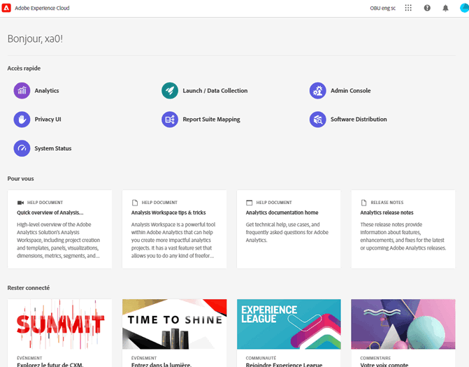
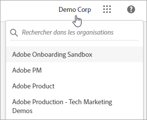
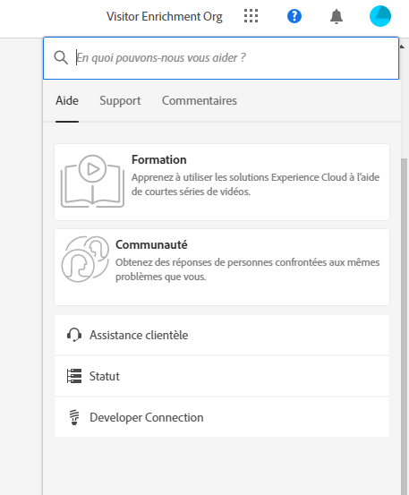
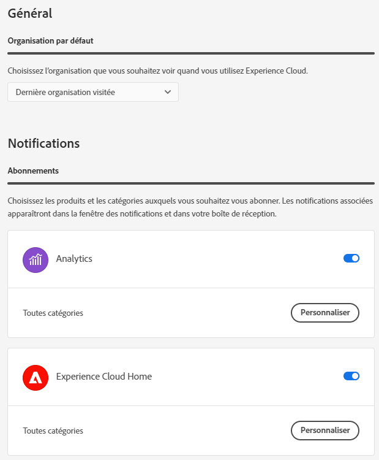
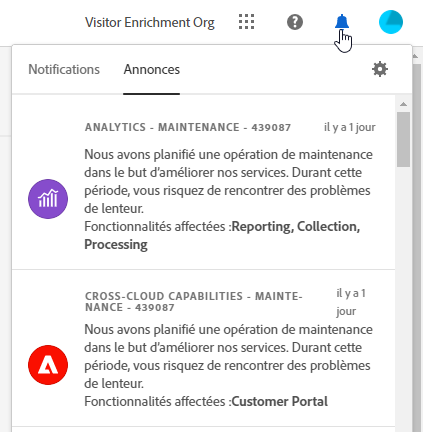

# Guide des composants de lʼinterface centrale dʼExperience Cloud

[Experience Cloud](https://experience.adobe.com) désigne la famille intégrée d’applications, de produits et de services de marketing numérique d’Adobe. Grâce à son interface intuitive, vous pouvez accéder rapidement à vos applications cloud, fonctionnalités de produit et services.

Dans l’en-tête d’Experience Cloud, vous pouvez :

* Accéder à vos applications et services
* Rechercher de la documentation sur les produits, des tutoriels et des publications de la communauté
* Effectuer une recherche globale d’objets commerciaux (pour les utilisateurs Experience Platform uniquement)
* Gestion des préférences du compte (alertes, notifications et abonnements)

## Connectez-vous à Experience Cloud {#signin}

Connectez-vous et vérifiez que vous vous trouvez dans la bonne [organisation](organizations.md).

1. Accédez à [Adobe Experience Cloud](https://experience.adobe.com).
1. Sélectionnez **[!UICONTROL Se connecter avec un Adobe ID]**.
1. Vérifiez que vous vous trouvez dans la bonne organisation.

   

   **Vérification de votre organisation**

   Pour vérifier que vous vous êtes connecté à votre [organisation](organizations.md) correcte, cliquez sur l’avatar de profil pour afficher le nom de l’organisation. Si vous avez accès à plusieurs organisations, vous pouvez également afficher et passer à une autre organisation directement dans la barre d’en-tête.

   Si votre entreprise utilise des Federated ID, Experience Cloud vous permet de vous connecter à l’aide de l’authentification unique de votre entreprise sans avoir à saisir votre adresse électronique et votre mot de passe. Pour ce faire, ajoutez `#/sso:@domain` à l’URL de l’Experience Cloud (`https://experience.adobe.com`).

   Par exemple, pour une organisation avec des Federated ID et le domaine `adobecustomer.com`, définissez votre lien URL sur `https://experience.adobe.com/#/sso:@adobecustomer.com`. Vous pouvez également accéder directement à une application spécifique en marquant cette URL avec le chemin de l’application. (Par exemple, pour Adobe Analytics, `https://experience.adobe.com/#/sso:@adobecustomer.com/analytics`.)

## Accès aux applications Experience Cloud {#navigation}

Une fois connecté à Experience Cloud, vous pouvez accéder rapidement à l’ensemble de vos applications, services et organisations à partir de l’en-tête unifié.

Pour accéder aux applications et services Experience Cloud configurés pour vous au sein de votre entreprise, accédez au sélecteur d’applications .

## Prise en charge du navigateur dans Experience Cloud {#browser}

Pour des performances optimales, Experience Cloud est optimisé pour les navigateurs les plus populaires, y compris la dernière version, ainsi que les deux versions précédentes.

* Chrome
* Edge
* Firefox
* Opera
* Safari

Si votre navigateur n’est pas répertorié, il peut toujours être pris en charge, mais il est recommandé d’utiliser l’un des navigateurs répertoriés.

>[!NOTE]
>
>Toutes les applications s’exécutant sur un domaine Experience Cloud ne prennent pas en charge tous les navigateurs. Si vous n’êtes pas sûr, consultez la documentation d’une application spécifique.

## Prise en charge linguistique en Experience Cloud {#languages}

Experience Cloud prend en charge les langues préférées de chaque utilisateur, telles que définies dans les préférences de votre compte utilisateur Adobe. Les langues actuellement prises en charge sont les suivantes :

* Chinois
* Anglais
* Français
* Allemand
* Italien
* Japonais
* Coréen
* brésilien
* Espagnol
* Taïwanais

Bien que toutes les équipes d’applications se soient engagées dans la prise en charge linguistique globale, toutes les applications ne sont pas proposées dans toutes les langues mentionnées ci-dessus. Si votre langue Principale n’est pas prise en charge dans une application Experience Cloud, vous pouvez également définir une langue secondaire par défaut sur , le cas échéant. Vous pouvez le faire dans [Préférences utilisateur Experience Cloud](https://experience.adobe.com/preferences).

## Obtention d’aide et de support {#support}

Accédez à l’apprentissage et à l’aide à l’aide de l’icône d’aide () dans l’en-tête, y compris le contenu d’aide (documentation, tutoriels et cours) sur [Experience League](https://experienceleague.adobe.com/?lang=fr#home), ainsi que des ressources supplémentaires pour des applications individuelles. Vous pouvez également envoyer des commentaires ouverts et créer des tickets d’assistance prioritaires.

Le menu [!UICONTROL Aide] vous donne également accès aux éléments suivants :

* **[!UICONTROL Support] :** créez un ticket d’assistance ou contactez l’[!UICONTROL assistance] technique à l’aide de Twitter.
* **[!UICONTROL Commentaires] :** partagez vos commentaires au sujet de votre expérience relative à Experience Cloud. Vos commentaires sont utilisés pour améliorer les produits et services d’Adobe.
* **[!UICONTROL Statut] :** accédez à `https://status.adobe.com/experience_cloud` et vérifiez le statut opérationnel du produit et [!UICONTROL gérez les abonnements].
* **[!UICONTROL Developer Connection] :** navigation vers `adobe.io` et recherche de la documentation destinée aux développeurs.

## Recherche globale d’objets et d’entités {#search}

La recherche globale vous permet de rechercher en un clic des objets commerciaux ou des entités pouvant faire l’objet de recherches, et ce, de manière fluide et cohérente. Cette recherche fait apparaître vos objets récemment consultés.

>[!NOTE]
>
>La recherche globale n’est pas disponible dans toutes les applications Experience Cloud, mais comme plus de contenu est indexé, elle sera ajoutée aux applications pertinentes. Disponibilité à partir de juillet 2021 :

* Experience Platform
* Journey Optimizer

## Préférences de profil utilisateur et de compte {#preferences}

Les préférences Experience Cloud incluent les notifications, les abonnements et les alertes. Dans le menu des préférences du compte, vous pouvez :

* Spécifier un thème sombre (toutes les applications ne prennent pas en charge ce thème) ;
* Rechercher des [Organisations](organizations.md) ;
* Vous déconnecter ;
* Configurer des préférences, notifications et abonnements relatives au compte ;

Pour gérer les préférences, sélectionnez **[!UICONTROL Préférences]** dans le menu de votre compte .

Dans [!UICONTROL Préférences Experience Cloud], vous pouvez configurer les fonctionnalités suivantes :

| Fonctionnalité | Description |
|--- |--- |
| [Organisation](organizations.md) par défaut | Sélectionnez l’organisation que vous souhaitez voir lorsque vous lancez Experience Cloud. |
| [!UICONTROL Abonnements] | Sélectionnez les produits et catégories auxquels vous souhaitez vous abonner. Notifications dans la fenêtre contextuelle [!UICONTROL Notifications] et sur votre adresse e-mail. |
| [!UICONTROL Priorité] | Sélectionnez les catégories qui doivent être considérées comme prioritaires. Ces catégories sont marquées d’une balise Élevée et peuvent être configurées pour une diffusion telle que des alertes. |
| [!UICONTROL Alertes] | Sélectionnez les notifications pour lesquelles vous souhaitez afficher les alertes dans votre navigateur. Les alertes s’affichent dans le coin supérieur droit de la fenêtre pendant quelques secondes. |
| E-mails | Indiquez la fréquence à laquelle vous souhaitez recevoir les e-mails de notification. (Non envoyé, instantané, quotidien ou hebdomadaire.) |

{style=&quot;table-layout:auto&quot;}

## Notifications et annonces {#notifications}

Sélectionnez **[!UICONTROL Notifications]** pour être averti des mises à jour pertinentes et exploitables. Cela inclut notamment les mises à jour de produits, les avis de maintenance, les éléments partagés et les demandes dʼapprobation.

## Domaines Experience Cloud {#domains}

Experience Cloud utilise les hôtes suivants pour diffuser l’application, améliorer les performances et améliorer l’expérience du produit. Adobe recommande d’ajouter ces domaines à la liste autorisée de votre pare-feu pour une expérience optimale. D’autres domaines peuvent également être utilisés pour des applications Experience Cloud spécifiques, telles qu’Adobe Analytics. Pour plus d’informations, consultez la documentation de ces applications.

| Technologie | Domaines |
|--- |--- |
| Domaines Adobe Experience Cloud | `adobe.com`, `adobe.net`, `adobe.io` |
| Adobe Identity Management Service (IMS) | `adobelogin.com` |
| Polices Experience Cloud | `typekit.net` |
| Gainsight (pour obtenir des conseils sur les produits et de l’aide) | `esp.aptrinsic.com` |

## Obtention d’aide au sujet de l’administration et des services sur plusieurs applications

Ce guide permet d’accéder à l’aide relative à l’administration des produits et des utilisateurs Experience Cloud dans Admin Console et d’activer ainsi des solutions pour les services de plateforme. Vous pouvez également accéder à l’aide de la bibliothèque d’audiences, des attributs du client, d’Experience Cloud Assets, etc. :

* [[!UICONTROL Bibliothèque d’audiences]](audience-library.md)
* [[!UICONTROL Attributs du client]](attributes.md)
* [[!UICONTROL Triggers]](triggers.md)
* [[!UICONTROL Ressources] Experience Cloud](experience-cloud-assets.md)
* [Cookies Experience Cloud](cookies-privacy.md)
* [Gestion des utilisateurs et des produits](admin-getting-started.md) (Admin Console)
* [Activation des solutions pour les services principaux](core-services.md)
* [Questions fréquentes](admin-getting-started.md)
* [Liaison d’organisations et de comptes](organizations.md)
* [Intégrations](marketing-cloud-integrations.md)
* [Intégration d’Adobe Target avec Experience Cloud](https://experienceleague.adobe.com/docs/target/using/integrate/a4t/a4t.html?lang=fr)
* [Présentation de la confidentialité et de la sécurité d’Experience Cloud](assets/Adobe-Marketing-Cloud-Privacy-and-Security-Overview.pdf)
* [Prérécupération DNS](admin-getting-started.md#concept_6BC8C6856E3644F8956D7AD0A96383B7)

## Guides

Les guides Experience Cloud associés sont les suivants :

* [Adobe Mobile](https://experienceleague.adobe.com/docs/mobile-services/using/home.html?lang=fr)
* [Graphique Co-Op pour Experience Platform](https://experienceleague.adobe.com/docs/device-co-op/using/home.html?lang=fr)
* [Exchange](https://exchange.adobe.com/experiencecloud)
* [Service Experience Cloud ID](https://experienceleague.adobe.com/docs/id-service/using/home.html?lang=fr)
* [Collecte de données Experience Platform/Launch](https://experienceleague.adobe.com/docs/launch.html?lang=fr)
* [Experience Cloud Debugger](https://experienceleague.adobe.com/docs/debugger/using/experience-cloud-debugger.html?lang=fr)
* [API relative au Règlement général sur la protection des données (RGPD)](https://www.adobe.io/apis/experiencecloud/gdpr.html)
* [[!UICONTROL Dynamic Tag Management]](https://experienceleague.adobe.com/docs/experience-platform/tags/home.html?lang=fr)

## Tutoriels

Profitez des tutoriels d’aide autonome et des instructions rapides dans Experience League :

* [Tous les tutoriels dans Experience League](https://experienceleague.adobe.com/?lang=fr#quick-how-tos)
* [Tutoriels Experience Platform](https://experienceleague.adobe.com/docs/launch-learn/tutorials/overview.html?lang=fr)
* [Plateforme de données clients en temps réel](https://experienceleague.adobe.com/docs/platform-learn/tutorials/application-services/rtcdp/understanding-the-real-time-customer-data-platform.html?lang=fr)

## Notes de mise à jour et aide Experience Cloud associée

* [Documentation sur les produits pour toutes les solutions Experience Cloud](https://experienceleague.adobe.com/docs/home.html?lang=fr) - Recherchez de l’aide sur le site Formation et support d’Experience Cloud.
* [Notes de mise à jour et mises à jour des produits](https://experienceleague.adobe.com/docs/release-notes/experience-cloud/current.html?lang=fr) - Découvrez les nouveautés d’Experience Cloud et abonnez-vous pour vous tenir informé.
* [Tutoriels de mise en œuvre des services principaux](https://experienceleague.adobe.com/docs/launch-learn/tutorials/overview.html?lang=en) - Visionnez des vidéos et des didacticiels sur les services principaux.
* [Aide d’experts Experience League](https://experienceleague.adobe.com/?lang=fr) - Obtenez des conseils d’experts et de la communauté.
* [Éducation et formation](https://helpx.adobe.com/fr/learning.html?promoid=KAUDK) - Contactez Adobe pour vous assurer de tirer le meilleur parti des produits de la marque.
* [Blog sur l’expérience client](https://blog.adobe.com/fr/topics/digital-transformation.html) - Lisez le blog Experience Cloud.
* [Assistance clientèle](https://experienceleague.adobe.com/?support-solution=General&amp;lang=fr#support) - Contactez l’assistance clientèle Adobe.
