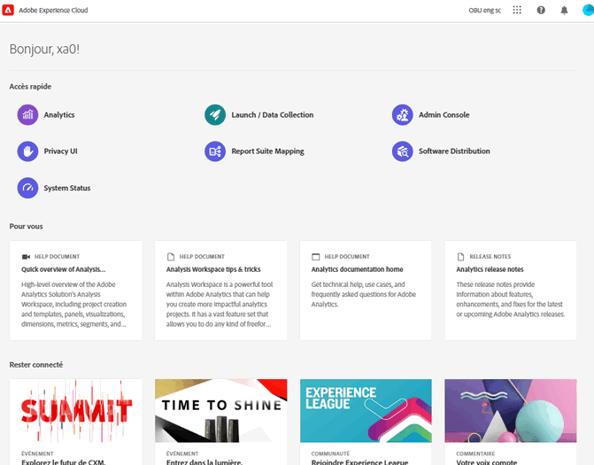

# Interface et administration de CX Enterprise

[&#128279;](https://experience.adobe.com?lang=fr) (anciennement _Experience Cloud_) est la famille intégrée d’applications, de produits et de services de marketing numérique d’Adobe. Grâce à son interface intuitive, vous pouvez accéder rapidement à vos applications cloud, fonctionnalités de produit et services.

<!--  -->

À partir de l’en-tête de CX Enterprise, vous pouvez :

* Accès à l’ensemble de vos applications et services CX Enterprise
* Dans le menu Aide, recherchez la documentation du produit, des tutoriels et des publications de la communauté. Affichez les résultats dans Experience League.
* Effectuez une recherche globale d’objets métier dans le champ de recherche (pour les utilisateurs et utilisatrices d’Experience Platform uniquement).
* Gérer les [préférences](features/account-preferences.md) du compte (alertes, notifications et abonnements)

## Connexion à CX Enterprise

Connectez-vous et vérifiez que vous vous trouvez dans la bonne [organisation](administration/organizations.md).

1. Accédez à [&#128279;](https://experience.adobe.com?lang=fr).
1. Saisissez votre adresse e-mail Adobe, puis cliquez sur **[!UICONTROL Continue]**.
1. Cliquez sur un compte.
1. Saisissez votre mot de passe.
1. Assurez-vous que vous êtes dans la bonne organisation.

   

   **Vérification de votre organisation**

   L’ [organisation](administration/organizations.md) s’affiche dans l’en-tête de l’interface.

   Si votre entreprise utilise des Federated ID, CX Enterprise vous permet de vous connecter à l’aide de l’authentification unique de votre entreprise sans avoir à saisir votre adresse e-mail et votre mot de passe. Ajoutez `#/sso:@domain` à l’URL CX Enterprise (`https://experience.adobe.com`) pour accomplir cette tâche.

   Par exemple, pour une organisation avec des Federated ID et le domaine `example.com`, définissez votre lien URL sur `https://experience.adobe.com/#/sso:@example.com`. Vous pouvez également accéder directement à une application spécifique en marquant cette URL avec le chemin de l’application. (Par exemple, pour Adobe Analytics, `https://experience.adobe.com/#/sso:@example.com/analytics`.)

   **Remarque :** l’administrateur ou l’administratrice de votre organisation peut restreindre l’accès aux produits Adobe par adresses IP. Si tel est le cas, vous pouvez recevoir une erreur après vous être connecté à CX Enterprise ou avoir basculé vers une organisation avec cette option activée. Pour plus d’informations, consultez la section [Limiter l’accès au produit par adresse IP](https://helpx.adobe.com/fr/enterprise/using/ip-based-access.html).

## Accès aux applications CX Enterprise

Une fois connecté à CX Enterprise, vous pouvez accéder rapidement à l’ensemble de vos applications, services et organisations à partir de l’en-tête unifié.

Pour accéder aux applications et services CX Enterprise configurés pour vous au sein de votre organisation, accédez au sélecteur d’applications .

## Obtention d’aide et de support

Accédez à l’apprentissage et à l’aide en utilisant l’**[!UICONTROL Help center]** () dans l’en-tête, y compris le contenu d’aide (documentation, tutoriels et cours) sur [Experience League](https://experienceleague.adobe.com/fr?lang=fr#home), ainsi que des ressources supplémentaires pour des applications individuelles. Vous pouvez également envoyer des commentaires ouverts et créer des tickets dʼassistance prioritaires.

Le menu [!UICONTROL Help] permet également d&#39;accéder aux éléments suivants :

* **[!UICONTROL Support]:** Créez un ticket d’assistance ou contactez [!UICONTROL Support] à l’aide de Twitter.
* **[!UICONTROL Feedback]:** Partagez vos commentaires sur votre expérience CX Enterprise. Vos commentaires sont utilisés pour améliorer les produits et services d’Adobe.
* **[!UICONTROL Status]:** accédez à `https://status.adobe.com/fr-fr/experience_cloud` et vérifiez l’état opérationnel et la [!UICONTROL Manage Subscriptions] du produit.
* **[!UICONTROL Developer Connection]:** Navigation pour `adobe.io` et rechercher la documentation destinée aux développeurs.

## Gérer votre profil d’utilisation

Dans le menu [!UICONTROL Profile], vous pouvez :

* Spécifier un thème sombre (toutes les applications ne prennent pas en charge ce thème).
* Gestion de CX Enterprise [Préférences](features/account-preferences.md)
* Sélectionner ou rechercher une [organisation](administration/organizations.md)
* Afficher les [!UICONTROL Legal Notices]
* Se déconnecter
* Configurer des préférences, notifications et abonnements relatives au compte ;

## Afficher des notifications et des annonces dans le produit

Cliquez sur l’icône représentant une cloche pour afficher les notifications et les annonces. Les annonces peuvent être pertinentes et exploitables. Cela inclut notamment les mises à jour de produits, les avis de maintenance, les éléments partagés et les demandes d’approbation.

Pour gérer les notifications et les alertes, voir la section [Préférences de compte et notifications](features/account-preferences.md).

