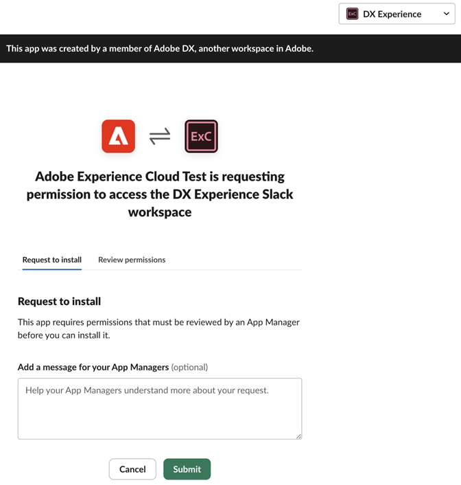

# Préférences de compte et notifications {#preferences}

Pour rechercher les préférences de l’Experience Cloud, cliquez sur **[!UICONTROL Profil]**  dans l’en-tête, puis cliquez sur **[!UICONTROL Préférences]**.

{width="100" zoomable="yes"}

Sur la page [!UICONTROL Préférences de l’Experience Cloud], vous pouvez gérer les fonctionnalités de compte suivantes :

| Fonctionnalité | Description |
|--- |--- |
| Profile | Mettez à jour votre [profil de compte d’Adobe](https://account.adobe.com/profile). 
Votre photo de profil et votre nom s’affichent lorsque vous vous connectez à Adobe.com, Adobe des produits et services et sur des sites publics tels que [!DNL Behance]. |
| Général | Sélectionnez une [organisation](../administration/organizations.md).
Cette organisation est celle utilisée par défaut lorsque vous vous connectez à Experience Cloud. |
| [!UICONTROL Collecte de données de produit] | Sélectionnez les technologies qu’Adobe peut utiliser pour collecter des données sur la manière dont vous utilisez vos produits Adobe. |
| Notifications | Configurez comment et à quel moment vous souhaitez recevoir des [notifications](#subscribe-to-notifications-in-experience-cloud) et des alertes de produit : <ul><li>Sélectionnez les produits auxquels vous souhaitez vous abonner pour les alertes.</li><li>Configurez le type de notification ([!UICONTROL in-app], [!UICONTROL email] ou [Slack](#slack-notifications))</li><li>Indiquez la fréquence à laquelle vous souhaitez recevoir les e-mails de notification. (Non envoyé, instantané, quotidien ou hebdomadaire.)</li><li>Déterminez la priorité des alertes. Les alertes in-app s’affichent dans le coin supérieur droit de la fenêtre pendant quelques secondes. Vous pouvez également indiquer si les alertes doivent s’afficher jusqu’à ce que vous les ignoriez.</li></ul> |
| [!UICONTROL Promotions et recommandations d’apprentissage personnalisées] | Sélectionnez l’emplacement où vous souhaitez recevoir [une aide personnalisée](personalized-learning.md) pour vos produits d’Adobe. Cette aide est disponible par courrier électronique, dans le produit et dans les communautés Experience League. |

## Abonnement aux notifications dans Experience Cloud {#notifications}

Vous pouvez sélectionner les produits et catégories auxquels vous souhaitez vous abonner. Les notifications apparaissent dans la fenêtre contextuelle [!UICONTROL  Notifications] (in-app), dans votre email, ou dans [Slack](#slack-notifications) (selon vos abonnements).

Les notifications par courrier électronique et Slack sont utiles lorsque vous n’êtes pas connecté à Experience Cloud.

### Abonnement aux notifications in-app et par e-mail

1. Accédez à l’Experience Cloud [preferences](https://experience.adobe.com/preferences).

1. Sous **[!UICONTROL Notifications]**, activez **[!UICONTROL In-app]** ou **[!UICONTROL Email]**.

   Les modifications apportées aux notifications sont enregistrées automatiquement.

### Abonnez-vous aux notifications [!DNL Slack] {#slack}

Vous pouvez configurer vos préférences de compte pour envoyer des notifications Experience Cloud à un canal [!DNL Slack].

**Conditions préalables**

* Vous devez avoir un compte Experience Cloud.
* Vous devez avoir un compte [!DNL Slack]. Votre administrateur [!DNL Slack] active l&#39;intégration de l&#39;Experience Cloud avec [!DNL Slack].
* Vous devez faire partie d’au moins un espace de travail [!DNL Slack].

**Pour vous abonner aux [!DNL Slack] notifications**

1. Accédez à l’Experience Cloud [Preferences](https://experience.adobe.com/preferences).

1. Recherchez [!DNL Slack], puis cliquez sur **[!UICONTROL Ajouter au Slack]**.

   

   Si [!DNL Slack] est installé, l’application s’ouvre et un message de demande d’autorisation s’affiche. Si Slack n&#39;est pas installé, vous devez [demander l&#39;autorisation](#slack-troubleshoot).

1. Cliquez sur **[!UICONTROL Autoriser]**.

1. Sous **[!UICONTROL Notifications]**, activez les [!DNL Slack] notifications pour les produits et catégories de votre choix.

   

   Les mises à jour des notifications sont automatiquement enregistrées.

### Demande d’autorisation dans [!DNL Slack] (dépannage) {#slack-troubleshoot}

Si [!DNL Slack] n&#39;est pas installé, un message _[!UICONTROL Demande d&#39;installation]_ s&#39;affiche lorsque le Slack s&#39;ouvre après avoir cliqué sur **[!UICONTROL Ajouter au Slack]**. Par exemple :

**Pour demander des autorisations en Slack**

1. Dans [!DNL Slack], sélectionnez l’espace de travail dans le menu **[!UICONTROL Workspace]** (coin supérieur droit).

1. Pour demander l’approbation de la demande pour le gestionnaire d’espace de travail [!DNL Slack], cliquez sur **[!UICONTROL Submit]**.

1. Vous recevrez une notification dans [!DNL Slack] après l’approbation de la demande d’application.

1. Une fois que vous avez reçu l’approbation [!DNL Slack], revenez à l’Experience Cloud **[!UICONTROL Notifications]** et suivez les étapes pour [vous abonner à Slack](#slack-notifications) (décrites ci-dessus).

### Ce que vous verrez dans [!DNL Slack]

Après l’intégration réussie de [!DNL Slack], les notifications [!DNL Slack] affichent les informations suivantes :

* Le message personnel sera reçu à partir du nom de l&#39;application _Adobe[!DNL Experience Cloud]_.
* Le message inclut le logo du produit pour l’application spécifique, tel que l’Adobe [!DNL Experience Platform], l’Adobe [!DNL Experience Manager], etc.
* Lien permettant d’afficher toutes les notifications sur Experience Cloud.
* Lien permettant de gérer les préférences de notification sur Experience Cloud.

## Afficher des [!UICONTROL notifications] et des annonces dans Experience Cloud {#view-notifications}

Dans l’en-tête [!DNL Experience Cloud], vous pouvez afficher les notifications auxquelles vous êtes [abonné](#notifications), ainsi que les annonces.

1. Cliquez sur l’icône représentant une cloche dans l’en-tête . 

1. Cliquez sur **[!UICONTROL Notifications]** ou **[!UICONTROL Annonces]**.

   Cet emplacement vous permet de recevoir des informations importantes sur les produits, votre collaboration avec d’autres utilisateurs et d’autres mises à jour pertinentes. Les mises à jour comprennent les versions de produit, les avis de maintenance, les éléments partagés et les demandes d’approbation.
