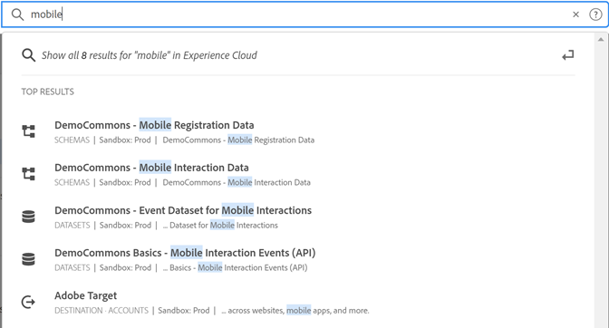

# [!UICONTROL Recherche unifiée] dʼobjets et dʼentités {#globally-search}

La [!UICONTROL Recherche unifiée] vous permet de rechercher en un clic des objets commerciaux ou des entités pouvant faire l’objet de recherches, et ce, de manière fluide et cohérente. Cette recherche fait également apparaître vos objets récemment consultés.

## Accéder à la recherche unifiée

La recherche unifiée est disponible sur chaque page, dans l’en-tête Experience Cloud, en haut de la page. Pour accéder à la recherche, vous pouvez également utiliser le raccourci clavier `command /` ou `ctrl /`.

Cette fonctionnalité est disponible uniquement pour les produits pris en charge actuellement, à savoir :

* Experience Platform (AEP)
* Journey Optimizer (AJO)

Au fur et à mesure que le contenu est indexé, cette fonctionnalité sera ajoutée aux applications pertinentes.

## Objets et champs pouvant faire l’objet d’une recherche

Pendant la saisie, les meilleurs résultats correspondants sʼaffichent pour les objets auxquels vous avez accès.

Nos algorithmes affichent d’abord les enregistrements les plus pertinents. L’ordre des résultats dépend de plusieurs facteurs, tels que :

Votre niveau dʼautorisation et autorisations d’objet
Pourcentage de correspondance
S’il y a une correspondance exacte

Les objets métier pouvant faire l’objet d’une recherche sont les suivants :

* Segments (nom, description, ID)
* Schéma (nom, description, ID)
* Jeux de données (nom, description, ID)
* Sources (nom, description, ID)
* Destinations (nom, description, ID)
* Requêtes (nom, description, ID)
* Messages (nom, description, ID)
* Offres (nom, description, ID)
* Composants (nom, description, ID)
* Parcours (nom, description, ID)

Si un mot-clé correspond à une page de navigation, vous pouvez obtenir un lien d’accès rapide aux exemples de jeux de données de la page de navigation. La section Meilleurs résultats affiche les 30 meilleurs résultats.

Vous trouverez également les articles dʼaide dʼExperience League et des communautés. Les requêtes en langues naturelles sont prises en charge.

Par exemple, _Comment créer un schéma_ renvoie les résultats dʼExperience League sous _[!UICONTROL Apprentissage]_ :

Les algorithmes de recherche affichent d’abord les enregistrements les plus pertinents. L’ordre des résultats dépend de plusieurs facteurs, tels que :

* Les autorisations utilisateurs requises pour accéder aux objets.
* Le pourcentage de correspondance.
* Les correspondances exactes.
* La section _[!UICONTROL Meilleurs résultats]_ affiche les 30 meilleurs résultats.

Pour affiner votre recherche, cliquez sur l’une des options suivantes :

* **[!UICONTROL Tous les apprentissages]** : ouvre la recherche dans Experience League.
* **[!UICONTROL Tout afficher...]** : permet d’affiner et de filtrer davantage les résultats.

## Fonctionnalités de la recherche unifiée

Les fonctionnalités suivantes sont disponibles dans la recherche unifiée.

| Fonctionnalité | Description |
| ------- | ------- |
| Prise en charge globale des langues | La recherche globale comprend les requêtes et génère des résultats en allemand, espagnol, français, italien, japonais, coréen, portugais et chinois. |
| Tolérance aux fautes de frappe | La recherche unifiée offre une tolérance robuste aux fautes de frappe grâce à des algorithmes avancés. Ces algorithmes calculent les modifications et fournissent les résultats appropriés. |
| Surbrillance | La réponse à la recherche met en surbrillance le mot-clé correspondant à la requête, afin que vous puissiez visualiser dʼun coup dʼœil la section et les mots qui correspondent à votre requête. La mise en surbrillance fonctionne également pour les mots mal orthographiés. |
| Extraits | Un extrait du résultat sʼaffiche dans la réponse à la recherche. Les extraits affichent les mots correspondants et leur contexte immédiat. |
| Mots vides | Certains mots couramment utilisés en anglais sont définis comme des _mots vides_. Si des mots vides sont inclus dans la requête, ils reçoivent une pondération moindre.  Les mots vides incluent les mots anglais suivants : _a, an, and, are, as, at, be, but, by, for, if, in, into, is, it, no, not, of, on, or, such, that, the, their, then, there, these, they, this, to, was, will, with_.  Les mots vides ne sont pris en charge que pour lʼanglais. |
| Requêtes en langage naturel | Lorsque vous recherchez un article d’aide ou une discussion dans les communautés Experience League, vous pouvez saisir votre question en utilisant le langage naturel et obtenir la réponse. Exemple de recherche : « Comment créer un schéma ? » |
| Recherche dʼune expression exacte entre guillemets | Vous pouvez effectuer la recherche dʼune expression exacte en incorporant des guillemets dans la requête. Aucune correction des fautes de frappe n’est effectuée sur les requêtes de correspondance exacte. Par exemple : « Voyage Luma 2022 » |
| Filtres | Vous pouvez appliquer des filtres comme _Type dʼobjet_ et dʼautres filtres spécifiques à lʼobjet dans la fenêtre pop-up des résultats de la recherche complète. Lorsque vous appuyez sur Entrée après avoir saisi les termes de la requête, une fenêtre pop-up sʼouvre en pleine page et inclut les filtres. |

{style="table-layout:auto"}

## Vous ne trouvez pas ce que vous recherchez ?

Essayez ces conseils :

* Saisissez un terme de recherche plus précis.
* Vérifiez l’orthographe.
* Essayez d’écrire le terme de recherche complet.
* Assurez-vous de disposer des autorisations nécessaires pour les objets que vous recherchez.
