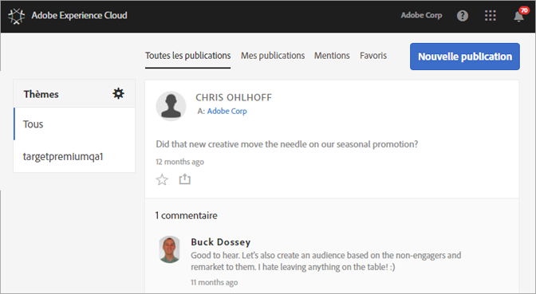
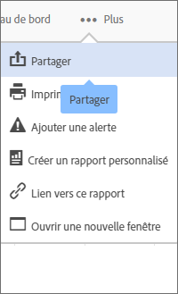

# Flux

**Le flux Experience Cloud ne sera plus pris en charge à compter du 1er novembre 2019 et sera abandonné d’ici décembre 2019.**

Découvrez comment partager ou publier des ressources et des rapports  Analytics directement sur votre flux Experience Cloud.

Le flux peut être vide la première fois que vous vous connectez à Experience Cloud. À mesure que vous créez des publications et partagez des objets, et que d’autres utilisateurs partagent des contenus avec vous, le flux est alimenté automatiquement afin de vous aider, ainsi que les membres de votre équipe, à vous tenir à jour.

Les paramètres du flux comprennent les suivants :

* **Sujets : tout \&lt;nom de l’organisation\&gt; :** affiche toutes les publications qui ont été partagées avec vous et toutes celles auxquelles vous avez accès.
* **Gérer les rubriques :** vous permet de suivre, ne plus suivre ou suggérer des rubriques. En outre, les administrateurs peuvent approuver, rejeter, désactiver et créer des rubriques.
* **Nouvelle publication :** créez des publications que les membres des groupes peuvent voir.
* **Toutes les publications :** affichez toutes les publications contenues dans votre flux.
* **Mes publications :** affichez uniquement vos publications.
* **Mentions :** affichez les publications dans lesquelles vous ou votre groupe êtes mentionnés.
* **Favoris :** affichez les publications que vous avez marquées comme favorites.

## Partager un projet Analytics sur le flux {#section_F2BDF9FEF4394686BAC5051CBE913EE5}

**Le flux Experience Cloud ne sera plus pris en charge à compter du 1er novembre 2019 et sera abandonné d’ici décembre 2019.**

Vous pouvez partager des rapports à partir de [!UICONTROL Reports &amp; Analytics] sur le flux Experience Cloud.

1. [Connectez-vous](admin-getting-started/getting-started-experience-cloud.md#topic_AC564B6795334DE39359ADD87F52F2E0) à Experience Cloud à l’aide de votre Adobe ID.

1. Accédez à Reports &amp; Analytics, puis [créez un projet](https://docs.adobe.com/content/help/en/analytics/analyze/analysis-workspace/build-workspace-project/freeform-overview.html).

1. Cliquez sur **[!UICONTROL Plus]** &gt; **[!UICONTROL Partager]**.

   

1. Dans la fenêtre Partager, ajoutez des destinataires, puis cliquez sur **[!UICONTROL Partager]**.
