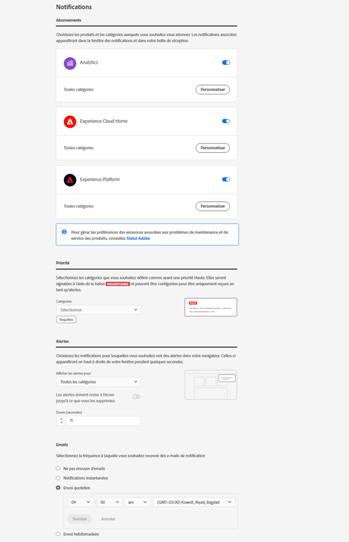

# Connexion et gestion des paramètres du profil Experience Cloud

En vous connectant à Experience Cloud (plutôt quʼà une application donnée), vous bénéficiez de lʼauthentification unique pour tous les services et applications que vous détenez. Cette aide explique comment vous connecter à Experience Cloud, gérer les mots de passe et les notifications, puis spécifier une page d’entrée par défaut.

>[!IMPORTANT]
>
>Si vous êtes administrateur, consultez [Administration](admin-getting-started.md#topic_3FCB4099640647E3B2411ADBFCE81909) pour obtenir des informations sur les mises à jour de la gestion des utilisateurs et des produits.

## Connexion à Experience Cloud (administrateurs) {#task_034FC955031347F3B02B686A09801A08}

Connectez-vous et vérifiez que vous vous trouvez dans la bonne [organisation](organizations.md#topic_C31CB834F109465A82ED57FF0563B3F1).

1. Sélectionnez le menu Experience Cloud (), puis **[!UICONTROL Administration]**.

   Si le lien **[!UICONTROL Administration]** n’apparaît pas, cela signifie que vous n’êtes pas un administrateur Experience Cloud pour l’[organisation](organizations.md#topic_C31CB834F109465A82ED57FF0563B3F1) affichée. Si vous avez besoin d’aide pour devenir administrateur, contactez l’assistance clientèle ou un autre administrateur Experience Cloud de votre entreprise.
1. Sélectionnez **[!UICONTROL Administration]**.

1. Poursuivez en sélectionnant lʼun des liens suivants :

| Élément | Description |
|--- |--- |
| [Concepts de base d’Admin Console](experience-cloud.md) | Découvrez les premières étapes à suivre pour commencer à utiliser les applications Experience Cloud. |
| [Configuration d’identité](https://helpx.adobe.com/fr/enterprise/using/set-up-identity.html) | Définissez et configurez un système d’identités qui déterminera le mode d’authentification de vos utilisateurs finaux. |
| [Gestion des utilisateurs](https://helpx.adobe.com/fr/enterprise/using/users.html) | Découvrez-en plus sur la connexion à Admin Console et sur la gestion des autorisations d’utilisateurs et sur les profils de produits dans Experience Cloud. |
| [Lancement d’Admin Console](admin-getting-started.md) | Admin Console centralise la gestion de vos utilisateurs et de vos droits sur les produits Adobe au sein de votre organisation dans son intégralité. Vous pouvez également vous connecter à Admin Console à l’aide d’un [lien direct](https://adminconsole.adobe.com). |
| [Gérer les utilisateurs de Creative Cloud](t-admin-add-cc-user.md) | Experience Cloud Assets permet aux spécialistes du marketing de partager des dossiers, de les synchroniser et de collaborer avec les concepteurs et autres créatifs dans Creative Cloud. Ici, vous pouvez gérer les utilisateurs de Creative Cloud autorisés à collaborer avec votre organisation. |
| [Mappage de vos suites de rapports](core-services.md) | (Analytics uniquement) Les services principaux Experience Cloud sont associés à une organisation plutôt qu’à une suite de rapports individuelle. Afin de garantir le bon fonctionnement de ces services, chaque suite de rapports Analytics doit être mappée à une organisation. (Cette tâche fait partie d’un processus permettant l’ [Activation d’Analytics pour les services principaux](core-services.md#concept_07ED1D5C64234E77976E6D572E78FB9C)). |
| [ID d’organisation](organizations.md) | Depuis Admin Console, l’*ID de l’organisation* se trouve dans l’URL. Vous pouvez également l’afficher sur la pop-up [!UICONTROL Débogueur de données utilisateur] (`ctrl+i` ou `cmd+i`) depuis n’importe quelle page sur `https://experience.adobe.com`. Il s’agit de l’identifiant associé à la société Experience Cloud configurée. Cet identifiant correspond à une chaîne de 24 caractères alphanumériques, suivie de @AdobeOrg (obligatoire). |

{style=&quot;table-layout:auto&quot;}

## Connexion à Experience Cloud (utilisateurs) {#task_1BFE87E20DCB44078CAC82F3CD44B985}

Cette section vise à aider les utilisateurs non-administrateurs qui se connectent à Experience Cloud.

1. Vérifiez auprès de votre administrateur que votre [organisation](organizations.md) a reçu les privilèges d’accès dans Experience Cloud.

1. Accédez à [Adobe Experience Cloud](https://experience.adobe.com) ([!DNL experience.adobe.com]).
1. Sélectionnez **[!UICONTROL Se connecter avec lʼAdobe ID]**.

   Votre administrateur Experience Cloud peut vous aider à déterminer le type de compte (Adobe ID ou Enterprise ID).

1. Sur votre page dʼentrée, sélectionnez lʼicône de sélecteur  pour accéder au menu déroulant.

   

   Les services et applications qui sʼaffichent dans ce menu dépendent de vos privilèges dʼapplication, définis par votre [administrateur](admin-getting-started.md#topic_3FCB4099640647E3B2411ADBFCE81909).

## Configuration des paramètres du compte personnel par défaut {#task_73CBCAE6C91749D19C95421E5AC311BA}

Vous pouvez modifier des détails personnels et spécifier une [organisation](admin-getting-started.md#concept_705C626560A54CA2A4215F1C870C42B2) et une page d’entrée par défaut, qui s’afficheront une fois que vous serez connecté à Experience Cloud.

1. Connectez-vous à Experience Cloud, puis sélectionnez votre icône de profil.

   
1. Sélectionnez **[!UICONTROL Modifier le profil]**.

   
1. Continuez à configurer et à modifier les informations personnelles, puis sélectionnez **[!UICONTROL Enregistrer les modifications]**.

## Activation des notifications {#concept_0105453AD71847B8BFCAF4A40915F157}

Recevez des notifications (par courrier électronique ou au sein du produit) concernant les mises à jour du système, les avis de maintenance, les publications, les mentions et les ressources partagées. Vous pouvez également spécifier les produits et les applications pour lesquels vous souhaitez recevoir des notifications, y compris lʼétat du chargement des attributs du client.

Pour accéder aux notifications, sélectionnez lʼicône **[!UICONTROL Notifications]** , puis choisissez lʼicône **[!UICONTROL Paramètres]** .

Vous pouvez trier l’affichage des notifications d’après les types de messages qui vous intéressent et rechercher des notifications. Vous pouvez également réaliser les opérations suivantes :

* Trier les messages selon les types qui vous intéressent
* Rechercher des notifications

<!-- 
 <b>Analytics</b> 
 
<ul id="ul_91BF597858124FA5BF338C36F6C5533F"> 
 <li id="li_FAD3E93CDE6242F58F14D55C8A6E23D7">Contribution analysis completed </li> 
 <li id="li_03D33D3228884CECA371B58656B2F3E7">Guided analysis shared </li> 
 <li id="li_DCF710F89317487B8DAA86CC05C694CA">Scheduled report failure </li> 
</ul> 

 <b>Adobe Target</b> 
 

Test started or stopped 
 

 <b>Advertising Cloud</b> 
 

Performance alerts 
 

 <b>Dynamic Tag Manager</b> 
 
<ul id="ul_9ACDA418933E40918744D9C32A57DD4B"> 
 <li id="li_4DD0FFD3D9F84A428703611EF767D4D0">New web property created </li> 
 <li id="li_C6B923012E9D40BA91F4CBF7D2D72986">New user added </li> 
 <li id="li_EB0B9D1CFDE24E6987935CCCBFC7892A">Approvals - publishing and approval status for new rules, data elements, and tools </li> 
 <li id="li_17B0B176FF85435FB7EDD4317BC18201">Property has been published </li> 
</ul> -->

## Gestion des profils et des mots de passe {#task_7B89F4F38E5A4C4EB0FF842953856382}

Vous pouvez modifier votre profil Experience Cloud, définir une organisation et une page d’entrée par défaut, etc.

1. Connectez-vous à Experience Cloud.

1. Dans Experience Cloud, sélectionnez la photo de votre profil.

   
1. Sélectionnez **[!UICONTROL Modifier le profil]**.

   Sur la page Profil et mots de passe, renseignez les champs et les options sous Détails personnels.

## Récupération du mot de passe {#task_46541A2806164CB1A4AE8239604E4EB1}

1. Naviguez jusqu’à la page d’ouverture de session de votre solution.
1. Sélectionnez **[!UICONTROL Mot de passe oublié]**.

   La réinitialisation du mot de passe de la solution résout habituellement les problèmes de liaison de mots de passe pour Experience Cloud.

   Pour les utilisateurs d’Adobe Analytics, accédez à la page [https://sc2.omniture.com/password_recovery.html](https://sc2.omniture.com/password_recovery.html).

## Configuration de la connexion aux applications à lʼaide dʼun lien direct {#concept_8BE493A08786469B88B210E13F78FF2F}

Vous pouvez éventuellement vous connecter à une page spécifique au sein d’une solution à l’aide de l’authentification fournie par l’interface d’Experience Cloud.

### Modèle d’URL

`https://experience.adobe.com/#/@<tenantId>/<solutionname>?destURL=<fullURL>`

Exemple d’URL :

`https://experience.adobe.com/#/@aem62tenant/analytics?destURL=https%3A%2F%2Fsc.omniture.com%2Freports%2F11562.html`

>[!NOTE]
>
>Vous devez coder les URL avant de les transmettre au paramètre `destURL`. (Des sites de codage tels que [URL Decoder / Encoder](https://meyerweb.com/eric/tools/dencoder/) sont disponibles.)

| Paramètre | Description | Exemple | Obligatoire / Facultatif |
|--- |--- |--- |--- |
| `tenantId` | Nom du client auquel l’utilisateur doit se connecter. | aem62tenant | Facultative |
| `destURL` | URL complète renvoyant vers l’emplacement auquel l’utilisateur doit accéder. | http://sc.omniture.com/login/?r=%2Fx%2F1_7xxzf&amp;tenantId=obuengsc&amp;company=OBU+Eng+SC | Facultative |
| `solutionname` | Nom de la solution MAC propriétaire du paramètre `destURL`. Cette solution est utilisée pour vérifier que lʼutilisateur a accès à lʼapplication propriétaire de lʼURL. Il appartient aux applications de sʼassurer que `applicationname` est synchronisé avec le paramètre `destURL`. Par exemple : si lʼURL comporte `solutionname` en tant que valeur « social » et que le paramètre `destURL` fourni est une URL Analytics, lʼutilisateur est redirigé vers lʼURL même sʼil n’a pas accès à Analytics. MAC ne vérifie PAS si le propriétaire du paramètre `destURL` est synchronisé avec le nom de lʼapplication. | analytics | Obligatoire si le paramètre `destURL` est utilisé. |

{style=&quot;table-layout:auto&quot;}
