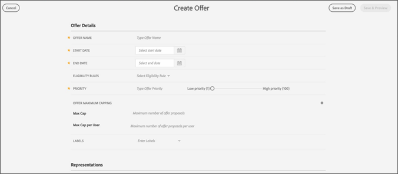

# Offres

Créez et gérez des offres à utiliser dans Adobe Campaign.

Il existe deux types d’offres dans la gestion des [!UICONTROL offres]:

| Type | Description |
|---|---|
| Offre générale | Permet de remplir le modèle de données d’offre complet (règles d’éligibilité, dates de début et de fin et contenu). |
| Offre de secours | Offre de dernier recours si un client n’est pas éligible pour l’une des autres offres sélectionnées. Vous ne pouvez associer aucune règle d’éligibilité ni date de début et de fin aux offres de secours. |

>[!NOTE]
>
>Dans une activité d’offre, vous serez toujours invité à sélectionner une offre de secours. Vous devez donc avoir au moins une offre de secours dans votre stock d’offres avant de pouvoir créer une activité d’offres.

## Create an offer {#task_6C4AE487377D424FA133ACCA6AF741D4}

Créez une offre à ajouter à votre inventaire d’offres.

1. Dans l’onglet [!UICONTROL Inventaire] de la gestion des [!UICONTROL offres], cliquez sur **[!UICONTROL Créer une offre]**, puis sélectionnez**[!UICONTROL  Créer une offre.]**

   

1. Renseignez les champs suivants :

   <table id="table_60A4001CE9F34422ACB59FB62C9CBDCD">
<thead> 
  <tr> 
   <th colname="col1" class="entry"> Champ </th> 
   <th colname="col2" class="entry"> Description </th> 
  </tr>
 </thead>
 <tbody> 
  <tr> 
   <td colname="col1"> 
Nom de l’offre 
 </td> 
   <td colname="col2"> 
Nom associé à l’offre. Vous ne pouvez pas avoir deux offres dans votre stock avec des noms en double. 
 </td> 
  </tr> 
  <tr> 
   <td colname="col1"> 
Date de début 
 </td> 
   <td colname="col2"> 
Date à laquelle l’offre peut être affichée. Si une date de début du 15/15/17 est sélectionnée, l’offre peut être affichée à partir de 12:00 le 1/15/17. 
 
La gestion des offres fonctionne selon la norme UTC. Cela signifie que : 
 
 
     <ul id="ul_A9D49B4405F34E6DA8FB52A13437F799"> 
      <li id="li_9490D092B235479A981FC2D5DD0B17B4">Les offres deviennent valides à 00:00 UTC le jour où l’offre est définie pour commencer. </li> 
      <li id="li_C28BB1FEB9E1495593826403CF5F67A9">Les offres expirent à 00:00 UTC le jour suivant la date de fin. Par exemple, si une offre est définie pour une date de fin de 5/14, l’offre expirera à 00:00 UTC le 15/5. L’offre est ensuite archivée. </li> 
      <li id="li_D3F7DCD1BF75410A8F4F5BC468B667AB">Lorsque des courriers électroniques sont préparés dans Adobe Campaign, seules les offres valides à ce moment-là s’affichent. </li> 
     </ul> 
 </td> 
  </tr> 
  <tr> 
   <td colname="col1"> 
Date de fin 
 </td> 
   <td colname="col2"> 
date de fin de l’offre. Si une date de fin du 20/11/17 est sélectionnée, l’offre n’est plus affichée après 23h59 le 20/17. Lorsqu’une offre dépasse sa date de fin, elle est automatiquement archivée. 

La gestion des offres fonctionne selon la norme UTC. Voir la ligne ci-dessus pour plus d’informations. 
</td> 
  </tr> 
  <tr> 
   <td colname="col1"> 
Règles d’éligibilité 
 </td> 
   <td colname="col2"> 
Vous pouvez créer des règles d’éligibilité d’offre en fonction des données disponibles dans la base de données  Campaign . Les règles d’éligibilité déterminent à qui et quand une offre peut être présentée. 
 
Par exemple, vous pouvez spécifier que vous souhaitez uniquement afficher une offre de vêtements d’hiver pour femmes lorsque (Sexe = Femme) et (Région = 'Nord-Est'). Les attributs utilisés pour créer ces règles proviennent du profil Campaign Standard. 
 
Remarque :  Lorsque vous accédez pour la première fois à la gestion des offres, aucun attribut n’est disponible dans le créateur de règles. Vous devez partager des attributs depuis l’interface utilisateur de la campagne. Une fois partagés, ces attributs sont disponibles. 
</td> 
  </tr> 
  <tr> 
   <td colname="col1"> 
Maximum 
 </td> 
   <td colname="col2"> 
Le nombre maximal de fois qu’une offre peut être proposée. 
 
Remarque :  Le nombre de fois où une offre est proposée est calculé au moment de la préparation du courrier électronique. Si, par exemple, vous préparez un courrier électronique avec un certain nombre d’offres, ces chiffres sont calculés selon votre plafond, que le message soit envoyé ou non. 
</td> 
  </tr> 
  <tr> 
   <td colname="col1"> 
Maximum cap par utilisateur 
 </td> 
   <td colname="col2"> 
durée maximale pendant laquelle une offre peut être proposée à un utilisateur donné. 
 
Remarque :  Le nombre de fois où une offre est proposée à un utilisateur donné est calculé au moment de la préparation du courrier électronique. Si, par exemple, vous préparez un courrier électronique avec un certain nombre d’offres, ces nombres sont comptabilisés dans le plafond maximal par utilisateur, que le courrier électronique soit envoyé ou non.
 </td> 
  </tr> 
  <tr> 
   <td colname="col1"> 
Étiquettes 
 </td> 
   <td colname="col2"> 
Ajoutez des étiquettes à une offre pour les regrouper. Vous pouvez taper et appuyer sur Entrée pour créer une étiquette ou commencer à taper et sélectionner une offre existante dans la liste déroulante. 
 </td> 
  </tr> 
 </tbody> 
</table>

1. Renseignez les détails des représentations.

   | Champ | Description |
   |---|---|
   | Canal | Canal dans lequel cette représentation du contenu peut être diffusée. Les courriers électroniques de Campaign Standard sont le seul canal actuellement disponible. |
   | Emplacement | Sélectionnez l’emplacement dans lequel cette représentation du contenu peut être diffusée. Les emplacements sont préremplis à partir de l’onglet Emplacements. Vous devez associer chaque représentation de contenu à un emplacement dans le menu déroulant. Vous ne pouvez pas créer plusieurs représentations de contenu avec le même emplacement dans la même offre. |
   | Type de contenu | Sélectionnez un type de contenu d’image, d’URL d’image, de texte ou de code HTML. |
   | Lien de redirection | Ce champ s’affiche si vous sélectionnez un type de contenu d’image ou d’URL d’image. Il s’agit du lien vers lequel l’utilisateur sera redirigé s’il clique sur cette offre dans un courrier électronique. |

1. Cliquez sur **[!UICONTROL Enregistrer et prévisualiser]**pour vérifier les détails de votre offre avant de l’envoyer.
1. Cliquez sur **[!UICONTROL Approuver]**pour approuver l’offre. Une fois l’offre approuvée, elle peut être utilisée dans une activité d’offre.

   Si vous ne disposez pas des autorisations requises pour approuver une offre, vous devez cliquer sur **[!UICONTROL Envoyer]**. L’offre s’affiche alors dans la bibliothèque d’offres avec un état en attente. Une fois qu’un utilisateur disposant de droits d’approbation l’approuve, il sera disponible pour une utilisation dans une activité d’offre.
