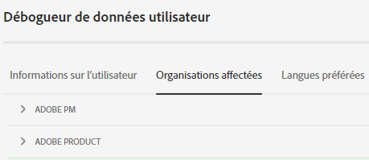
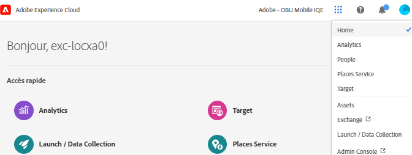
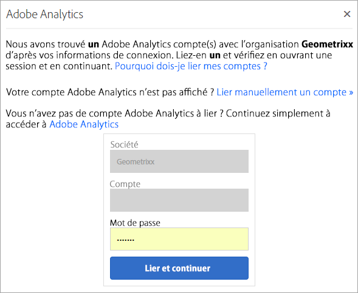
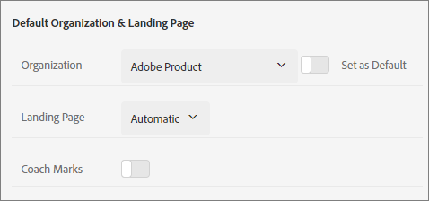

# Organisations dans Experience Cloud

Découvrez comment gérer et changer dʼorganisation dans Experience Cloud.

## Identification de votre organisation {#concept_384D169B0B724B799D573B8ECB5C39BF}

Une *organisation* est lʼentité qui permet à un administrateur de configurer des groupes et des utilisateurs, ainsi que de contrôler lʼauthentification unique dans Experience Cloud. Lʼorganisation fonctionne comme une société de connexion qui couvre tous les produits et applications Experience Cloud. La plupart du temps, une organisation désigne votre nom de société. Cependant, une société peut avoir plusieurs organisations.

Pour vérifier que vous êtes connecté à la bonne organisation, cliquez sur votre avatar de profil afin dʼafficher le nom de lʼorganisation. Si vous avez accès à plusieurs organisations, vous pouvez également afficher et passer à une autre organisation directement dans la barre d’en-tête.

Si votre entreprise utilise des Federated ID, Experience Cloud vous permet de vous connecter à l’aide de l’authentification unique de votre entreprise sans avoir à saisir votre adresse e-mail et votre mot de passe. Pour cela, ajoutez `#/sso:@domain` à l’URL d’Experience Cloud (`https://experience.adobe.com`).

Par exemple, pour une organisation avec des Federated ID et le domaine `adobecustomer.com`, définissez votre lien URL sur `https://experience.adobe.com/#/sso:@adobecustomer.com`. Vous pouvez également accéder directement à une application spécifique en marquant cette URL avec le chemin de l’application. (Par exemple, pour Adobe Analytics, `https://experience.adobe.com/#/sso:@adobecustomer.com/analytics`.)

## Trouvez l’ID de votre organisation {#concept_EA8AEE5B02CF46ACBDAD6A8508646255}

Vous devrez peut-être localiser lʼID dʼorganisation à des fins dʼassistance. Vous pouvez vérifier que vous vous trouvez dans la bonne organisation ou changer d’organisation à l’aide du menu **[!UICONTROL Organisation]**.

L’ID de l’organisation est l’identifiant associé à votre entreprise Experience Cloud provisionnée. Cet identifiant est une chaîne alphanumérique de 24 caractères, suivie de (et qui doit inclure) `@AdobeOrg`.

Vous pouvez afficher votre ID d’organisation ainsi que d’autres informations de compte à l’aide du raccourci clavier **Ctrl+i** depuis n’importe quelle page sur `https://experience.adobe.com`, puis cliquer sur l’onglet **[!UICONTROL Organisations affectées]** dans la boîte de dialogue.

Les administrateurs peuvent également se connecter à Admin Console (en accédant à [https://adminconsole.adobe.com](https://adminconsole.adobe.com)) et afficher votre ID d’organisation IMS dans l’URL.

Par exemple, dans l’URL suivante :

`https://adminconsole.adobe.com/C538193582390300A495CC9@AdobeOrg/overview`

L’ID est :

`C538193582390300A495CC9@AdobeOrg`

## Liaison dʼun compte dʼapplication à un Adobe ID {#task_FD389E78640848919E247AC5E95B8369}

En général, les administrateurs Experience Cloud accordent lʼaccès aux applications et aux services. Dans de rares cas, vous devrez peut-être lier les informations de connexion de lʼapplication à un Adobe ID.

1. Suivez les instructions fournies dans votre invitation par courrier électronique pour accéder à Experience Cloud.
1. Connectez-vous à l’aide de votre Adobe ID ou de votre Enterprise ID.
1. Sélectionnez le sélecteur dʼapplications ().

   

   Les applications auxquelles vous avez accès sont indiquées à l’aide d’une couleur.
1. Sélectionnez lʼapplication souhaitée.

   

   Si vous faites partie du groupe approprié (et disposez des autorisations nécessaires pour accéder à lʼapplication), mais nʼavez pas encore lié les informations de connexion de votre compte à votre Adobe ID, ce type de message sʼaffiche.
1. Sélectionnez **[!UICONTROL Lier le compte]**, puis fournissez vos informations dʼidentification.

## Définition d’une organisation et d’une page d’entrée par défaut {#concept_6A191B42A9874A9780882903BA18F071}

Vous pouvez définir une organisation et une page d’accueil par défaut à utiliser lorsque vous ouvrez une session.

Dans votre profil, sélectionnez **[!UICONTROL Modifier le profil]**.

Sous Organisation et page de destination par défaut, vous pouvez personnaliser votre expérience dʼouverture de session.

## Résoudre les problèmes de liaison de comptes {#concept_DFCB29A3B4834FC59AA29E0BBA301584}

Aide pour résoudre les problèmes qui se produisent lors de la liaison de comptes.

En règle générale, la liaison de comptes échoue, car l’Adobe ID est lié à un utilisateur précédent. Lorsque la liaison de comptes échoue, vous pouvez :

* [contacter l’assistance Adobe](https://experienceleague.adobe.com/?support-solution=General&amp;lang=fr#support) ;
* accéder à votre application en suivant la procédure de connexion standard pendant que nous résolvons le problème.
