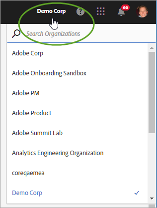
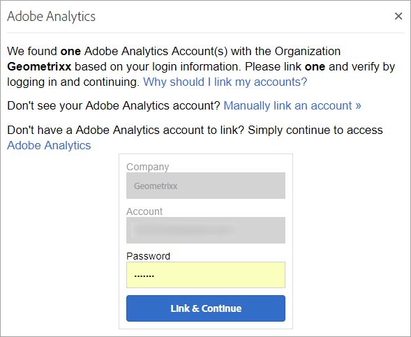

# Liaison d’organisations et de comptes

Découvrez la gestion des organisations et la liaison de comptes de solution à Experience Cloud.

## Identification de votre organisation {#concept_384D169B0B724B799D573B8ECB5C39BF}

Une *organisation* est l’entité qui permet à un administrateur de configurer des groupes et des utilisateurs et de contrôler l’authentification unique dans Experience Cloud. L’organisation fonctionne comme une société de connexion qui couvre tous les produits et solutions Experience Cloud. La plupart du temps, une organisation désigne votre nom de société. Cependant, une société peut avoir plusieurs organisations.

Pour vérifier que vous vous êtes connecté à la bonne organisation, cliquez sur l’avatar de profil pour afficher le nom de l’organisation. Si vous avez accès à plusieurs organisations, vous pouvez également afficher et passer à une autre organisation directement dans la barre d’en-tête.

Si votre entreprise utilise des Federated ID, Experience Cloud vous permet de vous connecter à l’aide de l’authentification unique de votre entreprise sans avoir à saisir votre adresse électronique et votre mot de passe. Pour ce faire, ajoutez `#/sso:@domain` à l’URL de l’Experience Cloud (`https://experience.adobe.com`).

Par exemple, pour une organisation avec des Federated ID et le domaine `adobecustomer.com`, définissez votre lien URL sur `https://experience.adobe.com/#/sso:@adobecustomer.com`. Vous pouvez également accéder directement à une application spécifique en marquant cette URL avec le chemin de l’application. (Par exemple, pour Adobe Analytics, `https://experience.adobe.com/#/sso:@adobecustomer.com/analytics`.)

## Obtention de votre ID d’organisation {#concept_EA8AEE5B02CF46ACBDAD6A8508646255}

Vous devrez peut-être localiser votre ID d’organisation à des fins d’assistance. Vous pouvez vérifier que vous vous trouvez dans la bonne organisation ou changer d’organisation à l’aide du menu **[!UICONTROL Organisation]**.

L’**ID d’organisation** est l’identifiant associé à la société Experience Cloud activée. Cet identifiant correspond à une chaîne de 24 caractères alphanumériques, suivie de @AdobeOrg (obligatoire).

Pour afficher votre ID d’organisation, accédez à la page d’entrée de l’Experience Cloud ou cliquez sur ( ), puis sélectionnez **[!UICONTROL Administration]**. Vous pouvez trouver l’ID d’organisation en bas de la page [!UICONTROL Prise en main d’Experience Cloud] ou de la page [!UICONTROL Administration].

## Liaison d’un compte de solution à un Adobe ID {#task_FD389E78640848919E247AC5E95B8369}

En général, les administrateurs Experience Cloud accordent l’accès aux solutions et aux services. Dans de rares cas, vous devrez peut-être lier les informations de connexion de la solution à un Adobe ID.

1. Suivez les instructions fournies dans votre invitation par courrier électronique pour accéder à Experience Cloud.
1. Connectez-vous à l’aide de votre Adobe ID ou de votre Enterprise ID.
1. Sélectionnez le sélecteur de solutions. ( ).

   

   Les solutions auxquelles vous avez accès sont indiquées en couleur.
1. Sélectionnez la solution souhaitée.

   

   Si vous faites partie du groupe approprié (et disposez des autorisations nécessaires pour accéder à la solution), mais n’avez pas encore lié votre compte à votre Adobe ID, ce type de message s’affiche.
1. Sélectionnez **[!UICONTROL Lier le compte]**, puis fournissez vos informations d’identification.

## Définition d’une organisation et d’une page d’entrée par défaut {#concept_6A191B42A9874A9780882903BA18F071}

Vous pouvez définir une organisation et une page d’accueil par défaut à utiliser lorsque vous ouvrez une session.

Dans votre profil, sélectionnez **[!UICONTROL Modifier le profil]**.

Sous l’organisation et la page d’accueil par défaut, vous pouvez personnaliser votre expérience d’ouverture de session.

## Résoudre les problèmes de liaison de comptes {#concept_DFCB29A3B4834FC59AA29E0BBA301584}

Aide pour résoudre les problèmes qui se produisent lors de la liaison de comptes.

En règle générale, la liaison de comptes échoue, car l’Adobe ID est lié à un utilisateur précédent. Lorsque la liaison de comptes échoue, vous pouvez :

* [contacter l’assistance Adobe](https://experienceleague.adobe.com/?support-solution=General&amp;lang=fr#support) ;
* accéder à votre solution en suivant la procédure de connexion standard pendant que nous résolvons le problème.
