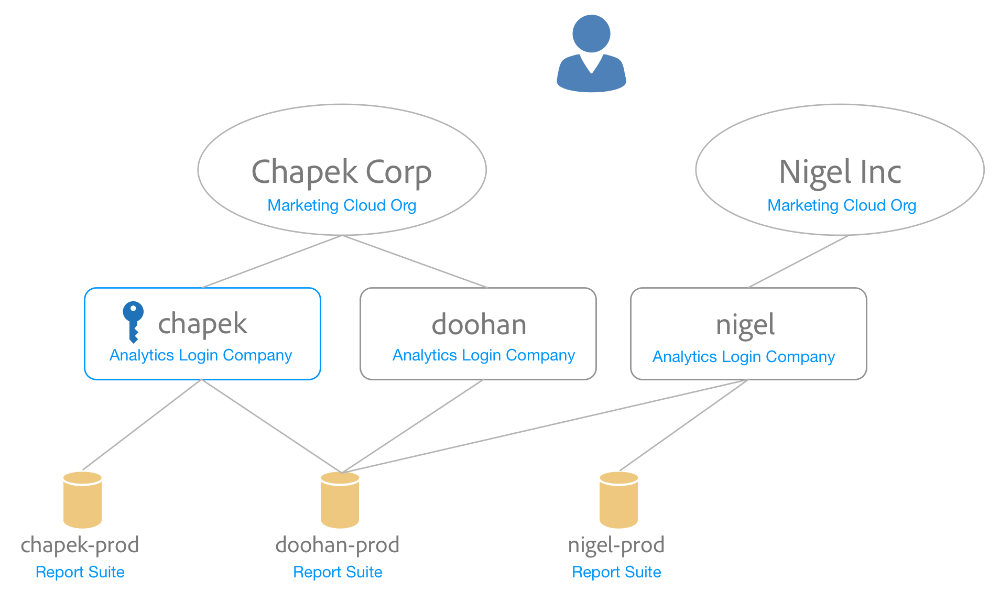

# Mappage de suites de rapports à une organisation {#topic_7C4740559EAC4E0FA5F8DEF886B580DA}

>[!NOTE]
>
>La fonctionnalité de mappage de suites de rapports a été abandonnée en novembre 2020. Contactez le Service clientèle pour toute question.

Les services Experience Cloud (tels que le service Experience Cloud ID et le service [!UICONTROL People]) sont associés à une organisation Experience Cloud plutôt qu’à une suite de rapports individuelle. Afin de garantir le bon fonctionnement de ces services, chaque suite de rapports Analytics doit être mappée à une organisation. Processus de mappage :

* Définit une organisation Experience Cloud comme organisation Principale pour la suite de rapports.
* Ne modifie pas les personnes pouvant accéder à une suite de rapports (l’accès est toujours déterminé par le compte de connexion Adobe Analytics pour chaque utilisateur).

## Conditions

Vous devez être administrateur Analytics d’une société de connexion ayant accès à la suite de rapports que vous souhaitez mapper. En outre, ce compte doit être [lié à une organisation Experience Cloud](organizations.md#topic_C31CB834F109465A82ED57FF0563B3F1) pour mapper des suites de rapports à cette organisation.

Les organisations sont grisées si vous ne disposez pas des autorisations d’administrateur Analytics pour une société de connexion sous cette organisation ayant accès à la suite de rapports.

## Mappage d’une suite de rapports à une organisation {#task_23993FE78DF6455FA8D7BE60686EA16C}

1. Accédez à Suites de rapport pour la gouvernance des données dans [!DNL Analytics] > **[!UICONTROL Admin]** > **[!UICONTROL Gouvernance des données]** (voir [Afficher/Gérer le paramètre de gouvernance des données de la suite de rapports).](https://experienceleague.adobe.com/docs/analytics/admin/data-governance/gdpr-view-settings.html?lang=en)

1. Pour afficher les sociétés de connexion ayant accès à chaque suite de rapports, sélectionnez **[!UICONTROL Visible pour les connexions d’entreprises]**.

   Cette vue a pour but de vous aider à prendre une décision éclairée concernant le mappage.

1. Sélectionnez la liste déroulante dans la colonne **[!UICONTROL Organisation mappée]** en regard d’une suite de rapports et sélectionnez l’organisation à laquelle vous souhaitez mapper la suite de rapports.

   Reportez-vous à la section suivante pour obtenir des conseils sur la sélection d’une organisation Experience Cloud.

## Mappage de plusieurs suites de rapports à une organisation {#task_94955B0D8ABA4CB1A38746ECF8E32711}

1. Sélectionnez **[!UICONTROL Experience Cloud]** > **[!UICONTROL Administration]** > **[!UICONTROL Mappage de suites de rapports]**.

1. Sélectionnez les suites de rapports que vous souhaitez mapper.

   

1. Sélectionnez l’organisation (Outdoors Inc, dans cet exemple), puis cliquez sur **[!UICONTROL Sélectionner]**.

   Reportez-vous à la section suivante pour obtenir des conseils sur la sélection d’une organisation Experience Cloud.

1. Sélectionnez **[!UICONTROL Enregistrer le mappage]**.

## Astuces pour sélectionner une organisation Experience Cloud {#mapping-tips}

Cette section contient des conseils pour vous aider à sélectionner l’organisation Experience Cloud à laquelle vous devez mapper une suite de rapports.

### Quelle organisation dois-je choisir ?

Si le service d’ID Experience Cloud est déployé sur la suite de rapports, assurez-vous que l’organisation que vous sélectionnez dans l’outil de mappage des suites de rapports correspond à celle spécifiée dans le fichier [!DNL visitorAPI.js] de votre site. Vous pouvez suivre les instructions de la section [Test et vérification du service Experience Cloud ID](https://experienceleague.corp.adobe.com/docs/id-service/using/implementation/test-verify.html) pour trouver l’ID d’organisation utilisé par le service d’identification des visiteurs.

Assurez-vous que votre déploiement correspond à l’organisation que vous avez choisie dans l’outil de mappage des suites de rapports.

### Pourquoi certaines organisations sont-elles grisées ?

La suppression d’une organisation indique que vous ne disposez pas des privilèges suffisants pour mapper la suite de rapports grisée. Examinez l’exemple suivant :

Sur ce schéma, la clé bleue représente les privilèges d’administrateur. Les lignes grises indiquent la visibilité.

Cet utilisateur a accès à deux organisations Experience Cloud. Ils ont effectué les opérations suivantes :

* Liaison de leur compte administrateur dans la société de connexion [!UICONTROL chapek] Analytics à leur [!UICONTROL compte d’organisation Experience Cloud Corp.]
* Liaison de leur compte non administrateur dans la société de connexion [!UICONTROL doohan] Analytics à leur [!UICONTROL compte d’organisation Experience Cloud Corp.]
* Liaison de leur compte non administrateur dans la société de connexion Analytics d’nigel à leur compte d’organisation Experience Cloud Nigel Inc.

Les points suivants répertorient les actions de mappage que cet utilisateur peut et ne peut pas effectuer concernant ces suites de rapports :

* La suite de rapports [!UICONTROL Chapek-prod] peut être mappée à l’organisation [!UICONTROL Chapek] Corp puisque cet utilisateur est l’administrateur d’une société de connexion Analytics liée ([!UICONTROL chapek]) et que son compte est lié à cette organisation.
* [!UICONTROL La suite de ] rapports Nigel-prodreport ne peut pas être liée par cet utilisateur, puisqu’il ne s’agit pas d’un administrateur d’une société de connexion pour laquelle cette suite de rapports est visible.
* La suite de rapports [!UICONTROL Doohan-prod] peut être mappée à [!UICONTROL Chapek Corp], car cet utilisateur est administrateur d’une société de connexion ([!UICONTROL chapek]) liée à l’organisation Experience Cloud (notez qu’il n’est pas administrateur de la société de connexion Analytics doohan). Il est important de savoir que la suite de rapports [!UICONTROL doohan-prod] peut également être mappée à l’organisation Experience Cloud Nigel Inc, même si cet utilisateur ne peut pas effectuer ce mappage. Dans ce cas, les deux organisations Experience Cloud apparaissent dans la liste, mais [!UICONTROL Nigel Inc] est grisé. Avant le mappage, cet utilisateur doit consulter un administrateur de la société de connexion nigel pour déterminer quelle organisation est la plus adaptée au mappage. L’interface utilisateur affiche un avertissement Conflit possible si vous sélectionnez une organisation différente de l’organisation sous laquelle la suite de rapports a été créée à l’origine.

## Questions fréquentes {#section_099E485805994C929FF9C9F75219BEE1}

### Pourquoi est-ce que je ne vois pas toutes mes suites de rapports ?

Certaines de vos suites de rapports peuvent être visibles sous une autre société de connexion. Vous pouvez modifier la société de connexion actuelle à l’aide de la liste déroulante située en haut de l’écran.

### Que se passe-t-il si je ne reconnais pas certaines des organisations répertoriées dans la liste déroulante pour l’une de mes suites de rapports ?

La liste répertorie toutes les organisations auxquelles votre suite de rapports *peut* être mappée, même si vous ne disposez pas des autorisations nécessaires pour le faire. Si vous ne savez pas si la suite de rapports doit être mappée à l’une des suites de rapports grisées de la liste, consultez un administrateur Experience Cloud de votre organisation pour déterminer le meilleur choix.

### Que se passe-t-il si je ne reconnais pas certaines des sociétés de connexion répertoriées pour une suite de rapports dans la colonne « Visible pour les connexions d’entreprises » ?

À un moment donné, cette suite de rapports a été partagée avec une autre société de connexion qui peut faire partie d’une autre organisation Experience Cloud.

### Que signifie cette erreur de conflit potentiel de la suite de rapports générée par une autre organisation ? Pourquoi est-ce important ?

Cette notification vous aide à prendre une décision éclairée concernant le mappage de vos suites de rapports. Nous voulons vous informer que la suite de rapports a été créée à l’origine sous une autre organisation au cas où elle serait plus adaptée à cette suite de rapports.

### Comment savoir si une suite de rapports est mappée ?

Les suites de rapports mappées s’affichent dans un format non modifiable. Si vous devez modifier un mappage, contactez l’assistance clientèle.

### Que faire si je connais uniquement l’ID d’organisation de mon organisation Experience Cloud ? Comment rechercher le nom associé à mon ID d’organisation ?

Vous pouvez trouver le nom de votre organisation dans [Paramètres des organisations et des comptes](organizations.md).

### Une date apparaît dans la colonne « Date de mappage ». Qui a effectué ce mappage ?

Vous pouvez vous reporter au journal des modifications de la suite de rapports dans l’interface d’Analytics pour consulter l’ID de l’utilisateur qui a procédé au changement. Recherchez le événement « Suite associée à l’organisation IMS ».
