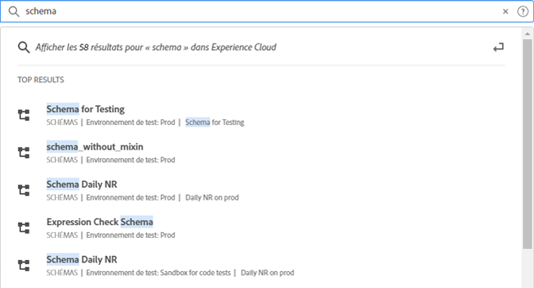
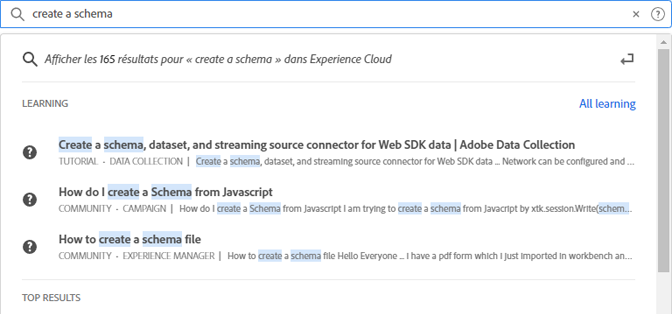

# [!UICONTROL Recherche unifiée] pour les objets et les entités {#globally-search}

Le [!UICONTROL Recherche unifiée] La recherche vous permet de rechercher des objets ou des entités métier pouvant faire l’objet de recherches dans une expérience transparente, cohérente et en un clic. Cette recherche fait également apparaître vos objets récemment consultés.

## Accès à la recherche unifiée

La recherche unifiée est disponible sur chaque page de l’en-tête de l’Experience Cloud en haut de la page. Vous pouvez également utiliser le raccourci clavier `command /` ou `ctrl /` pour accéder à la recherche.

Cette fonctionnalité est disponible uniquement pour les produits pris en charge, qui sont actuellement :

* Experience Platform (AEP)
* Journey Optimizer (AJO)

À mesure que davantage de contenu est indexé, cette fonctionnalité est ajoutée aux applications pertinentes.

## Objets et champs pouvant faire l’objet d’une recherche

Au fur et à mesure que vous tapez, le résultat supérieur correspondant est celui des objets que vous avez accès à afficher.

Nos algorithmes affichent d’abord les enregistrements les plus pertinents. L’ordre des résultats dépend de plusieurs facteurs, tels que :

Votre capacité et vos autorisations d’objet Pourcentage correspondant S’il existe une correspondance exacte

Les objets métier pouvant faire l’objet d’une recherche incluent :

* Segments (nom, description, ID)
* Schéma (nom, description, ID)
* Jeux de données (nom, description, identifiant)
* Sources (nom, description, ID)
* Destinations (nom, description, ID)
* Requêtes (Nom, Description, ID)
* Messages (Nom, Description, ID)
* Offres (nom, description, ID)
* Composants (nom, description, ID)
* Parcours (nom, description, ID)

Si un mot-clé correspond à une page de navigation, vous pouvez obtenir un lien d’accès rapide aux exemples de jeux de données de la page de navigation. La section des résultats supérieurs affiche les 30 premiers résultats.

Vous trouverez également les articles d’aide d’ Experience League et de Communities . Les requêtes en langues naturelles sont prises en charge.

Par exemple : _Création d’un schéma_ produit des résultats de l’Experience League sous _[!UICONTROL Formation]_:

Les algorithmes de recherche affichent d’abord les enregistrements les plus pertinents. L’ordre des résultats dépend de plusieurs facteurs, tels que :

* Autorisations utilisateur d’accès aux objets
* Pourcentage correspondant
* Correspondances exactes
* Le _[!UICONTROL Résultats principaux]_ La section affiche les 30 premiers résultats.

Pour affiner votre recherche, cliquez sur l’une des options suivantes :

* **[!UICONTROL Tout apprentissage]**: Ouvre la recherche dans Experience League.
* **[!UICONTROL Tout afficher...]**: Vous permet d’affiner et de filtrer les résultats.

## Fonctionnalités de recherche unifiée

Les fonctionnalités suivantes sont disponibles dans la recherche unifiée.

| Fonctionnalité | Description |
| ------- | ------- |
| Prise en charge de la langue globale | La recherche globale comprend les requêtes et produit des résultats en allemand, espagnol, français, italien, japonais, coréen, portugais et chinois. |
| Tolérance au typographie | La recherche unifiée offre une tolérance robuste aux coquilles à l’aide d’algorithmes avancés. Ces algorithmes calculent les modifications et fournissent les résultats appropriés. |
| Surbrillance | La réponse de recherche met en surbrillance le mot-clé correspondant de la requête de recherche afin que vous puissiez facilement trouver la section et les mots qui correspondent à votre requête. La mise en surbrillance fonctionne également pour les mots mal orthographiés. |
| Fragments de code | Dans la réponse de recherche, vous pouvez voir un extrait du résultat. Les fragments renvoient les mots correspondants et du contenu autour des mots-clés correspondants. |
| Stop Words | Certains mots couramment utilisés en anglais sont définis comme _arrêter les mots_. Si des mots d’arrêt sont inclus dans la requête de recherche, ils reçoivent moins de poids.  Les mots d’arrêt incluent : _a, an et sont, en tant que, à, être, mais, par, pour, si, in, into, is, it, no, of, on, or, such, the, they, then, they, this, to, was, will with_.  Les mots d’arrêt ne sont pas pris en charge dans d’autres langues mondiales. |
| Requêtes de langue naturelle | Lorsque vous recherchez un article d’aide ou une discussion dans les communautés Experience League, vous pouvez saisir votre question en utilisant le langage naturel et obtenir la réponse. Exemple de recherche : &quot;Comment créer un schéma ?&quot; |
| Recherche exacte entre guillemets | Vous pouvez effectuer une recherche exacte en utilisant des guillemets dans la requête. Aucune correction de type n’est effectuée sur les requêtes de correspondance exactes. Par exemple : &quot;Parcours Luma 2022&quot;. |
| Filtres | Vous pouvez appliquer des filtres tels que _Type d’objet_ et d’autres filtres spécifiques à l’objet dans la fenêtre contextuelle des résultats de recherche complets. Lorsque vous appuyez sur Entrée après avoir lié la requête, une fenêtre contextuelle de page entière s’ouvre, qui inclut les filtres. |

{style=&quot;table-layout:auto&quot;}

## Vous ne le trouvez pas ?

Essayez les conseils suivants :

* Entrer un terme de recherche plus spécifique
* Vérifier l’orthographe
* Essayer d’écrire le terme de recherche complet
* Assurez-vous de disposer des autorisations pour les objets que vous recherchez.

