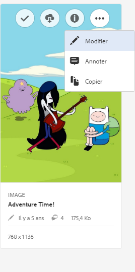
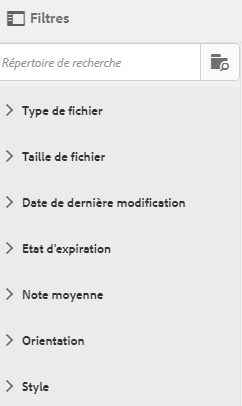
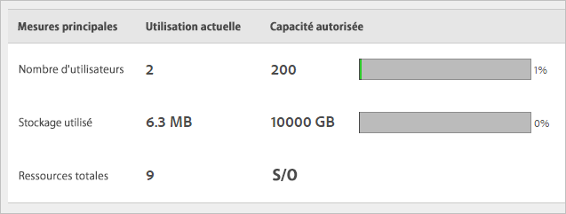

# Présentation de CX Enterprise Assets

CX Enterprise Assets fournit un référentiel unique et centralisé de ressources prêtes pour le marketing que vous pouvez partager entre les applications. Une ressource est un document, une image, une vidéo ou de l’audio numérique (en tout ou en partie) qui peut comporter plusieurs rendus et des sous-ressources (par exemple, les calques d’un fichier [!DNL Photoshop], les diapositives d’un fichier [!DNL PowerPoint], les pages d’un PDF ou les fichiers d’un ZIP).

Les services de ressources comprennent ce qui suit :

* Stockage des ressources, interface de gestion, interface de sélection incorporée (accessible dans les applications).
* Intégrations avec Creative Cloud, collaboration CX Entreprise et applications CX Entreprise.

Lʼutilisation des ressources améliore la cohérence et l’homogénéité de la marque. Elle accélère également la mise sur le marché. Vous pouvez rationaliser les workflows dans les applications :

* **[!DNL Adobe Target]** : créez du contenu pour des tests A/B et multivariés.
* **[!DNL Ad Cloud]** : développez des unités d’annonce à l’échelle de différents canaux et campagnes.
* **[!DNL Adobe Campaign]** : placez des ressources dans les bulletins électroniques et les campagnes.

## Accéder à CX Enterprise Assets

## Accès à la barre dʼoutils

Accédez à une ressource (ou un répertoire de ressources), puis cliquez sur **[!UICONTROL Select]**.

La barre dʼoutils permet dʼaccéder rapidement aux fonctionnalités telles que la recherche, le journal, les rendus, la modification, les annotations et le téléchargement.

>[!NOTE]
>
>Les ressources doivent d’abord être supprimées des activités Adobe Target pour pouvoir les supprimer de [!DNL Target].

## Modification de ressources

La modification d’une ressource active plusieurs fonctionnalités, dont les suivantes :

* Recadrer
* Pivoter
* Retourner

## Recherche de ressources

Vous pouvez effectuer une recherche par mot-clé, type de fichier, taille, date de dernière modification, statut de publication, orientation et style.

## Annotation de ressources

Cliquez sur **[!UICONTROL Annotate]** en dessinant des cercles ou des flèches sur une image et annotez la ressource pour permettre sa consultation par vos collaborateurs.

## Affichage des ressources en plein écran et en mode zoom

Cliquez sur **[!UICONTROL Views]** > **[!UICONTROL Image]** pour afficher l’image complète de la ressource et activer le zoom.

## Affichage des propriétés des ressources

Choisissez entre l’affichage des cartes avec les propriétés, la vue Liste et sous forme de colonnes afin de localiser plus facilement vos ressources.

Cliquez sur **[!UICONTROL Views]** > **[!UICONTROL Properties]** pour afficher les propriétés d’une ressource :

## Exécution des rapports sur l’utilisation

Affichez le nombre d’utilisateurs, l’espace de stockage utilisé et le nombre total de ressources.

Cliquez sur **[!UICONTROL Tools]** > **[!UICONTROL Reports]** > **[!UICONTROL Usage Report]**

