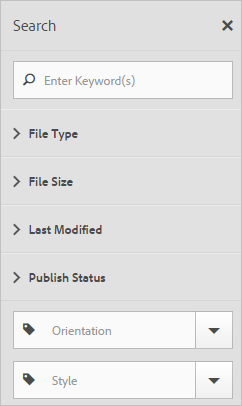

# Présentation dʼExperience Cloud Assets

Experience Cloud Assets constitue un référentiel unique et centralisé de ressources prêtes pour le marketing que vous pouvez partager entre les applications. Une ressource est un document, une image, une vidéo ou de l’audio numérique (en tout ou en partie) qui peut comporter plusieurs rendus et des sous-ressources (par exemple, les calques d’un fichier [!DNL Photoshop], les diapositives d’un fichier [!DNL PowerPoint], les pages d’un PDF ou les fichiers d’un ZIP).

Les services de ressources comprennent ce qui suit :

* Stockage des ressources, interface de gestion, interface de sélection incorporée (accessible dans les applications).
* Intégrations à Creative Cloud, collaboration Experience Cloud et applications Experience Cloud.

Lʼutilisation des ressources améliore la cohérence et l’homogénéité de la marque. Elle accélère également la mise sur le marché. Vous pouvez rationaliser les workflows dans les applications :

* **[!DNL Adobe Target]** : créez du contenu pour des tests A/B et multivariés.
* **[!DNL Ad Cloud]** : développez des unités d’annonce à l’échelle de différents canaux et campagnes.
* **[!DNL Adobe Campaign]** : placez des ressources dans les bulletins électroniques et les campagnes.

## Accéder à Experience Cloud Assets {#section_3657039DD3524F2AA88753BFF4781125}

## Accès à la barre dʼoutils {#section_EC2E401D225148818F3753248556BE6B}

Accédez à une ressource (ou un répertoire de ressources), puis choisissez **[!UICONTROL Sélectionner]**.

La barre dʼoutils permet dʼaccéder rapidement aux fonctionnalités telles que la recherche, le journal, les rendus, la modification, les annotations et le téléchargement.

>[!NOTE]
>
>Les ressources doivent d’abord être supprimées des activités Adobe Target pour pouvoir les supprimer de [!DNL Target].

## Modification de ressources {#section_CD3C55A9D4574455B94D0955391C8FEC}

La modification d’une ressource active plusieurs fonctionnalités, dont les suivantes :

* Recadrer
* Pivoter
* Retourner

## Recherche de ressources {#section_50FE049010B446FC9640AA6A30E5A730}

Vous pouvez effectuer une recherche par mot-clé, type de fichier, taille, date de dernière modification, statut de publication, orientation et style.

## Annotation de ressources {#section_67FE1DFAAB744DA5B1CD3AD3CCEABF7A}

Sélectionnez **[!UICONTROL Annoter]** en dessinant des cercles ou des flèches sur une image et annotez la ressource pour permettre sa consultation par vos collaborateurs.

## Affichage des ressources en plein écran et en mode zoom {#section_A9F50D7D6BE341A2AB8244A4E42A4EF7}

Sélectionnez **[!UICONTROL Vues]** > **[!UICONTROL Image]** pour afficher lʼimage complète de la ressource et activer le zoom.

## Affichage des propriétés des ressources {#section_FED28711DAB14E1BBEEA7CA890EE9573}

Choisissez entre l’affichage des cartes avec les propriétés, la vue Liste et sous forme de colonnes afin de localiser plus facilement vos ressources.

Sélectionnez **[!UICONTROL Vues]** > **[!UICONTROL Propriétés]** pour afficher les propriétés dʼune ressource :

## Exécution des rapports sur l’utilisation {#section_15D782FFB8D74CF4A735116CC03AD902}

Affichez le nombre d’utilisateurs, l’espace de stockage utilisé et le nombre total de ressources.

Sélectionnez **[!UICONTROL Outils]** > **[!UICONTROL Rapports]** > **[!UICONTROL Rapport dʼutilisation]**.

