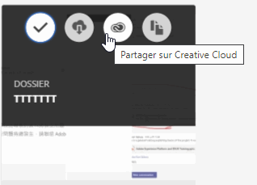
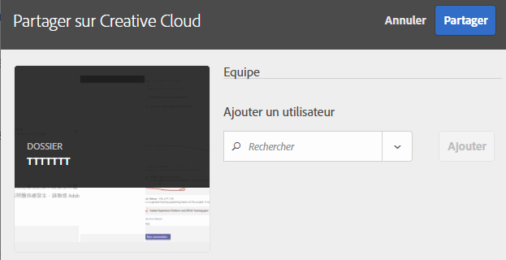
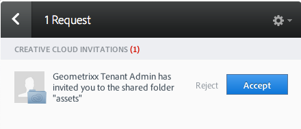
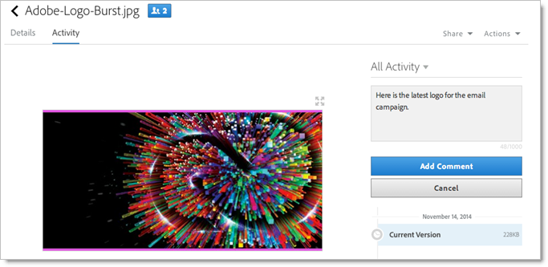
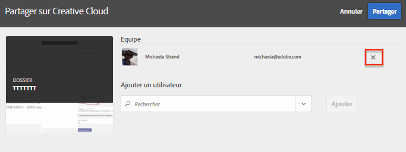
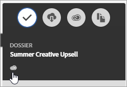

# Partage d’un dossier de ressources CX Enterprise

Partagez des dossiers et des ressources entre CX Enterprise et Creative Cloud. Collaborez, annotez des ressources partagées et utilisez-les dans des applications CX Enterprise comme Adobe Target. Le dossier partagé doit provenir de CX Enterprise.

**Avantages du partage**

* Rationalisation des workflows de production créative lors des phases de révision, d’approbation et de publication
* Gestion plus rapide des fichiers et versions en cours de traitement à plusieurs emplacements
* Suivi et gestion plus efficaces des ressources créatives
* Optimisation de la sécurité de l’entreprise
* Partage, enregistrement et envoi faciles de fichiers entre les créatifs et les spécialistes marketing

Pour que les utilisateurs de Creative Cloud aient accès aux ressources, ils doivent figurer sur la liste autorisée de CX Enterprise. Voir [Gestion des utilisateurs Creative Cloud](manage-cc-users.md).

**Pour partager un dossier de ressources CX Enterprise**

1. Dans un dossier de ressources, cliquez sur **[!UICONTROL Share to Creative Cloud]**.

   
1. Sur la page Partager sur Creative Cloud, recherchez un utilisateur, puis cliquez sur **[!UICONTROL Add]**.

   

1. Cliquez sur **[!UICONTROL Share]**.
1. Ouvrez l’application de bureau [!DNL Creative Cloud] (ou accédez à la page [!UICONTROL Creative Cloud Files] dans un navigateur) et recherchez la notification de la demande.

   
1. Ouvrez la requête, puis cliquez sur **[!UICONTROL Accept]**.

   
1. Pour accéder au contenu du dossier, cliquez sur **[!UICONTROL Open Folder]** (ou **[!UICONTROL View on Web]**).

   
1. Continuez en ajoutant des commentaires à la ressource partagée :

   Dans Creative Cloud, sélectionnez une image, puis cliquez sur **[!UICONTROL Activity]** pour ajouter un commentaire à cette image. Les commentaires sont synchronisés sur les ressources dans [!DNL Creative Cloud] et dans [!DNL CX Enterprise].

   

   Dans CX Enterprise, sélectionnez une image, puis sélectionnez l’icône de frise chronologique pour ajouter un commentaire à l’image. Les commentaires sont synchronisés sur les ressources dans Creative Cloud et CX Enterprise.

   

1. Pour annuler le partage d’un dossier, cliquez sur **[!UICONTROL Share Using Creative Cloud]** (procédure similaire à [étape 3](share.md)), supprimez des utilisateurs en sélectionnant X, puis cliquez sur **[!UICONTROL Share]**.

   

   Une fois tous les utilisateurs Creative Cloud supprimés, le partage du dossier est annulé et les utilisateurs de Creative Cloud nʼy ont plus accès.

Parmi les autres façons d’utiliser une ressource partagée, citons le chargement ou la permutation de ressources dans la [&#x200B; Bibliothèque des offres &#x200B;](https://experienceleague.adobe.com/docs/target/using/experiences/offers/manage-content.html) dans Adobe Target pour des images dans des activités .

Une fois que vous avez partagé un dossier sur Creative Cloud, le logo Creative Cloud apparaît sur le dossier.

Aide connexe :

* [Aide de Creative Cloud - Gérer et synchroniser les fichiers](https://helpx.adobe.com/fr/creative-cloud/help/sync-creative-cloud-files.html)
* [Aide de Creative Cloud - Collaboration avec d’autres utilisateurs](https://helpx.adobe.com/fr/creative-cloud/help/collaboration.html)
* [Aide de Creative Cloud - FAQ sur Collaboration](https://helpx.adobe.com/fr/creative-cloud/help/collaboration-faq.html)

## Partage de ressources avec Adobe Target

Lors de la création d’activités dans [!DNL Adobe Target], vous pouvez utiliser une ressource d’image partagée lors de la permutation d’images dans le [!UICONTROL Offers Library].

Reportez-vous à la [bibliothèque d’offres](https://experienceleague.adobe.com/docs/target/using/experiences/offers/manage-content.html) dans l’aide [!DNL Target].

