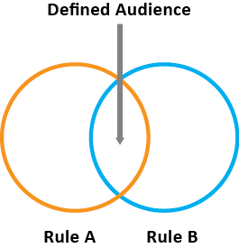

# Créer une audience

Dans [!UICONTROL Audience Library], vous pouvez utiliser des règles d’attribut pour créer une audience et définir une audience composite pour le partage dans les applications d’entreprise CX.

Cet article vous aidera à accomplir ce qui suit :

* Création d’une audience
* Création d’une règle
* Utilisation de règles pour définir une audience composite

Le graphique suivant représente deux règles dans une audience composite.

Chaque cercle représente une règle qui définit l’appartenance à une audience. Les visiteurs qui remplissent les conditions requises pour devenir membres dans les deux règles d’audience se chevauchent pour devenir l’audience composite définie.

>[!NOTE]
>
>L’audience est entièrement définie une fois la collecte des données terminée pour la période spécifiée.

L’exemple suivant explique comment créer des règles pour une audience composite. L’audience se compose comme suit :

* Section Maison et jardin dérivée des données de page ou des données d’analyse brutes.
* Utilisateurs de Chrome et de Safari dérivés d’un segment [!DNL Adobe Analytics] [publié](overview.md) dans [!DNL CX Enterprise].

  

**Création d’une audience**

1. Cliquez sur [!DNL CX Enterprise] applications (), puis sur **[!UICONTROL People]** > **[!UICONTROL Audience Library].**

1. Sur la page [!UICONTROL Audiences], cliquez sur **[!UICONTROL New]**. 

   

1. Sur la page [!UICONTROL Create New Audience], renseignez les champs **[!UICONTROL Title]** et **[!UICONTROL Description]** .
1. Sous [!UICONTROL Rules], sélectionnez une suite de rapports de référence, puis une source d’attributs :

   * **[!UICONTROL Real-Time Analytics Data:]** (ou données brutes) Il s’agit de données d’attribut provenant de demandes d’images Real-Time Analytics. Elle comprend des eVars et des événements. Lorsque vous utilisez cette source d’attribut, vous devez sélectionner une suite de rapports et définir la dimension ou l’événement à inclure. Cette sélection de suite de rapports fournit la structure de variable utilisée par la suite de rapports.

     >[!NOTE]
     >
     >En raison de la mise en cache, les suites de rapports supprimées dans Analytics nécessitent 12 heures avant que la suppression ne s’affiche dans CX Enterprise.

   * **[!UICONTROL CX Enterprise:]** des données d’attributs provenant de sources [!DNL CX Enterprise]. Il peut, par exemple, s’agir de données de segments d’audience que vous créez dans [!DNL Analytics], ou de données d’[!DNL Audience Manager].

1. Définissez les règles d’audience, puis cliquez sur **[!UICONTROL Save].**

**Exemple : définition de règles pour une audience composite**

>[!NOTE]
>
>Lorsque vous définissez des règles d’audience, vous devez maîtriser le fonctionnement de vos variables de mise en œuvre.

Sous [!UICONTROL Rules], définissez les sélections d’attributs *`Home & Garden`* :

* **[!UICONTROL Attribute Source:]** les données brutes d’analyse
* Suite de rapports **[!UICONTROL Report Suite:]** 31
* DIMENSION = **[!UICONTROL Store (Merch) (v6)]** > **[!UICONTROL Equals]** > **[!UICONTROL Home & Garden]**

Les visiteurs *Chrome et Safari* sont un segment d’audience partagé à partir d’Analytics :

* **[!UICONTROL Attribute Source:]** CX Entreprise
* Visiteurs **[!UICONTROL Dimension:]** Chrome et Safari

Pour effectuer une comparaison, vous pouvez ajouter une règle *OU* pour afficher tous les visiteurs dʼune section du site telle que Patio et meubles.

La règle obtenue est une audience définie composée des utilisateurs Chrome et Safari ayant visité Maison et jardin. Le segment Patio et meubles fournit des informations supplémentaires sur tous les visiteurs qui visitent cette section du site.

* **Historique (estimation) :** (cercle en pointillé) représente les règles créées en fonction des données [!DNL Analytics].
* **Audience réelle :** (cercle plein) règle créée qui possède 30 jours de données d’Audience Manager. Lorsque les données d’Audience Manager atteignent 30 jours, la ligne devient pleine et représente les chiffres réels.

Une fois la collecte des données terminée pour la période spécifiée, les cercles se combinent pour afficher une audience définie.

Une fois l’audience enregistrée, elle est disponible pour d’autres applications d’entreprise CX. Par exemple, vous pouvez inclure une audience partagée dans une [activité](https://experienceleague.adobe.com/en/docs/target/using/activities/activities) Adobe Target.
