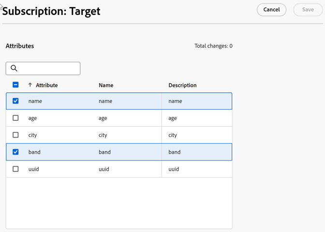

# Configuration des abonnements aux attributs du client

Les abonnements [!DNL Customer Attributes] activent le flux de données d’attributs du client entre l’entreprise CX et les applications ([!DNL Analytics] et [!DNL Target]).

Par exemple, un abonnement Adobe Analytics active les données d’attribut dans les rapports. Si vous utilisez [!DNL Adobe Target], vous pouvez charger des attributs de client pour le ciblage et la segmentation.

**Pour configurer les abonnements et activer la source de données**

1. Localisez votre source de données dans [!DNL Customer Attributes] pour la modifier :

   Dans [!DNL CX Enterprise], cliquez sur **[!UICONTROL Apps]**  > **[!DNL Customer Attributes]**.

1. Sur [!UICONTROL Edit Customer Attribute Source], cliquez sur **[!UICONTROL File Upload]**.

1. Cliquez sur **[!UICONTROL Configure Subscriptions]**.

   

1. Pour activer la source d’attributs du client, cliquez sur **[!UICONTROL Active]**, puis sur **[!UICONTROL Save]**.

1. Pour configurer un abonnement à [!DNL Analytics] ou [!DNL Target], cliquez sur **[!UICONTROL Configure]**.

   L’exemple suivant illustre un abonnement [!DNL Target] :

   

   | Élément | Description |
   | --- | --- |
   | Solution | ****  Sélectionnez [!DNL Analytics], spécifiez les suites de rapports destinées à recevoir les données d’attribut, ainsi que les attributs à inclure. **Adobe Target**  Vous pouvez charger des attributs de client pour le ciblage et la segmentation. Cette fonctionnalité est utile si vous souhaitez cibler un test en fonction de données d’attribut ou rendre les données disponibles pour la segmentation dans Analytics. Les données d’attributs du client chargées pour un visiteur sont disponibles lors de la connexion dans **[!DNL Target]** > **Audiences**. Plusieurs sources de données sont prises en charge. Lorsque vous définissez des ID de client sur votre site web, vérifiez qu’au moins un des alias est abonné à [!DNL Target]. |
   | Suite de rapports (Adobe Analytics) | Les suites de rapports d’Analytics. Vous ne pouvez pas ajouter plus de 10 suites de rapports au total aux abonnements Analytics dans une seule source d’attributs. Lorsque vous choisissez les suites de rapports à inclure, tenez compte des suggestions suivantes :<ul><li>Choisissez des suites de rapports ayant un jeu commun de clients authentifiés. Si les clients authentifiés d’une suite de rapports ne chevauchent pas les clients authentifiés d’une autre suite de rapports, séparez ces suites de rapports en différentes sources d’attributs.</li><li>Si possible, les suites de rapports incluses dans une source d’attributs doivent avoir un volume de trafic similaire.</li></ul> Si vous détenez plus de dix suites de rapports avec un jeu commun de clients authentifiés, vous pouvez configurer d’autres sources d’attributs du client, chacune d’elles pouvant contenir jusqu’à dix suites de rapports. |
   | Attributs à inclure (Analytics et [!DNL Target]). | Attributs à envoyer à lʼapplication.  Lors de la configuration des abonnements et de la sélection des attributs, les restrictions suivantes sʼappliquent _par suite de rapports_, selon les applications que vous détenez :<ul><li>Foundation : 0</li><li>Select : 3</li><li>Prime : 15</li><li>Ultimate : 200</li><li>Standard : 3 au total</li><li>Premium : 200 par suite de rapports</li><li>[!DNL Target] Standard : 5</li><li>[!DNL Target] Premium : 200</li></ul> **Remarque :** lorsque vous effectuez la mise à niveau vers Analytics Premium, un délai de 24 heures est nécessaire avant que des attributs supplémentaires soient disponibles. Il se peut que l’erreur Abonnement max d’attribut s’affiche pendant ce délai. |

1. Cliquez sur **[!UICONTROL Save]**.
