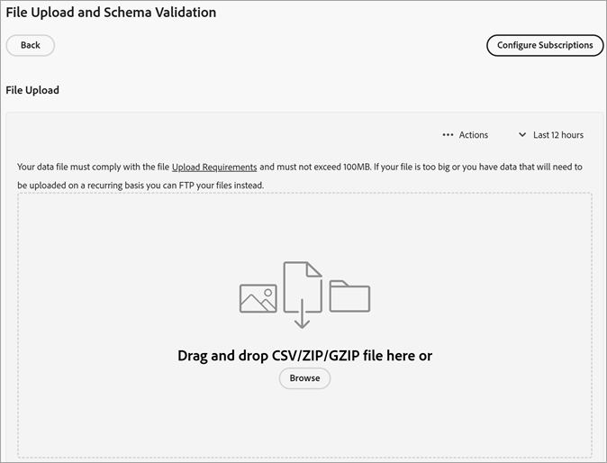

# Créer une source de données et charger le fichier

Créez la source d’attributs du client (fichiers `.csv` et `.fin`) et chargez les données. Vous pouvez activer la source de données lorsque vous êtes prêt. Une fois la source de données active, partagez les données d’attribut avec [!DNL Analytics] et [!DNL Target].

**[!DNL Customer Attributes]workflow**


## Localiser [!DNL Customer Attributes]

Dans [!DNL Experience Cloud], cliquez sur **[!UICONTROL Applications]**  > **[!DNL Customer Attributes]**.

## Conditions préalables à l’utilisation de [!DNL Customer Attributes] {#prerequisites}

* **Appartenance à un groupe :** pour charger les données, les utilisateurs doivent être membres du groupe [!DNL Customer Attributes]. Vous devez également appartenir à un groupe d’Adobe Analytics ou d’Adobe Target.

  Pour savoir si votre société a accès aux attributs du client, votre administrateur [!DNL Experience Cloud] doit se connecter à [Experience Cloud](https://experience.adobe.com?lang=fr). Accédez à **[!UICONTROL Admin Console]** > **[!UICONTROL Products]**. Si les *[!DNL Customer Attributes]* s’affichent en tant qu’un des [!UICONTROL profils de produits], vous pouvez commencer.

  Les utilisateurs ajoutés à [!DNL Customer Attributes] voient l’option de menu [!DNL Customer Attributes] sur le côté gauche de l’interface d’Experience Cloud.

* **Adobe Target** `at.js` (toute version) ou `mbox.js` version 58 ou ultérieure est requis pour utiliser les attributs du client.

  Voir [Comment déployer at.js](https://experienceleague.adobe.com/docs/target-dev/developer/client-side/overview.html?lang=fr).

## Création d’un fichier de données {#create-data}

Ces données des clients de l’entreprise proviennent de votre système de gestion de la relation client. Elles peuvent inclure des données sur les abonnés pour les produits, y compris les ID des membres, les produits autorisés, les produits les plus souvent utilisés, etc.

1. Créez un fichier `.csv`.

   >[!NOTE]
   >
   >Plus loin dans ce processus, vous effectuez un glisser-déposer du fichier `.csv` pour charger le fichier. Cependant, si vous effectuez un [chargement par FTP](t-upload-attributes-ftp.md#task_591C3B6733424718A62453D2F8ADF73B), vous devez également créer un fichier `.fin` du même nom que le fichier `.csv`.

   Exemple de fichier de données du client d’entreprise :

   

1. Avant de poursuivre, passez en revue les informations importantes dans [Exigences liées aux fichiers de données](crs-data-file.md) avant de télécharger le fichier.
1. [Créez une source d’attributs du client et chargez les données](t-crs-usecase.md#create-source), comme décrit ci-dessous.

## Création d’une source d’attributs et chargement du fichier de données {#create-source}

Effectuez les étapes suivantes sur la page [!UICONTROL Créer une Source d’attributs du client] dans Experience Cloud.

>[!IMPORTANT]
>
>Lorsque vous créez, modifiez ou supprimez une source d’attributs du client, la synchronisation des identifiants avec la nouvelle source de données peut prendre jusqu’à une heure. Pour créer ou modifier des sources d’attributs du client, vous devez disposer des droits d’administration dans Audience Manager. Contactez l’assistance clientèle ou le consulting d’Audience Manager pour obtenir les droits d’administration.

1. Dans [!DNL Experience Cloud], cliquez sur **[!UICONTROL Applications]**  > **[!DNL Customer Attributes]**.

   

1. Cliquez sur **[!UICONTROL Nouveau]**.

   

1. Sur la page [!UICONTROL Créer un Source d’attributs du client], configurez les champs suivants :

   * **[!UICONTROL Nom :]** nom convivial de la source d’attributs de données. Pour [!DNL Adobe Target], les noms d’attribut ne peuvent pas contenir d’espaces. Si un attribut comportant un espace est transmis, [!DNL Target] l’ignore. Les autres caractères non pris en charge sont les suivants :`< , >, ', "`.

   * **[!UICONTROL Description :]** (facultatif) description de la source d’attribut de données.

   * **[!UICONTROL ID d’alias :]** représente une source de données d’attributs du client, par exemple un système de gestion de la relation client spécifique. [!UICONTROL ID d’alias] est un ID unique utilisé dans votre code [!UICONTROL Source d’attributs du client]. L’identifiant doit être unique, en minuscules, sans espace. La valeur saisie dans le champ [!UICONTROL ID d’alias] pour une source d’attributs du client dans Experience Cloud doit correspondre aux valeurs transmises à partir de l’implémentation (que ce soit via la collecte de données Platform ou JavaScript de Mobile SDK).

     >[!IMPORTANT]
     >
     >La suppression d’une source de données associée à un ID d’alias ne rend pas cet ID disponible, car l’ID d’alias est enregistré dans plusieurs services et utilisé pour mapper des profils entre eux.

     L’ID d’alias correspond à certaines zones où vous définissez des valeurs d’ID de client supplémentaires. Par exemple :

      * **Balises :** l’ID d’alias correspond à la valeur *Code d’intégration* sous [!UICONTROL Paramètres client], dans l’outil [Service Experience Cloud ID](https://experienceleague.adobe.com/docs/experience-platform/tags/home.html?lang=fr).

      * **API visiteur :** l’ID d’alias correspond aux [ID de client](https://experienceleague.adobe.com/docs/id-service/using/reference/authenticated-state.html?lang=fr) supplémentaires que vous pouvez associer à chaque visiteur.

        Par exemple, *&quot;crm_ id&quot;* dans :

        ```
        "crm_id":"67312378756723456"
        ```

      * **iOS:** L’ID d’alias correspond à *« idType »* dans [visitorSyncIdentifiers:identifiers](https://experienceleague.adobe.com/docs/mobile-services/ios/overview.html?lang=fr).

        Par exemple :

        `[ADBMobile visitorSyncIdentifiers:@{@<`**`"idType"`**`:@"idValue"}];`

      * **Android™ :** l’ID d’alias correspond à *« idType »* dans [syncIdentifiers](https://experienceleague.adobe.com/docs/mobile-services/android/overview.html?lang=fr).

        Par exemple :

        `identifiers.put(`**`"idType"`**`, "idValue");`

        Voir [Utilisation de plusieurs sources de données](crs-data-file.md#section_76DEB6001C614F4DB8BCC3E5D05088CB) pour plus d’informations sur le traitement des données concernant le champ ID d’alias et les ID de client.

   * **[!UICONTROL Code d’espace de noms :]** utilisez cette valeur pour identifier la source d’attributs du client lors de l’utilisation du [IdentityMap](https://experienceleague.adobe.com/fr/docs/experience-platform/web-sdk/identity/overview) dans le cadre d’une implémentation du SDK Web AEP.

1. Cliquez sur **[!UICONTROL Enregistrer]**.

## Charger le fichier {#upload}

L’enregistrement d’attribut du client est créé et vous pouvez charger le fichier en modifiant l’attribut du client.

1. Sur la page [!DNL Customer Attributes], cliquez sur la source d’attributs.

1. Sur la page [!UICONTROL Modifier le Source de données client], cliquez sur **[!UICONTROL Chargement de fichier]**.

   

1. Faites glisser et déposez le fichier de données `.csv`, `.zip` ou `.gzip` dans la fenêtre glisser-déposer.

>[!IMPORTANT]
>
>Il existe des exigences spécifiques liées aux fichiers de données. Voir [Exigences liées aux fichiers de données](crs-data-file.md) pour en savoir plus.

Après avoir transféré le fichier, les données du tableau s’affichent sous l’en-tête [!UICONTROL Téléchargement du fichier] sur cette page. Vous pouvez valider le schéma, configurer les abonnements ou configurer le FTP.


* **[!UICONTROL ID de client unique :]** affiche le nombre d’ID uniques que vous avez chargés sur cette source d’attributs.

* **[!UICONTROL ID fournis par le client avec alias pour les ID de visiteurs Experience Cloud :]** affiche le nombre d’ID qui ont reçu un alias vers les ID de visiteurs Experience Cloud.

* **[!UICONTROL ID fournis par le client avec un nombre élevé d’alias :]** affiche le nombre d’ID fournis par le client avec 500 identifiants visiteur Experience Cloud ou plus avec alias. Ces identifiants fournis par le client représentent probablement un certain type de connexion partagée plutôt que des individus. Le système distribue les attributs associés à ces identifiants aux 500 identifiants de visiteur Experience Cloud en alias les plus récents, jusqu’à ce qu’il y ait 10 000 alias. Ensuite, le système invalide l’ID fourni par le client et ne distribue plus les attributs associés. —>

## Validation du schéma {#validate-schema}

Le processus de validation permet de mapper les noms d’affichage et les descriptions aux attributs chargés (chaînes, nombres entiers, numéros, etc.). Vous pouvez également supprimer des attributs en mettant à jour le schéma.

Voir [Validation du schéma](validate-schema.md).

Pour supprimer des attributs, voir [(Facultatif) Mise à jour du schéma (supprime les attributs)](t-crs-usecase.md).

## (Facultatif) Mise à jour du schéma (suppression des attributs) {#task_6568898BB7C44A42ABFB86532B89063C}

Suppression des attributs et remplacement des attributs dans le schéma.

1. Sur la page [!UICONTROL Modifier la source d’attributs cliente], supprimez l’abonnement **[!UICONTROL Target]** ou **[!UICONTROL Analytics]** (sous **[!UICONTROL Configurer les abonnements]**).

1. [Chargez un nouveau fichier de données avec les champs mis à jour](t-crs-usecase.md).

## Configuration des abonnements et activation de la source d’attributs {#task_1ACA21198F0E46A897A320C244DFF6EA}

La configuration des abonnements configure le flux de données entre Experience Cloud et les applications. Activez la source dʼattributs pour que les données circulent vers les applications abonnées. Les enregistrements de client que vous avez chargés sont mis en correspondance avec les signaux d’ID entrants provenant de votre site web ou de votre application.

Voir [Configuration des abonnements et activation de la source de données](subscription.md).

## Utilisation des données [!DNL Customer Attributes] dans Adobe Analytics {#task_7EB0680540CE4B65911B2C779210915D}

Les données étant désormais disponibles dans des applications telles quʼAdobe Analytics, vous pouvez créer des rapports sur les données, les analyser et prendre les mesures appropriées dans vos campagnes marketing.

L’exemple suivant présente un segment [!DNL Analytics] d’après les attributs téléchargés. Ce segment présente les abonnés à [!DNL Photoshop Lightroom] dont le produit le plus souvent lancé est Photoshop.


Lorsque vous publiez un segment dans Experience Cloud, il est disponible dans les audiences Experience Cloud et Audience Manager.

## Utilisation des données [!DNL Customer Attributes] dans Adobe Target {#task_FC5F9D9059114027B62DB9B1C7D9E257}

Dans [!DNL Target], vous pouvez sélectionner un attribut du client à partir de la section [!UICONTROL Profil du visiteur] lors de la création d’une audience. Tous les attributs du client comportent le préfixe `crs.` dans la liste. Suivant les besoins, combinez ces attributs avec dʼautres attributs de données afin de créer des audiences.


Voir [Création d’une audience](https://experienceleague.adobe.com/docs/target/using/audiences/create-audiences/audiences.html?lang=fr) dans l’aide [!DNL Target].
