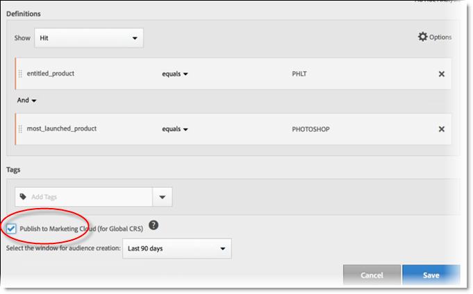

# Création d’une source d’attributs du client et chargement du fichier de données

Créez la source d’attributs du client (fichiers CSV et FIN) et téléchargez les données. Vous pouvez activer la source de données lorsque vous êtes prêt. Une fois que la source de données est active, partagez les données d’attributs avec Analytics et Target.

## Workflow Attributs du client {#concept_BF0AF88E9EF841219ED4D10754CD7154}


>[!IMPORTANT]
>
>Pour accéder à cette fonction, les utilisateurs doivent être affectés au profil de produit Attributs du client (Attributs du client - Accès par défaut). Accédez à **[!UICONTROL Administration]** > **[!UICONTROL Admin Console]** > **[!UICONTROL Produits]**. Si *Attributs du client* s’affiche comme l’un des [!UICONTROL  profils de produit], vous êtes prêt à commencer. Les utilisateurs membres du groupe Attributs du client ont accès au menu [!UICONTROL Attributs du client] sur le côté gauche de l’interface d’Experience Cloud.
>
>Pour utiliser la fonctionnalité Attributs du client, les utilisateurs doivent également appartenir à des groupes au niveau de lʼapplication (Analytics ou [!DNL Target]).

## Création d’un fichier de données {#task_B5FB8C0649374C7A94C45DCF2878EA1A}

Ces données des clients de l’entreprise proviennent de votre système de gestion de la relation client. Elles peuvent inclure des données sur les abonnés pour les produits, y compris les ID des membres, les produits autorisés, les produits les plus souvent utilisés, etc.

1. Créez un `.csv`.

   >[!NOTE]
   >
   >Plus loin dans ce processus, vous effectuez une opération de glisser-déposer du fichier `.csv` afin de le télécharger. Cependant, si vous effectuez un [chargement par FTP](t-upload-attributes-ftp.md#task_591C3B6733424718A62453D2F8ADF73B), vous devez également créer un fichier `.fin` du même nom que le fichier `.csv`.

   Exemple de fichier de données du client d’entreprise :

   

1. Avant de poursuivre, passez en revue les informations importantes dans [Exigences liées aux fichiers de données](crs-data-file.md) avant de télécharger le fichier.
1. [Créez une source d’attributs du client et téléchargez les données](t-crs-usecase.md), comme décrit ci-dessous.

## Création d’une source d’attributs et chargement du fichier de données {#task_09DAC0F2B76141E491721C1E679AABC8}

Effectuez les étapes suivantes sur la page Créer un Source d’attributs du client dans Experience Cloud.

>[!IMPORTANT]
>
>Lorsque vous créez, modifiez ou supprimez une source d’attributs du client, le démarrage de la synchronisation des identifiants avec la nouvelle source de données peut prendre jusqu’à une heure. Pour créer ou modifier des sources d’attributs du client, vous devez disposer des droits d’administration dans Audience Manager. Contactez le service à la clientèle ou le service d’assistance clientèle d’Audience Manager pour obtenir des droits d’administration.

1. Dans le [!DNL Experience Cloud], sélectionnez l&#39;icône Menu  .
1. Sous **[!DNL Experience Platform]**, sélectionnez **[!UICONTROL Personnes]** > **[!UICONTROL Attributs du client]**.

   Sur la page [!UICONTROL Attributs du client], vous pouvez gérer et modifier les sources de données d’attributs existantes.

   

1. Sélectionnez **[!UICONTROL Nouveau]**.

   

1. Sur la page [!UICONTROL Modifier la source d’attributs cliente], configurez les champs suivants :

   * **[!UICONTROL Nom :]** nom convivial de la source d’attributs de données. Pour [!DNL Adobe Target], les noms d’attribut ne peuvent pas contenir d’espaces. Si un attribut comportant un espace est transmis, [!DNL Target] l’ignore. Les autres caractères non pris en charge sont les suivants :`< , >, ', "`.

   * **[!UICONTROL Description :]** (facultatif) description de la source d’attribut de données.

   * **[!UICONTROL ID d’alias :]** représente une source de données d’attributs du client, par exemple un système de gestion de la relation client spécifique. Lʼ[!UICONTROL ID dʼalias] est un ID unique utilisé dans le code de la source dʼattributs du client. L’identifiant doit être unique, en minuscules, sans espace. La valeur entrée dans le champ [!UICONTROL ID d’alias] pour une source d’attributs du client dans Experience Cloud doit correspondre aux valeurs transmises à partir de l’implémentation (que ce soit par le biais de la collecte de données Platform ou de JavaScript du SDK mobile).

     L’ID d’alias correspond à certaines zones où vous définissez les valeurs des identifiants de client supplémentaires. Par exemple :

      * **Dynamic Tag Management :** l’ID d’alias correspond à la valeur du *code d’intégration* sous [!UICONTROL Paramètres du client], dans l’outil [Service Experience Cloud ID](https://experienceleague.adobe.com/docs/experience-platform/tags/home.html?lang=fr).

      * **API visiteur :** l’ID d’alias correspond aux [ID de client](https://experienceleague.adobe.com/docs/id-service/using/reference/authenticated-state.html) supplémentaires que vous pouvez associer à chaque visiteur.

        Par exemple, *&quot;crm_ id&quot;* dans :

        ```
        "crm_id":"67312378756723456"
        ```

      * **iOS :** l’ID d’alias correspond à *« idType »* dans [visitorSyncIdentifiers:identifiers](https://experienceleague.adobe.com/docs/mobile-services/ios/overview.html?lang=fr).

        Par exemple :

        `[ADBMobile visitorSyncIdentifiers:@{@<`**`"idType"`**`:@"idValue"}];`

      * **Android™ :** l’ID d’alias correspond à *« idType »* dans [syncIdentifiers](https://experienceleague.adobe.com/docs/mobile-services/android/overview.html?lang=fr).

        Par exemple :

        `identifiers.put(`**`"idType"`**`, "idValue");`

        Pour plus d’informations sur le traitement des données concernant le champ ID d’alias et les ID de client, voir [Utilisation de plusieurs sources de données](crs-data-file.md#section_76DEB6001C614F4DB8BCC3E5D05088CB).

   * **[!UICONTROL Téléchargement du fichier :]** faites glisser et déposez le fichier de données `.csv`, ou chargez les données par FTP. (En cas de chargement par FTP, un fichier `.fin` est également requis.) Voir [Chargement des données par FTP.](t-upload-attributes-ftp.md#task_591C3B6733424718A62453D2F8ADF73B)

     >[!IMPORTANT]
     >
     >Il existe des exigences spécifiques liées aux fichiers de données. Voir [Exigences liées aux fichiers de données](crs-data-file.md) pour en savoir plus.


     Après avoir transféré le fichier, les données du tableau s’affichent sous l’en-tête [!UICONTROL Téléchargement du fichier] sur cette page. Vous pouvez valider le schéma, configurer les abonnements ou configurer le FTP.

     **Graphique du téléchargement du fichier**

     

   * **[!UICONTROL ID de client unique :]** indique combien d’ID uniques vous avez chargés vers cette source d’attributs.

   * **[!UICONTROL ID fournis par le client avec alias pour les ID de visiteurs Experience Cloud :]** affiche le nombre d’ID qui ont reçu un alias vers les ID de visiteurs Experience Cloud.

   * **[!UICONTROL ID fournis par le client avec un nombre élevé d’alias :]** affiche le nombre d’ID fournis par le client avec 500 identifiants visiteur Experience Cloud ou plus avec alias. Ces identifiants fournis par le client représentent probablement un certain type de connexion partagée plutôt que des individus. Le système distribue les attributs associés à ces identifiants aux 500 identifiants de visiteur Experience Cloud en alias les plus récents, jusqu’à ce qu’il y ait 10 000 alias. Alors, le système invalide l’ID fourni par le client et ne distribue plus les attributs associés.

## Validation du schéma {#task_404AAC411B0D4E129AB3AC8B7BE85859}

Le processus de validation permet de mapper les noms affichés et les descriptions aux attributs chargés (chaînes, nombres entiers, numéros, etc.). Vous pouvez également supprimer des attributs en mettant à jour le schéma.

Voir [Validation du schéma](validate-schema.md).

Pour supprimer des attributs, voir [(Facultatif) Mise à jour du schéma (supprime les attributs)](t-crs-usecase.md).

## (Facultatif) Mise à jour du schéma (suppression des attributs) {#task_6568898BB7C44A42ABFB86532B89063C}

Suppression des attributs et remplacement des attributs dans le schéma.

1. Sur la page [!UICONTROL Modifier la source d’attributs cliente], supprimez l’abonnement **[!UICONTROL Target]** ou **[!UICONTROL Analytics]** (sous [!UICONTROL Configurer les abonnements]).
1. [Chargez un nouveau fichier de données avec les champs mis à jour](t-crs-usecase.md).

## Configuration des abonnements et activation de la source d’attributs {#task_1ACA21198F0E46A897A320C244DFF6EA}

La configuration d’un abonnement configure le flux de données entre l’Experience Cloud et les applications. Activez la source dʼattributs pour que les données circulent vers les applications abonnées. Les enregistrements de client que vous avez chargés sont mis en correspondance avec les signaux d’ID entrants provenant de votre site web ou de votre application.

Voir [Configuration des abonnements](subscription.md).

**Pour activer une source d’attributs, procédez comme suit :**

Sur la page [!UICONTROL Créer ou Modifier le Source d’attributs du client], recherchez l’en-tête [!UICONTROL Activer], puis sélectionnez **[!UICONTROL Actif]**.


## Utilisation des attributs du client dans Adobe Analytics {#task_7EB0680540CE4B65911B2C779210915D}

Les données étant désormais disponibles dans des applications telles quʼAdobe Analytics, vous pouvez créer des rapports sur les données, les analyser et prendre les mesures appropriées dans vos campagnes marketing.

L’exemple suivant présente un segment [!DNL Analytics] d’après les attributs téléchargés. Ce segment présente les abonnés à [!DNL Photoshop Lightroom] dont le produit le plus souvent lancé est Photoshop.



Lorsque vous publiez un segment sur Experience Cloud, il devient disponible dans les audiences et l’Audience Manager Experience Cloud.

## Utilisation des attributs du client dans Adobe Target {#task_FC5F9D9059114027B62DB9B1C7D9E257}

Dans [!DNL Target], vous pouvez sélectionner un attribut du client à partir de la section [!UICONTROL Profil du visiteur] lors de la création d’une audience. Tous les attributs du client comportent le préfixe `crs.` dans la liste. Suivant les besoins, combinez ces attributs avec dʼautres attributs de données afin de créer des audiences.


Voir [Création dʼune audience](https://experienceleague.adobe.com/docs/target/using/audiences/create-audiences/audiences.html?lang=fr) dans lʼaide de [!DNL Target].
