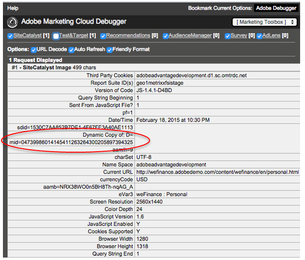
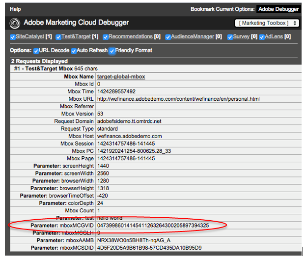
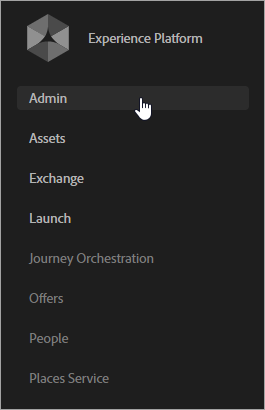

# Prise en main des services CX Enterprise

Si vous avez récemment implémenté CX Enterprise à l’aide de balises Experience Platform, vous disposez déjà d’une configuration pour les attributs du client et les audiences CX Enterprise. Vous pouvez également gérer les utilisateurs et utilisatrices et les produits dans Admin Console.

Les clients existants peuvent moderniser leurs implémentations d’applications et implémenter CX Enterprise. Cela vous permet d’utiliser les attributs du client ou de la cliente et les fonctionnalités d’audience dans Adobe Analytics, Audience Manager et Adobe Target.

## Rejoindre CX Enterprise et devenir administrateur {#section_2423F0BD3DF642658103310EE5EA6154}

Pour rejoindre CX Enterprise, procédez comme suit :

1. Assurez-vous d’être en possession des SKU d’Adobe Analytics ou d’Adobe Target appropriées.

   * **Adobe Analytics :** Standard ou Premium (et non la [!DNL SiteCatalyst] SKU héritée).
   * **Adobe Target :** Standard ou Premium.

   >[!NOTE]
   >
   >Pour [!DNL Target], migrez vers at.js depuis `mbox.js`. Voir [&#x200B; Mise à niveau à partir d’at.js 1. x vers at.js 2. x](https://experienceleague.adobe.com/docs/target-dev/developer/client-side/at-js-implementation/upgrading-from-atjs-1x-to-atjs-20.html?lang=fr).

1. Gérez les utilisateurs et les produits dans le [!UICONTROL Admin Console].

### Connexion administrateur

Une fois votre statut d’administrateur acquis, vous pouvez vous connecter à [experience.adobe.com](https://experience.adobe.com?lang=fr).

Le lien **[!UICONTROL Admin Console]** est disponible dans la navigation du menu CX Enterprise.

### Connexion utilisateur

Pour vous connecter à CX Enterprise, les utilisateurs doivent :

* Posséder un Adobe ID (ou un Enterprise ID pour votre société).
* Connectez-vous à [experiencecloud.adobe.com](https://experience.adobe.com?lang=fr).
* Appartenir à un groupe dʼapplications mappé avec un groupe dʼentreprises.
* Si nécessaire, liez leurs comptes dʼapplication à leur Adobe ID (comme décrit ci-après).

### Facultatif : liez les comptes dʼutilisateurs existants.

Il est probable que certains de vos utilisateurs soient déjà membres de groupes d’applications, tels qu’un groupe Analytics que vous avez précédemment géré dans [!UICONTROL Analytics] > [!UICONTROL Admin Tools].

Lorsque vous mappez ces groupes avec des groupes d’entreprise CX Enterprise, ces utilisateurs doivent associer manuellement les informations d’identification de leur compte d’application à leurs Adobe ID.

Voir [Liaison de comptes dans CX Enterprise](../administration/organizations.md)

>[!NOTE]
>
>Une fois le mappage de groupes d’entreprises et dʼapplications effectué, les nouveaux utilisateurs sont liés automatiquement. (Les informations d’identification de la solution sont automatiquement créées et liées à leur Adobe ID.)

Les sections suivantes expliquent comment moderniser votre mise en œuvre. La modernisation de votre implémentation permet d’activer les services principaux dans CX Enterprise.

## mettre en œuvre le [!UICONTROL CX Enterprise ID Service] ; {#section_3C9F6DF37C654D939625BB4D485E4354}

Le [!UICONTROL CX Enterprise ID Service] fournit un ID commun pour une intégration entre applications. Il fournit une identification des visiteurs interdomaines ainsi qu’un chemin d’accès pour le ciblage et la personnalisation interpériphérique/des navigateurs basés sur les données de gestion de la relation client chargées par le biais de [!DNL Customer Attributes].

La méthode la plus simple pour activer les services principaux de CX Enterprise consiste à les activer automatiquement pour Analytics et Adobe Target à l’aide de l’extension du service CX Enterprise ID [&#128279;](https://experienceleague.adobe.com/docs/experience-platform/tags/extensions/adobe/id-service/overview.html?lang=fr) dans [!UICONTROL Experience Platform Launch].

Pour accéder à l’aide complète du service CX Enterprise ID (anciennement, identifiant visiteur), rendez-vous [ici](https://experienceleague.adobe.com/docs/id-service/using/intro/overview.html?lang=fr#intro).

**Vous N’Utilisez Pas [!UICONTROL Experience Platform tags] ?**

Si vous n’utilisez pas [!UICONTROL Experience Platform tags], mettez en œuvre manuellement le service d’ID par le biais du déploiement de JavaScript (`VisitorAPI.js`), en procédant comme suit :

| Tâche | Description |
| -----------| ---------- |
| [Mise en œuvre du service CX Enterprise ID pour Analytics](https://experienceleague.adobe.com/docs/id-service/using/implementation/setup-analytics.html?lang=fr) | Adobe recommande également de paramétrer des [ID de client](https://experienceleague.adobe.com/docs/id-service/using/reference/authenticated-state.html?lang=fr) supplémentaires. Ces identifiants sont associés à chaque visiteur et permettent d’accéder aux fonctionnalités actuelles et futures de CX Enterprise. |
| Mettez à jour le fichier `s_code` existant vers la version H.27.3 ou ultérieure ou le fichier `AppMeasurement.js` vers la version 1.4 ou ultérieure. | Ces fichiers peuvent être téléchargés dans le [Gestionnaire de code](https://experienceleague.adobe.com/docs/analytics/admin/admin-tools/code-manager-admin.html?lang=fr) des outils d’administration Analytics. (Le guide de [mise en œuvre de JavaScript](https://experienceleague.adobe.com/docs/analytics/implementation/js/overview.html?lang=fr#js) est disponible si vous avez besoin d’informations complémentaires sur `AppMeasurement.js`.) |

{style="table-layout:auto"}

### Analytics et Adobe Target - Synchronisation de l’ID client {#section_AD473A6A21C1446498E700363F9A8437}

Dans le cadre de la configuration du service CX Enterprise ID, Adobe recommande, pour Analytics et [!DNL Target], de synchroniser vos [ID de client](https://experienceleague.adobe.com/docs/id-service/using/reference/authenticated-state.html?lang=fr) avec CX Enterprise.

Dans Adobe Target, le paramètre `mbox3rdpartyid` doit obtenir l’ID client et l’envoyer à [!DNL Target]. (Reportez-vous à la section [Utilisation des attributs du client](https://experienceleague.adobe.com/docs/target/using/audiences/visitor-profiles/working-with-customer-attributes.html?lang=fr) dans [!DNL Target].)

Chaque fois qu’un visiteur s’authentifie sur votre site web ou s’identifie d’une autre manière, votre implémentation doit afficher son ID client CRM sur la page ou dans l’application. Vous pouvez ensuite utiliser l’appel de fonction approprié pour synchroniser votre ID client avec CX Enterprise. Cette synchronisation stocke l’ID de client CRM du visiteur dans CX Enterprise et active les attributs de ce client en vue d’une utilisation dans CX Enterprise.

Par exemple, supposons que Robert a l’identifiant de client `52mc210tr42` dans votre système de gestion de la relation client. Quand Robert s’authentifie sur votre site, vous devez exposer cet identifiant sur la page, puis le synchroniser de l’une des deux façons suivantes :

* Appelez `visitor.setCustomerIDs({"crm_id":"52mc210tr42"})` à l’aide du service d’identification des visiteurs. Sinon,
* renseignez le *`Customer ID (52mc210tr42)`* dans une variable prop ou eVar.

L’ID de client doit être défini dans chaque appel au serveur [!DNL Analytics] où il est connu.

#### Analytics : synchronisation de l’identifiant client avec la méthode de renvoi de l’entrepôt de données

Lorsque les attributs du client sont devenus disponibles pour la première fois, certains clients n’avaient pas encore mis en œuvre le service CX Enterprise ID et ne pouvaient pas facilement utiliser les attributs du client. Pour faire face à ce problème, Adobe a mis en place le moyen d’effectuer un renvoi des synchronisations des identifiants à l’aide de l’entrepôt de données d’Adobe Analytics. Cette fonctionnalité est connue sous le nom de renvoi de l’entrepôt de données. Le renvoi de l’entrepôt de données n’est désormais généralement plus nécessaire et ne sera donc plus disponible à partir d’octobre 2022.

### SDK mobiles

Consultez la section *Service CX Enterprise ID* pour obtenir des exemples de syntaxe sur la manière de définir des ID de client supplémentaires dans les applications mobiles [Android™](https://experienceleague.adobe.com/docs/mobile-services/android/overview.html?lang=fr) et [iOS](https://experienceleague.adobe.com/docs/mobile-services/ios/overview.html?lang=fr).

### Attributs d’activation pour les données historiques

Les données d’attribut du client sont disponibles une fois les visiteurs connectés. Si vous n’avez pas encore mis en œuvre le service d’ID et que vous avez effectué le suivi historique des ID de client dans une variable prop ou eVar, vous pouvez demander un processus qui envoie les connexions historiques à CX Enterprise. Grâce à ce processus, vous pouvez commencer à utiliser immédiatement les attributs du client.

Contactez l’assistance clientèle pour activer les données d’historique.

## Mapper des suites de rapports à une organisation CX Enterprise {#section_7B08516B01BA421681DF03D0E86CE3BA}

>[!NOTE]
>
>La fonctionnalité de mappage de suites de rapports a été abandonnée en novembre 2020. Contactez le Service clientèle pour toute question.

Les services CX Enterprise (tels que le service CX Enterprise ID) sont associés à une organisation CX Enterprise plutôt qu’à une suite d’Analytics rapports individuelle. Pour garantir le bon fonctionnement de ces services, chaque suite de rapports Analytics doit être mappée à une organisation CX Enterprise.

## Mettre à jour votre code Analytics AppMeasurement {#section_1798D9D0F05C47E29816AC4EEB9A0913}

Si vous utilisez des cookies propriétaires, reportez-vous à la section [CNAME et service CX Enterprise ID](https://experienceleague.adobe.com/docs/id-service/using/reference/analytics-reference/cname.html?lang=fr) pour plus d’informations sur les CNAME de collecte de données et le suivi inter-domaines.

Il vous est recommandé d’actualiser votre mise en œuvre Analytics en mettant à jour vos bibliothèques JavaScript, y compris l’API visiteur. La méthode la plus simple pour y parvenir consiste à ajouter une [extension Adobe Analytics](https://experienceleague.adobe.com/docs/experience-platform/tags/extensions/adobe/analytics/overview.html?lang=fr) dans la collecte de données Experience Platform.

## Mettre à jour votre implémentation Adobe Target {#section_C2F4493C7A36406DAE2266B429A4BD24}

* Il est recommandé d’ajouter une extension [&#128279;](https://experienceleague.adobe.com/docs/experience-platform/tags/extensions/adobe/target-v2/overview.html?lang=fr) dans les balises [!UICONTROL Experience Platform], de sorte que la récupération de votre bibliothèque soit automatique. Vous pouvez également configurer l’extension du service CX Enterprise ID [&#128279;](https://experienceleague.adobe.com/docs/experience-platform/tags/extensions/adobe/id-service/overview.html?lang=fr) pour Adobe Target (et d’autres applications) à l’aide de balises [!UICONTROL Experience Platform]. La mise à jour [!UICONTROL CX Enterprise ID Service] **est requise** pour qu’Adobe Target puisse utiliser les services Personnes.
* Si vous n’utilisez pas de balises [!UICONTROL Experience Platform], [mettez à jour votre bibliothèque mbox](https://experienceleague.adobe.com/docs/target/using/implement-target/client-side/implement-target-for-client-side-web.html?lang=fr) manuellement.
* Demandez lʼaccès afin dʼutiliser Adobe Analytics comme source de création de rapports pour [!DNL Adobe Target]. Les données de [!DNL Target] et dʼ[!DNL Analytics] sont combinées dans le même appel au serveur durant le traitement afin que les visiteurs soient connectés entre les deux applications. Voir [Implémentation d’Analytics for Target](https://experienceleague.adobe.com/docs/target/using/integrate/a4t/a4t.html?lang=fr).

  >[!IMPORTANT]
  >
  >Tous les clients d’Analytics sont déjà configurés pour les services principaux ainsi que pour les attributs du client. Si vous n’êtes pas client d’Analytics, contactez le service à la clientèle pour demander à recevoir les privilèges d’accès.

## Vérification de la mise en œuvre {#section_E641782A0F4F44AF8C9C91216BE330D5}

Procédez comme suit pour vous assurer que le service CX Enterprise ID est correctement mis en œuvre sur votre site.

1. Effacez les cookies de votre site afin de pouvoir visualiser la requête du service CX Enterprise ID (la requête est émise lors de la première visite, puis une fois par visiteur et par semaine).
1. À l’aide d’un analyseur de paquets ou du volet des réseaux dans un débogueur de navigateur web, recherchez une requête envoyée à [!DNL dpm.demdex.net].
1. Vérifiez que la réponse contient `d_mid` et une valeur, par exemple : `_setMarketingCloudFields({"d_mid":"4235...`
1. Vérifiez que la requête Analytics contient le paramètre `mid` (l’identifiant CX Enterprise). Durant la période de grâce (le cas échéant), un paramètre `aid` doit également s’afficher (l’identifiant visiteur Analytics).

Réponse attendue contenant l’identifiant CX Enterprise :

Demande d’image Analytics contenant l’identifiant CX Enterprise (également appelé `mid` ou _identifiant visiteur_) :

Identifiant CX Enterprise dans la requête de mbox :

### Qu’est-ce que la période de grâce ?

Une fois que vous avez déployé le service CX Enterprise ID, les nouveaux visiteurs ne reçoivent plus d’Analytics CX Enterprise ID de votre serveur de collecte de données. Si le service d’ID n’a pas encore été mis en œuvre sur certaines sections de votre site, l’ID CX Enterprise n’est pas reconnu lorsque les visiteurs parcourent ces sections et un identifiant visiteur Analytics hérité est attribué aux visiteurs. Ce comportement peut être à l’origine de certains problèmes, notamment des visites en double et des attributions incorrectes.

Si, par exemple, la section Assistance de votre site est gérée dans un système de gestion de contenu distinct, il se peut que vous ayez un fichier JavaScript Analytics différent pour cette section. Si vous déployez l’identifiant CX Enterprise sur votre site principal avant de déployer le service d’ID sur le site d’assistance, les nouveaux visiteurs recevront un identifiant Analytics hérité lorsqu’ils se rendent dans la section d’assistance. Les visites qui s’étendent sur les deux sections du site sont signalées comme des visites différentes.

Le déploiement du service CX Enterprise ID sur les sites qui utilisent plusieurs fichiers JavaScript ou d’autres technologies (telles que Flash) peut entraîner des problèmes de coordination. Ces problèmes se produisent car vous devez activer le service CX Enterprise ID en même temps sur toutes les parties de votre site. En configurant une période de grâce, les nouveaux visiteurs pourront continuer à recevoir un identifiant visiteur Analytics du service d’ID. Les visiteurs et visiteuses peuvent être identifiés de manière cohérente sur des sections de votre site qui n’ont pas été mises à niveau pour utiliser le service d’identification des visiteurs.

## Gérer les utilisateurs et les produits {#section_B6E95F4E0E12483CB9DA99CBC0C5A4AF}

Lorsque vous êtes opérationnel, accédez à [Admin Console](https://adminconsole.adobe.com/), à partir de laquelle vous pouvez gérer les utilisateurs et les profils de produits.

### Attributs du client ou de la cliente

Les utilisateurs ajoutés au groupe [!DNL Customer Attributes] peuvent voir l’option de menu [!DNL Customer Attributes] sur le côté gauche de CX Enterprise.

## Commencer à partager les données d’attribut et d’audience {#section_960C06093623462E8EA247B3E97274A1}

Profitez des fonctionnalités suivantes.

### [!UICONTROL Customer Attributes]

Si vous capturez des données client d’entreprise dans une base de données de gestion de la relation client (GRC), vous pouvez les charger dans une source de données d’attributs du client dans CX Enterprise. Une fois le chargement effectué, utilisez les données dans [!DNL Adobe Analytics] et [!DNL Adobe Target].

Voir [Attributs du client](customer-attributes/attributes.md) pour plus d’informations.

### [!UICONTROL People] > [!UICONTROL Audience Library]

CX Enterprise [!UICONTROL Audiences] est l’interface qui vous permet de créer des audiences, de combiner les audiences existantes pour créer des audiences composites et d’afficher toutes les audiences partagées.

Voir [Audiences](audiences/overview.md) pour plus d’informations.

## Stockage des données et divulgation des données confidentielles

L’utilisation du profilage d’audiences en temps réel et d’autres services principaux au sein d’Adobe [!DNL CX Enterprise] peut avoir une influence sur le centre de données (et le pays) où se trouvent vos données. En particulier, dans la mesure où [!DNL CX Enterprise] utilise Audience Manager, les données utilisées dans le service [!UICONTROL People] doivent se trouver sur les serveurs Audience Manager situés aux États-Unis.

Lors de l’utilisation de services accessibles par le biais du service [!UICONTROL People], les types de données envoyés depuis d’autres produits Adobe à la gestion de l’audience sont les suivants :

* Paires clé/valeur [!DNL Analytics] (Props, eVars, variables de liste, etc.). Par défaut, les lignes des journaux contiennent l’adresse IP, notamment le dernier octet de l’adresse IP (en supposant que l’adresse IP n’a pas été modifiée par les paramètres de masquage d’Adobe [!DNL Analytics]).
* Caractéristiques et segments pour lesquels les visiteurs sont inclus selon les règles configurées dans Audience Manager.
* (Facultatif) Un ou plusieurs de vos identifiants. Selon votre mise en œuvre du service d’ID, vous envoyez peut-être également un ou plusieurs de vos ID, tels que les ID CRM ou des adresses électroniques hachées. Si ces données sont envoyées à Adobe [!DNL Analytics], elles sont transférées à la gestion de l’audience d’Adobe. Adobe recommande de ne pas fournir de données personnelles à Adobe [!DNL Analytics]. Utilisez un hachage à sens unique pour masquer les données avant de les envoyer à Adobe.
* Segments provenant d’[!DNL Analytics] au moyen de la fonctionnalité de partage des segments principale.
* Le cookie demdex.net est défini si les cookies tiers ne sont pas bloqués. Le cookie propriétaire `AMCV_###@AdobeOrg` est toujours défini avec le service CX Enterprise ID.

Tous ces éléments de données sont transmis à Adobe Audience Manager sous forme de fichiers journaux. Audience Manager traite et stocke ces données aux États-Unis. Audience Manager ne permet pas de stocker ni de traiter ces données en dehors des États-Unis.
