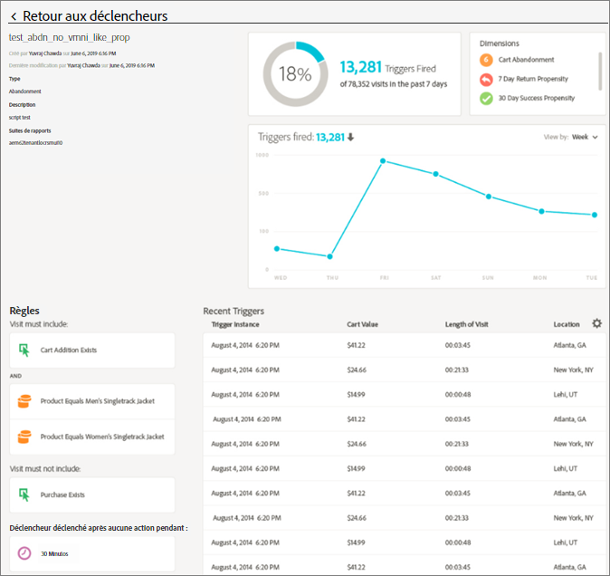
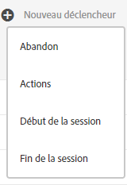
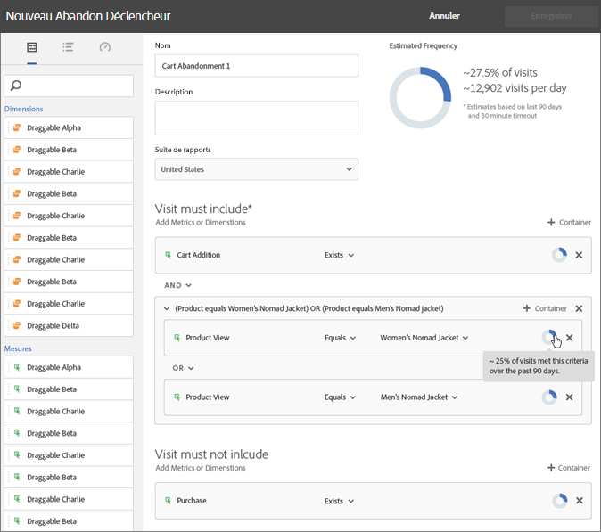
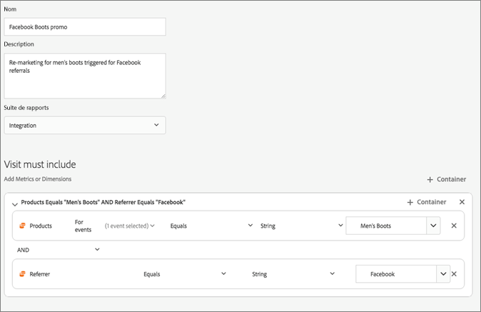

# Experience Cloud Triggers

[!UICONTROL Triggers] dʼExperience Cloud vous permet dʼidentifier, définir et surveiller les comportements clés des consommateurs, puis de générer une communication entre applications destinée à réengager les visiteurs.

## Présentation de Triggers {#topic_4F21FCE9A64E46E8B6D51F494FA652A7}

Vous pouvez utiliser des triggers pour la personnalisation et les décisions en temps réel. Par exemple :

* Configurez un remarketing rapide pour les abandons de panier ou les abandons de panier sans suppression de produits
* Formulaires et demandes incomplets
* Actions ou séquence d’actions sur site

>[!NOTE]
>
>Retrouvez plus d’informations sur l’utilisation de [!UICONTROL Triggers] dans [Campaign Standard](https://experienceleague.adobe.com/docs/campaign-standard/using/integrating-with-adobe-cloud/working-with-campaign-and-triggers/using-triggers-in-campaign.html?lang=fr).

### Types de Triggers

En règle générale, un trigger peut prendre 15 à 90 minutes pour lancer une campagne marketing. Ce délai varie en fonction de l’implémentation de la collecte de données, de la charge sur le pipeline, de la configuration personnalisée du trigger défini et du workflow dans Adobe Campaign.

* **Abandon :** vous pouvez créer un trigger qui se déclenche lorsqu’un visiteur consulte un produit mais ne l’ajoute pas au panier.
* **Action :** vous pouvez créer des triggers, par exemple, pour qu’ils se déclenchent après des inscriptions à une newsletter, des abonnements par e-mail ou des demandes de cartes de crédit (confirmations). Si vous êtes un détaillant, vous pouvez créer un trigger pour un visiteur qui s’inscrit à un programme de fidélité. Dans le secteur des médias et du divertissement, créez des triggers pour les visiteurs qui regardent un programme en particulier et qui doivent répondre à une enquête.
* **Début et fin de session :** créez un trigger pour les événements de début et de fin de session.

## Création d’un trigger Experience Cloud {#task_821F37183AC045E5AC8EED20317598FE}

Créez un trigger et configurez les conditions correspondantes. Vous pouvez par exemple indiquer les critères des règles d’un trigger pendant une visite, comme des mesures telles que Abandon du panier ou des dimensions telles que le nom du produit. Lorsque les règles sont satisfaites, le trigger s’exécute.

>[!NOTE]
>
>Pour des raisons techniques, le nombre de triggers est actuellement limité à 100.

1. Dans Experience Cloud, sélectionnez , puis sélectionnez **[!UICONTROL Collecte de données/lancement]**.
2. Sur la carte [!UICONTROL Triggers], sélectionnez **[!UICONTROL Gérer les triggers]**.
3. Sélectionnez **[!UICONTROL Nouveau trigger]**, puis spécifiez le type de trigger :

   

4. Configurez le trigger en renseignant les champs suivants et en faisant glisser les éléments de mesure et de dimension vers les conteneurs de la règle :

   | Élément | Description |
   |--- |--- |
   | [!UICONTROL Nom] | Nom convivial du trigger. |
   | [!UICONTROL Description] | Description du trigger, de sa fonction, etc. |
   | [!UICONTROL Suite de rapports] | La [suite de rapports](https://experienceleague.adobe.com/docs/analytics/admin/manage-report-suites/report-suites-admin.html?lang=fr) Analytics utilisée pour ce trigger. Ce paramètre identifie les données de rapport à utiliser. |
   | Visite doit inclure Visite ne doit pas inclure Trigger après aucune action Inclure métadonnées | Vous pouvez définir des critères ou des comportements de visiteur qui doivent se produire ou ne pas se produire. Par exemple, les règles pour un trigger d’abandon de panier simple peuvent ressembler à celles-ci :<ul><li>La visite doit inclure : [!UICONTROL Ajout au panier] (mesure) et [!UICONTROL Existe]. (Vous pouvez affiner davantage la règle avec une consultation de produit spécifique ou des dimensions telles que Types de navigateur.)</li><li>La visite ne doit pas inclure : [!UICONTROL Passage en caisse].</li><li>Trigger après aucune action pendant : 10 minutes</li><li>[!UICONTROL Inclure les métadonnées] : permet d’ajouter une dimension spécifique de [!DNL Campaign] ou des variables qui sont pertinentes par rapport au comportement d’un visiteur. Ce champ peut s’avérer utile pour la création d’un e-mail de remarketing correct par Adobe Campaign.</li></ul> Vous pouvez spécifier une logique [!UICONTROL Quelconque], [!UICONTROL Et] ou [!UICONTROL Ou] dans ou entre des conteneurs, selon les critères que vous déterminez comment étant importants pour la règle. |
   | [!UICONTROL Conteneur] | Vous définissez et stockez des règles, des conditions ou des filtres qui définissent un trigger dans les [!UICONTROL Conteneurs]. Si vous souhaitez que des événements se produisent en même temps, placez-les dans un même conteneur. En effet, chaque conteneur procède indépendamment au traitement au niveau de l’accès. Par exemple, si deux conteneurs sont associés par l’opérateur AND, vous pouvez vous attendre à ce que les règles remplissent les critères lorsque deux accès répondent aux exigences. |
   | Démarrer une nouvelle session après | Créez un trigger pour les événements de début et de fin de session. |

   {style="table-layout:auto"}

5. Sélectionnez **[!UICONTROL Enregistrer]**.
6. Utilisez ces triggers pour le [remarketing en temps réel](https://experienceleague.adobe.com/docs/campaign-standard/using/integrating-with-adobe-cloud/working-with-campaign-and-triggers/about-adobe-experience-cloud-triggers.html?lang=fr) dans [!DNL Adobe Campaign].

### Exemples de triggers

Exemples de triggers Experience Cloud :

#### Trigger d’abandon de panier

Par exemple, la page suivante montre les règles que vous pouvez utiliser pour un trigger d’[!UICONTROL abandon de panier], selon les produits consultés lors d’une visite.

#### Trigger de référent

Le trigger suivant se déclenche lorsqu’un accès est associé au produit Men’s Boots et au référent Facebook. Pour que les deux critères (*produits* et *référent*) soient évalués dans le même accès, ils doivent être ajoutés au même conteneur.

