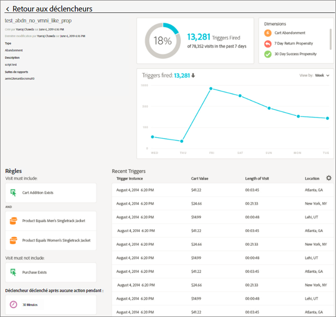
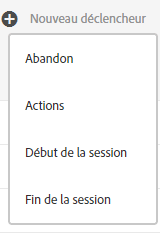
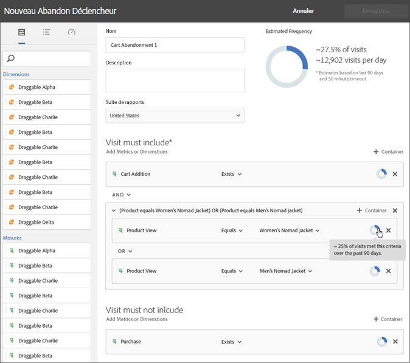
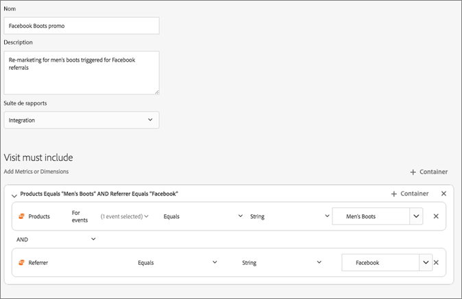

# Experience Cloud Triggers

[!UICONTROL Triggers] dans Experience Cloud vous permet d’identifier, définir et surveiller les comportements clés des consommateurs, puis de générer une communication entre applications destinée à réengager les visiteurs. Vous pouvez utiliser des déclencheurs pour la personnalisation et les décisions en temps réel.

Par exemple :

* Configurez un remarketing rapide pour les abandons de panier ou les abandons de panier sans suppression de produits
* Formulaires et demandes incomplets
* Actions ou séquence d’actions sur site

>[!NOTE]
>
>Vous trouverez plus d’informations sur l’utilisation de [!UICONTROL Triggers] dans [Campaign Standard](https://experienceleague.adobe.com/docs/campaign-standard/using/integrating-with-adobe-cloud/working-with-campaign-and-triggers/using-triggers-in-campaign.html?lang=fr).

## Types de déclencheurs

En règle générale, un déclencheur peut prendre 15 à 90 minutes pour lancer une campagne marketing. Ce délai varie en fonction de l’implémentation de la collecte de données, de la charge sur le pipeline, de la configuration personnalisée du déclencheur défini et du workflow dans Adobe Campaign.

* **Abandon :** vous pouvez créer un trigger qui se déclenche lorsqu’un visiteur consulte un produit mais ne l’ajoute pas au panier.
* **Action :** vous pouvez créer des triggers, par exemple, pour qu’ils se déclenchent après des inscriptions à une newsletter, des abonnements par e-mail ou des demandes de cartes de crédit (confirmations). Si vous êtes un détaillant, vous pouvez créer un déclencheur pour un visiteur qui s’inscrit à un programme de fidélité. Dans le secteur des médias et du divertissement, créez des déclencheurs pour les personnes qui regardent un programme en particulier et qui doivent répondre à une enquête.
* **Début et fin de session :** créez un déclencheur pour les événements de début et de fin de session.

## Création d’un trigger Experience Cloud

Créez un déclencheur et configurez les conditions correspondantes. Vous pouvez par exemple indiquer les critères des règles d’un déclencheur pendant une visite, comme des mesures telles que Abandon du panier ou des dimensions telles que le nom du produit. Lorsque les règles sont satisfaites, le déclencheur s’exécute.

>[!NOTE]
>
>Pour des raisons techniques, le nombre de déclencheurs est actuellement limité à 100.

1. Dans Experience Cloud, cliquez sur , puis sur **[!UICONTROL Data Collection/Launch]**.
1. Sur la carte [!UICONTROL Triggers], cliquez sur **[!UICONTROL Manage Triggers]**.
1. Cliquez sur **[!UICONTROL New Trigger]**, puis spécifiez le type de déclencheur :

   

1. Configurez le déclencheur en renseignant les champs suivants et en faisant glisser les éléments de mesure et de dimension vers les conteneurs de la règle :

   | Élément | Description |
   |--- |--- |
   | [!UICONTROL Name] | Nom convivial du déclencheur. |
   | [!UICONTROL Description] | Description du déclencheur, de sa fonction, etc. |
   | [!UICONTROL Report Suite] | La [suite de rapports](https://experienceleague.adobe.com/docs/analytics/admin/manage-report-suites/report-suites-admin.html?lang=fr) Analytics utilisée pour ce déclencheur. Ce paramètre identifie les données de rapport à utiliser. |
   | Visite doit inclure Visite ne doit pas inclure Déclencheur après aucune action Inclure métadonnées | Vous pouvez définir des critères ou des comportements de visiteur qui doivent se produire ou ne pas se produire. Par exemple, les règles pour un déclencheur d’abandon de panier simple peuvent ressembler à celles-ci :<ul><li>La visite doit inclure : [!UICONTROL Cart Addition] (mesure) et [!UICONTROL Exists]. (Vous pouvez affiner davantage la règle avec une consultation de produit spécifique ou des dimensions telles que Types de navigateur.)</li><li>La visite ne doit pas inclure : [!UICONTROL Checkout].</li><li>Déclencheur après aucune action pendant : 10 minutes</li><li>[!UICONTROL Include Meta Data] : permet d’ajouter une dimension de [!DNL Campaign] spécifique ou des variables pertinentes par rapport au comportement d’un visiteur. Ce champ peut s’avérer utile pour la création d’un e-mail de remarketing correct par Adobe Campaign.</li></ul> Vous pouvez spécifier une logique de [!UICONTROL Any], de [!UICONTROL And] ou de [!UICONTROL Or] dans ou entre des conteneurs, selon les critères que vous déterminez comme étant importants pour la règle. |
   | [!UICONTROL Container] | [!UICONTROL Containers] vous définissez et stockez des règles, des conditions ou des filtres qui définissent un déclencheur. Si vous souhaitez que des événements se produisent en même temps, placez-les dans un même conteneur. En effet, chaque conteneur procède indépendamment au traitement au niveau de l’accès. Par exemple, si deux conteneurs sont associés par l’opérateur AND, vous pouvez vous attendre à ce que les règles remplissent les critères lorsque deux accès répondent aux exigences. |
   | Démarrer une nouvelle session après | Créez un déclencheur pour les événements de début et de fin de session. |

   {style="table-layout:auto"}

1. Cliquez sur **[!UICONTROL Save]**.
1. Utilisez ces déclencheurs pour le [remarketing en temps réel](https://experienceleague.adobe.com/docs/campaign-standard/using/integrating-with-adobe-cloud/working-with-campaign-and-triggers/about-adobe-experience-cloud-triggers.html?lang=fr) dans [!DNL Adobe Campaign].

## Exemples de déclencheurs

Exemples de triggers Experience Cloud :

### Déclencheur d’abandon de panier

Par exemple, la page suivante montre les règles que vous pouvez utiliser pour un déclencheur [!UICONTROL Cart Abandonment], en fonction des produits consultés lors d’une visite.

### Déclencheur référent

Le trigger suivant se déclenche lorsqu’un accès est associé au produit Men’s Boots et au référent Facebook. Pour que les deux critères (*produits* et *référent*) soient évalués dans le même accès, ils doivent être ajoutés au même conteneur.

