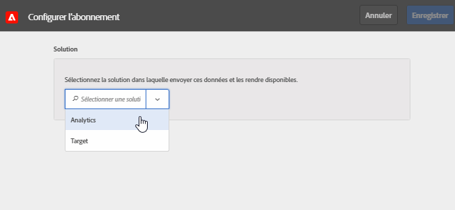

# Configuration des abonnements dans Experience Cloud

Découvrez les sources de données des solutions et comment configurer les abonnements. Les abonnements activent le flux de données Attribut client entre l’Experience Cloud et les solutions ([!DNL Analytics] et [!DNL Target]).

Par exemple, un abonnement Adobe Analytics active les données d’attribut dans les rapports. Si vous utilisez Adobe Target, vous pouvez charger des attributs de client pour le ciblage et la segmentation.

**[!UICONTROL Sources d’attributs du client]** > **[!UICONTROL Créer une source d’attributs du client]** > **[!UICONTROL Nouveau]**

| Élément | Description |
|--- |--- |
| Solution | **Adobe Analytics**  Sélectionnez Analytics, spécifiez les suites de rapports destinées à recevoir les données d’attribut, ainsi que les attributs à inclure. **Adobe Target**  Vous pouvez charger des attributs de client pour le ciblage et la segmentation. Cette fonctionnalité est utile si vous souhaitez cibler un test sur la base de données d’attribut, ou rendre les données disponibles pour la segmentation dans Analytics. Les données d’attribut du client chargées pour un visiteur sont disponibles lors de la connexion dans  **[!DNL Target]** >  **Audiences**. Plusieurs sources de données sont prises en charge. Lorsque vous [définissez des ID de client](core-services.md) sur votre site web, vérifiez qu’au moins un des alias est abonné à [!DNL Target]. |
| Suite de rapports (Analytics) | Suites de rapports issues d’Analytics. Vous ne pouvez pas ajouter plus de 10 suites de rapports aux abonnements Analytics au sein d’une même source d’attributs. Lorsque vous choisissez les suites de rapports à inclure, tenez compte des suggestions suivantes :<ul><li>Choisissez des suites de rapports ayant un jeu commun de clients authentifiés. Si les clients authentifiés d’une suite de rapports ne chevauchent pas les clients authentifiés d’une autre suite de rapports, séparez ces suites de rapports en différentes sources d’attributs.</li><li>Si possible, les suites de rapports incluses dans une source d’attributs doivent avoir un volume de trafic similaire.</li></ul> Si vous détenez plus de dix suites de rapports avec un jeu commun de clients authentifiés, vous pouvez configurer d’autres sources d’attributs du client, chacune d’elles pouvant contenir jusqu’à dix suites de rapports. |
| Attributs à inclure (Analytics et [!DNL Target]) | Attributs à envoyer à la solution.  Lors de la configuration des abonnements et de la sélection des attributs, les restrictions suivantes s’appliquent _par suite de rapports,_ selon les solutions que vous détenez :<ul><li>Foundation : 0</li><li>Select : 3</li><li>Prime : 15</li><li>Ultimate : 200</li><li>Standard : 3 au total</li><li>Premium : 200 par suite de rapports</li><li>[!DNL Target] Standard : 5</li><li>[!DNL Target] Premium : 200</li></ul> **Remarque :** lorsque vous effectuez la mise à niveau vers Analytics Premium, un délai de 24 heures est nécessaire avant que des attributs supplémentaires soient disponibles. Il se peut que l’erreur Nombre maximal d’abonnements des attributs s’affiche durant ce délai. |

{style=&quot;table-layout:auto&quot;}
