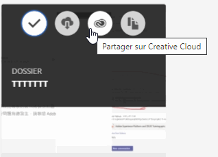
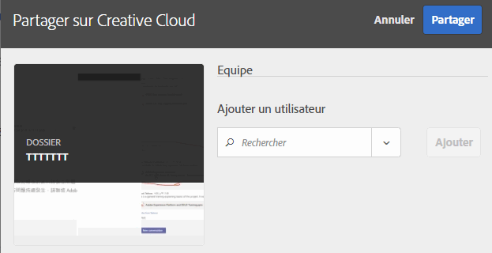
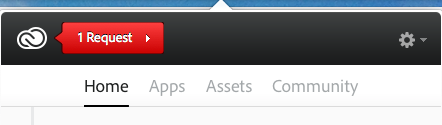
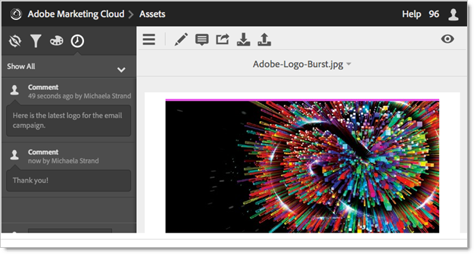

# Partage d’un dossier de ressources Experience Cloud

Partagez un dossier de ressources Experience Cloud avec des utilisateurs Creative Cloud.

1. Sur un dossier de ressources, sélectionnez **[!UICONTROL Partager sur Creative Cloud]**.

   
1. Sur la page Partager sur Creative Cloud, recherchez un utilisateur, puis sélectionnez **[!UICONTROL Ajouter]**.

   

1. Sélectionnez **[!UICONTROL Partager]**.
1. Ouvrez l’application de bureau [!DNL Creative Cloud] (ou accédez à la page [!UICONTROL Fichiers Creative Cloud] dans un navigateur), puis recherchez la notification de la demande.

   
1. Ouvrez la demande, puis sélectionnez **[!UICONTROL Accepter]**.

   
1. Pour accéder au contenu du dossier, sélectionnez **[!UICONTROL Ouvrir le dossier]** (ou **[!UICONTROL Afficher sur le Web]**).

   
1. Continuez en ajoutant des commentaires à la ressource partagée :

   Dans Creative Cloud, sélectionnez une image, puis choisissez **[!UICONTROL Activité]** pour ajouter un commentaire sur cette image. Les commentaires sont synchronisés sur les ressources dans [!DNL Creative Cloud] et dans [!DNL Experience Cloud].

   

   Dans l’Experience Cloud, sélectionnez une image, puis sélectionnez l’icône de frise chronologique pour ajouter un commentaire à l’image. Les commentaires sont synchronisés sur les ressources dans Creative Cloud et Experience Cloud.

   

1. Pour annuler le partage dʼun dossier, sélectionnez **[!UICONTROL Partager à l’aide de Creative Cloud]** (comme à lʼ[étape 3](t-share-creative-cloud.md#step_BA17CFA185284641A9B878BA29551996)), supprimez les utilisateurs en sélectionnant lʼicône de croix (X), puis sélectionnez **[!UICONTROL Partager]**.

Une fois tous les utilisateurs Creative Cloud supprimés, le partage du dossier est annulé et les utilisateurs de Creative Cloud nʼy ont plus accès.

Voici dʼautres moyens dʼutiliser une ressource partagée :

* Utilisez les ressources du [!UICONTROL Sélecteur de ressources] dans [!DNL Adobe Social] pour les publications sociales.
* Chargez ou permutez des fichiers dans la [bibliothèque d’offres](https://experienceleague.adobe.com/docs/target/using/experiences/offers/manage-content.html?lang=fr) dans [!DNL Adobe Target] pour les images dans les activités.

Une fois que vous avez partagé un dossier sur Creative Cloud, le logo Creative Cloud apparaît sur le dossier.

Aide connexe :

* [Aide de Creative Cloud - Gestion et synchronisation des fichiers](https://helpx.adobe.com/fr/creative-cloud/help/sync-creative-cloud-files.html)
* [Aide de Creative Cloud - Collaboration avec d’autres utilisateurs](https://helpx.adobe.com/fr/creative-cloud/help/collaboration.html)
* [Aide de Creative Cloud - FAQ sur la collaboration](https://helpx.adobe.com/fr/creative-cloud/help/collaboration-faq.html)
